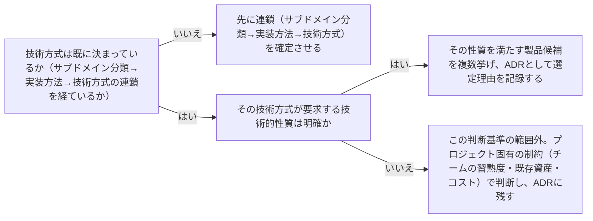

# architecture-tech-stack-selection-chain

---

## 概要

### この概念が答える判断

- 業務ロジックの実装方法（トランザクションスクリプト／アクティブレコード／ドメインモデル／イベント履歴式ドメインモデル）が決まった。技術方式・技術選定はどう決まるか？
- 具体的にどのライブラリ・製品を使うかは、この判断基準が決めてくれるか？

DDDのサブドメイン分類から実装方法・技術方式まで連鎖する判断フローを受けて、技術方式が要求する技術的性質（技術要件）までを扱う。具体的にどの製品・ライブラリを選ぶかはこの原則の範囲外であり、プロジェクトごとのADR（Architecture Decision Record）に委ねる。

---

## 原則

- サブドメイン分類→実装方法→技術方式という連鎖の続きとして、技術方式が決まれば、その技術方式が要求する技術的性質（技術要件）が決まる。
- 例えば技術方式がCQRSであれば「書き込み用と読み取り用で異なる永続化モデルを扱えること」が要件になり、ポートとアダプターであれば「ドメイン層から独立してテスト用の偽実装に差し替え可能なインターフェース機構」が要件になる。
- この技術要件を満たす具体的な製品・ライブラリの選定（例：どのDBを使うか、どのWebフレームワークを使うか）は、原則からは一意に決まらない——プロジェクトの制約（チームの習熟度・既存資産・コスト）に依存するため、この判断基準の範囲外とし、選定の経緯と理由を記録するADR（Architecture Decision Record）として別途残すべきである。

---

## 分類

| 分類 | 特徴 |
|---|---|
| CQRSが要求する技術要件 | 書き込み用と読み取り用で異なる永続化モデル・異なるスキーマを扱えること |
| ポートとアダプターが要求する技術要件 | インターフェース機構を持つ言語であること・テスト用の偽実装に差し替え可能な構造であること |
| レイヤードアーキテクチャが要求する技術要件 | 特別な技術要件は薄い。一般的なWebフレームワーク・DBアクセス手段で足りることが多い |

---

## 判断基準

---

## 実例

架空の物流プラットフォームで、決済機能はイベント履歴式ドメインモデル→CQRSという連鎖で技術方式が決まった。CQRSが要求する技術要件（書き込み／読み取りモデルの分離）を満たす候補として、書き込み用にイベントストア、読み取り用に検索特化DBを使う案が挙がった。どちらの具体的な製品を使うかはこの判断基準が決めることではなく、チームの習熟度と既存のインフラ資産を踏まえてADRとして記録し、tech-stack文書に残す。

---

## アンチパターン

| アンチパターン | 問題点 |
|---|---|
| 技術方式を経ずにいきなり製品を選定する | 「流行っているから」という理由だけで技術方式に見合わない製品を選び、後から要件との不整合が発覚する |
| ADRを残さず製品選定の理由が失われる | 後任者が「なぜこの製品を選んだか」を再現できず、変更の是非を判断できなくなる |

---

## 出典・根拠の透明性

ddd-advisorの`design-heuristics.md`が扱う連鎖（サブドメイン分類→実装方法→技術方式）の続きとして、技術方式が要求する技術的性質までをAIが総合し、has-udd独自にまとめたものである。具体的な製品選定はこの判断基準の範囲外とし、ADR形式に委ねるという判断は既に合意済みである（[[brainstorm-platform-engineering-application]] 論点6・論点11拡張を受けて着手）。

---

## 関連概念

| 関連概念 | 関係 |
|---|---|
| architecture-layer-boundary | サブドメイン分類→実装方法→技術方式の連鎖の起点との接続点 |
| architecture-port-adapter | 技術方式の1つ（ポートとアダプター）が要求する技術要件の具体例 |
