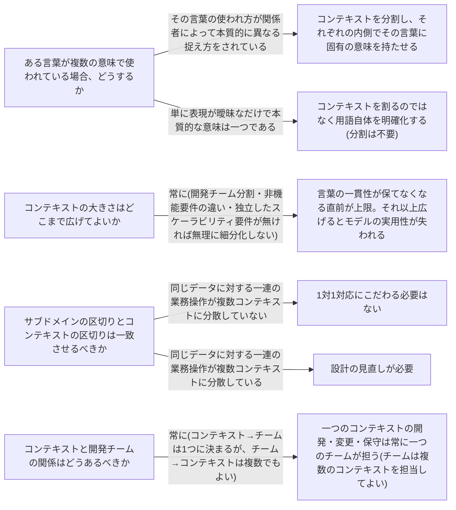

# bounded-context

---

## 概要

### この概念が答える判断

- 同じ言葉が複数の意味で使われていて混乱している。どう切り分けるべきか
- このモデル(またはspec)の境界はどこまで広げてよいか
- 業務領域(サブドメイン)の区切りと、実装単位の区切りは一致させるべきか

境界づけられたコンテキストとは、ある言葉が一貫した意味を持ち続けられる範囲であり、同時にその意味を表現するモデルが実装として独立している範囲である。

---

## 原則

境界づけられたコンテキストとは、ある言葉が一貫した意味を持ち続けられる範囲のことであり、同時にその意味を表現するモデルが実装として独立している範囲でもある。一つの言葉が事業のあらゆる場面で同じ意味を持つという前提は成り立たない。同じ言葉が部署・工程・利害関係者によって異なる指し示し方をされるのは、事業がある程度の規模を持てば自然に起きる現象であり欠陥ではない。境界づけられたコンテキストは、この暗黙のうちに複数存在している意味を明示的な境界として切り出す手法である。重要なのは境界の内側でだけ言葉の一貫性を保証すればよく、組織全体で言葉を統一する必要はないという点である。統一しようとすると、それぞれの文脈が本来持つべきモデルの独自性が失われる。

---

## 判断基準

---

## 実例

集荷・配送・請求を一括で扱う架空の物流プラットフォームを考える。当初「配送管理」と「配送状況の通知」という2つのコンテキストへの分割を検討したが、同じデータ(配送1件の記録)に対する一連の操作が意味もなく複数の区切りに分散していないかを問うたところ、両者は一つの一貫した関心事(配送というモノの状態を追跡する)に属すると判断され、「配送管理」という単一のコンテキストに統合された。一方「請求・精算」は配送管理とは扱う言葉も関心事も明確に異なる。同じ「配送」という言葉でも、配送管理コンテキストでは「今どこにあるか」を指すのに対し、請求コンテキストでは「いくら課金する対象か」を指すため、意図的に別のコンテキストとして切り分ける。

---

## アンチパターン

| アンチパターン | 問題点 |
|---|---|
| 組織全体で言葉を統一しようとする | DDDにおける同じ言葉は組織横断の共通言語を意味しない。コンテキストの外側で言葉の一貫性を強制すると、それぞれの業務が本来持つモデルの独自性を損なう。 |
| 複数のチームが一つのコンテキストを担当する | 一つのソフトウェアに意図せず異なるモデルが混入する原因になる。連携が必要な場合は暗黙の依存ではなく明示的な連携方針を定めるべき。 |
| コンテキストを必要以上に細分化する | 分割しすぎると、それらを組み合わせて全体の振る舞いを成立させること自体が新たな難題になる。 |
| サブドメインとコンテキストを常に1対1に固定する | 柔軟性を失う。一つのサブドメインに複数の異なる課題があるなら、課題ごとに別のコンテキストを用意した方がよい場合がある。 |

---

## 出典・根拠の透明性

本ファイルの原則・判断の分岐点・アンチパターンは『ドメイン駆動設計をはじめよう』第3章が扱う一般原則を要約・再構成したものであり、本文の直接引用ではない。書籍固有の例示(特定の業界・特定の逸話)はあえて用いず、教材専用の架空ドメイン(物流プラットフォーム)の実例に置き換えている。

---

## 関連概念

| 関連概念 | 関係 |
|---|---|
| ubiquitous-language | コンテキストの内側で一貫性を保つ同じ言葉 |
| subdomain | コンテキストが対応する業務活動の単位 |
| business-domain | コンテキストが属する事業全体 |
