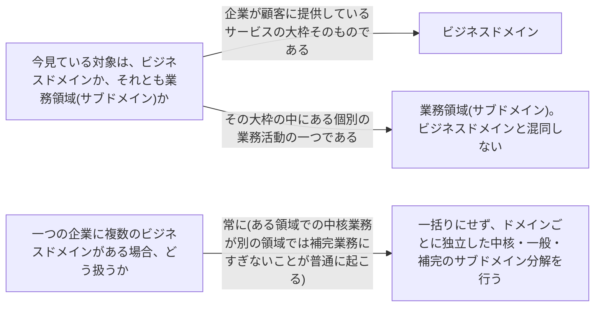

# business-domain

---

## 概要

### この概念が答える判断

- 今議論しているのは事業全体の話か、それとも事業の中の一つの業務活動の話か
- これから作るのは、まったく新しい事業の話なのか、既存の事業を構成する一部の話なのか
- 業務領域(サブドメイン)の分析を始める前に、そもそも境界を引くべき対象は何か

ビジネスドメインとは企業が顧客に価値を提供している活動の全体を指し、その内側は複数の業務領域(サブドメイン)に分解される。

---

## 原則

ビジネスドメインとは、企業が顧客に価値を提供している活動の全体を指す。企業が何をして稼いでいるかの大枠であり、その内側は複数の業務領域(サブドメイン)に分解される。ビジネスドメインそれ自体は設計対象ではなく、設計・分析の実務が始まるのはビジネスドメインを中核・一般・補完のサブドメインに分解した後である。したがってこの概念の役割は、分析に着手する前にまず対象の全体像と外枠を確認するという、思考の出発点を定めることにある。ビジネスドメインは固定ではなく事業の成長・方針転換によって変化しうる。また企業によっては単一のビジネスドメインではなく複数の独立したビジネスドメインを同時に持つこともあり、この場合ドメインごとに個別の業務領域分析が必要になる。

---

## 判断基準

---

## 実例

架空の物流プラットフォーム企業を考える。この企業のビジネスドメインは「物流サービスの提供」であり、その内側に集荷・配送・請求・カスタマーサポートといった複数の業務領域(サブドメイン)を持つ。この企業がやがて、集荷・配送で培った経路最適化の技術を転用して、まったく別の「都市交通データ解析サービス」を新規事業として立ち上げたとする。この場合、後者は前者の業務領域の一つではなく独立した二つ目のビジネスドメインとして扱う。二つのドメインは顧客像も収益構造も異なるため、それぞれ別個にサブドメイン分解を行う必要がある。

---

## 出典・根拠の透明性

本ファイルの原則・判断の分岐点は『ドメイン駆動設計をはじめよう』第2章が扱う一般原則を要約・再構成したものであり、本文の直接引用ではない。書籍固有の企業名・実例はあえて用いず、教材専用の架空ドメイン(物流プラットフォーム)の実例に置き換えている。

---

## 関連概念

| 関連概念 | 関係 |
|---|---|
| subdomain | ビジネスドメインを構成する個々の業務活動の単位 |
| bounded-context | サブドメインをソフトウェアとして実装する際の境界 |
