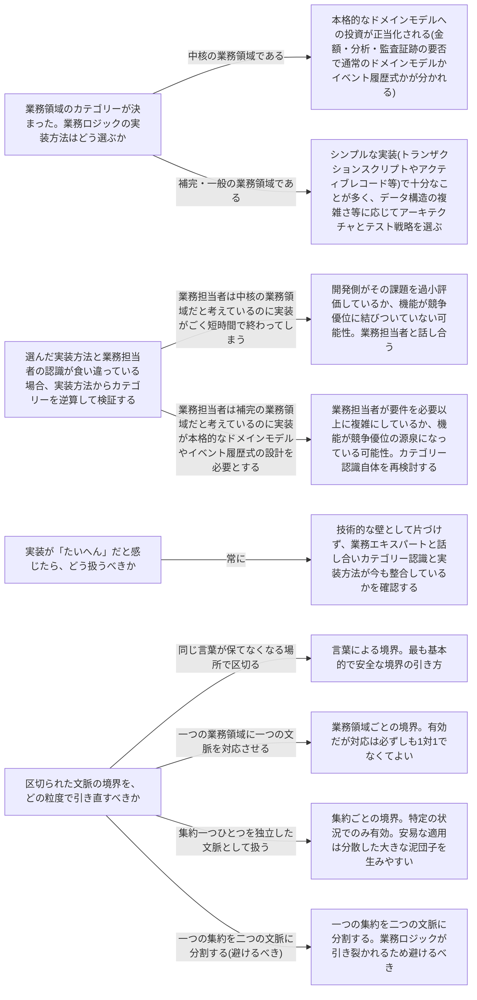

# closing-heuristics

---

## 概要

### この概念が答える判断

- 業務領域のカテゴリー(中核・一般・補完)が決まった後、業務ロジックの実装方法・土台となるアーキテクチャ・テスト戦略を具体的にどう選べばよいか
- 選んだ実装方法と、業務担当者が考えている業務領域のカテゴリーが食い違っているとき、どちらを疑うべきか
- 実装が「たいへん」だと感じたとき、それは単なる技術的な難易度なのか、それとも設計判断そのものを見直すべきサインなのか
- 区切られた文脈の境界を引き直すとき、どの粒度で区切るのが安全で、どの粒度が危険か

実装方法の選択は単発の判断ではなく連鎖する判断であり、業務領域のカテゴリー→業務ロジックの実装方法→アーキテクチャ/テスト戦略の順に決まり、逆方向にも検証に使える経験則である。

---

## 原則

- 実装方法の選択は単発の判断ではなく連鎖する判断である。
- まず業務領域のカテゴリー(中核・一般・補完)を特定し、そのカテゴリーに応じて業務ロジックの実装方法(シンプルな実装か本格的なドメインモデルか)を選び、その業務ロジックの実装方法に応じて土台となるアーキテクチャとテスト戦略が決まる。
- カテゴリーが変われば、この連鎖全体を見直す必要がある。
- この連鎖のどの段階でも判断の土台になるのは同じ言葉(ユビキタス言語)である。
- 同じ言葉を早い段階から使って開発していれば、実装方法が現実に合わなくなった時点で気づきやすい。
- 同じ言葉を欠いたまま設計を進めると実装方法の破綻に気づくのが遅れ、後になるほど手直しの費用が大きくなる。
- もう一つの前提は、業務領域のカテゴリーは固定ではないという点である。
- ある機能が最初は補完的な業務領域として扱われていても事業の発展とともに中核へ性質を変えることがあり、逆に中核だと思われていた機能が実際には競争優位に結びついていない補完領域だったと判明することもある。
- この経験則は一度カテゴリーを決めたら終わりではなく、実装のたびに現在のカテゴリー認識が正しいかを問い直すための道具として使う。

---

## 分類

この概念自体は他の経験則(design-heuristics等)を連鎖として総括するものであり、独自の分類軸は持たない。

---

## 判断基準

---

## 実例

在庫・注文・レコメンデーションを扱う架空のオンライン書店を例にとる。サービス立ち上げ当初「注文管理」は業務ロジックがほとんどなく在庫を引き当てて発送指示を出すだけだったため補完的な業務領域と判断し、シンプルなトランザクションスクリプトで実装した。同じ言葉(「注文」「引当」)を業務担当者と共有しながら開発していたため後の変化に早く気づける土台ができていた。事業が成長し複数の割引ルール・在庫の部分出荷・返品時の返金計算が絡むようになると「注文管理」の実装が急激にたいへんになり、これは実装方法から逆に業務領域カテゴリーを検証すべきサインであり、実際には「注文管理」が競争優位を左右する中核の業務領域へと性質を変えていたことが判明した。そこでトランザクションスクリプトを変更履歴を記録するイベント履歴式のドメインモデルへ置き換えた。一方「レコメンデーション」は当初「注文管理」と同じ文脈の中に実装されていたが、業務担当者との会話で「おすすめ」という言葉が注文管理側では「よく一緒に注文される組み合わせ」を、レコメンデーション側では「行動履歴に基づく個人ごとの推薦」を指すという本質的に異なる意味で使われていることが分かり、言葉による境界が必要なサインとしてレコメンデーションを独立した文脈として切り出した。

---

## アンチパターン

| アンチパターン | 問題点 |
|---|---|
| 業務領域のカテゴリーを一度決めたきり見直さない | カテゴリーは事業の発展とともに変化しうる。補完だと思っていた機能が中核に育っても実装方法を変えないままだと、本来必要な複雑さに実装が追いつかず無理な拡張を重ねることになる。 |
| 業務担当者の認識と実装方法の食い違いを放置する | 実装方法から逆算したカテゴリーが業務担当者の認識とずれているのはどちらかの理解が誤っているサインであり、放置すると事業判断と技術判断が別々の前提で動き続けてしまう。 |
| 実装の困難さを技術的な壁としてだけ処理する | たいへんさを頑張って乗り切るものとして扱い業務エキスパートと話し合う機会を作らないと、本来はカテゴリー変化のサインだったはずの兆候を見逃す。 |
| 集約ごとにコンテキスト(あるいはサービス)を分割する | 小さければ良いという思い込みから集約単位で境界を引くと、コンテキスト間の通信ばかりが増加し、疎結合を狙って分散した密結合(分散した大きな泥団子)になりやすい。 |
| 一つの集約を二つの文脈に分割する | 業務ロジックが引き裂かれ、同じ業務ルールが複数の場所に重複して実装される危険が最も高い境界の引き方であり避けるべきである。 |

---

## 出典・根拠の透明性

本ファイルの原則・判断の分岐点・アンチパターンは『ドメイン駆動設計をはじめよう』の終盤で扱われる、業務領域カテゴリー・実装方法・アーキテクチャ・テスト戦略の対応関係と、それらを検証的に使うという考え方を要約・再構成したものであり、本文の直接引用ではない。書籍固有の事例研究(特定の企業・特定の逸話・図表)はあえて再利用せず、教材専用の架空ドメイン(オンライン書店)の実例に置き換えている。

---

## 関連概念

| 関連概念 | 関係 |
|---|---|
| subdomain | 事業領域の3分類(中核・一般・補完)とその判断 |
| business-logic-simple | トランザクションスクリプト・アクティブレコード |
| domain-model | 値オブジェクト・エンティティ・集約 |
| event-sourced-domain-model | イベント履歴式ドメインモデル |
| architecture-patterns | レイヤード・ポートとアダプター・CQRS |
| design-heuristics | 業務領域カテゴリーと実装方法の総合判定 |
| evolving-design | 業務領域カテゴリーの変化への対応 |
| bounded-context | 区切られた文脈の境界の引き方 |
| ubiquitous-language | 同じ言葉と区切られた文脈の関係 |
