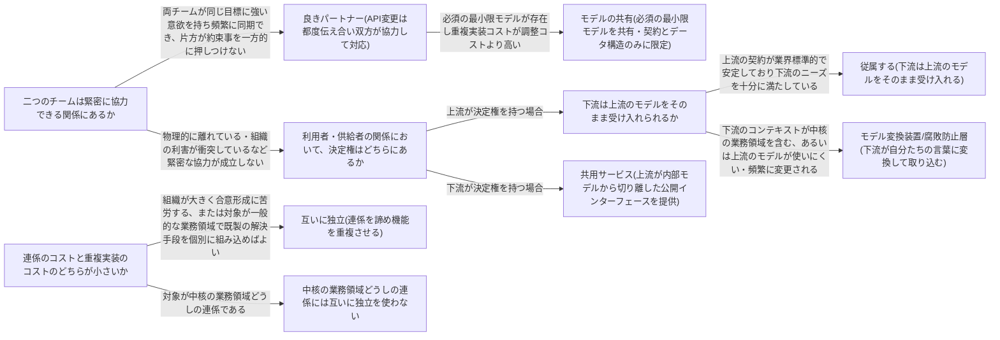

# context-integration

---

## 概要

### この概念が答える判断

- 複数の境界づけられたコンテキストが同じ業務を跨いで協調しなければならない。どういう関係として設計すべきか
- 上流・下流のどちらのモデルを優先すべきか、決定権をどう扱うか
- 連係するコストと、機能を重複させて連係しないコストのどちらが小さいか

境界づけられたコンテキストどうしが協調するための連係パターンを、チーム間の協力関係の性質に基づいて選び分ける考え方を扱う。

---

## 原則

- 境界づけられたコンテキストは独立して進化できるべきものだが、システム全体として機能する以上、コンテキストどうしは何らかの形で連係しなければならない。
- この連係の接合部分を契約と呼ぶ。
- 契約が必要になるのは、異なるコンテキストは異なるモデル・異なる言葉を持つため、何も取り決めなければお互いの意図が正しく伝わらないからである。
- 連係の方法は無数にあるわけではなく、コンテキストを担当するチームどうしの協力関係の性質によっておおむね3つのグループに分類できる。
- 緊密に協力し合える関係(対等な協力)、一方が上流、一方が下流という力関係がある関係(利用者と供給者)、そもそも協力しないという選択(互いに独立)である。
- どの連係方法を選ぶかは技術だけの問題ではなく、チーム間の組織的な力学と協力の実態を反映した設計判断である。
- 連係方法を決めるときにコード上の実装しか見ないと、実際の協力関係と食い違ったパターンを選んでしまい、後で軋轢を生む。

---

## 分類

| 分類 | 特徴 |
|---|---|
| 良きパートナー | 両チームが同じ目標に強い意欲を持ち頻繁に同期できる対等な協力関係。API変更は都度伝え合い双方が協力して対応する |
| モデルの共有 | どちらのコンテキストにも必須の最小限モデルが存在し、重複実装コストが調整コストより高い場合に検討する。共有範囲は契約と境界を越えて渡すデータ構造だけに絞るのが理想 |
| 共用サービス | 利用者・供給者関係で下流が決定権を持つ場合。上流が外部向け公開インターフェースを内部モデルから切り離し、公開された言葉を提供することで内部実装と外部契約を別々のタイミングで変更できるようにする |
| 従属する | 上流の契約が業界標準的で安定しており下流のニーズを十分に満たす場合、下流は上流のモデルをそのまま受け入れ変換の手間をかけない |
| モデル変換装置(腐敗防止層) | 下流のコンテキストが中核の業務領域を含む、あるいは上流のモデルが使いにくい・頻繁に変更される場合、下流は自分たちのニーズに合わせてモデルを変換し外部の概念を自分のモデルに持ち込ませない |
| 互いに独立 | 連係を諦め、必要な機能をコンテキストごとに重複させる。組織が大きく合意形成に苦労する、または対象が一般的な業務領域で既製の解決手段を個別に組み込めばよい場合に選ぶ。中核の業務領域どうしの連係には使わない |

---

## 判断基準

---

## 実例

架空のレストラン予約プラットフォームには、利用者の予約受付・空席管理を担当する予約コンテキストと、仕込み量の計画・調理の進行管理を担当する厨房オペレーションコンテキストがある。当初、両コンテキストのチームは頻繁に同期を取り合い、予約APIの変更があれば厨房側チームがすぐに合わせて対応する良きパートナーの関係が成立していた。しかし事業が拡大し厨房オペレーションのチームが複数店舗展開先の別チームに分割されると、頻繁な同期が難しくなった。そこで予約コンテキストが上流、厨房オペレーションコンテキストが下流という利用者・供給者の関係に整理し直し、予約コンテキストは本日確定した予約一覧(人数・時間帯・コース種別)という外部向けの契約を、内部の予約モデル(キャンセル履歴やクレジットカード情報などを含む複雑なモデル)から切り離して提供する共用サービスを用意し、厨房オペレーション側が使いやすい公開された言葉として公開した。一方、厨房オペレーションのコンテキストが外部の食材発注サービス(他社が提供するSaaS)と連係する場面では、厨房オペレーションは中核の業務領域であり、外部サービスの発注モデル(複雑なSKUコードや外部固有の単位系)にそのまま引きずられると仕込み量というモデルの表現がゆがんでしまうため、厨房オペレーション側にモデル変換装置を置き、外部の発注モデルを厨房側の言葉(食材・分量・仕込み単位)に変換してから取り込むことにした。さらに、両コンテキストとも一般的なロギング基盤については共通サービスを作らずそれぞれが個別に既存のロギングフレームワークを組み込んでおり、これは互いに独立に相当する。

---

## アンチパターン

| アンチパターン | 問題点 |
|---|---|
| 中核の業務領域どうしの連係に「互いに独立」を使う | 中核の業務領域を重複して実装することは、その領域を最も効率的かつ最適化された方法で実装するという事業戦略に反する |
| 中核の業務領域を含む下流が上流に「従属する」 | 供給側のモデルに引きずられ、中核の課題を表現するはずのモデルがゆがんでしまう。この場合はモデル変換装置を使い、外部モデルを自分たちの言葉に変換してから取り込むべきである |
| モデルの共有範囲を広げすぎる | 共有されたモデルへの変更はすべての関係コンテキストに即座に影響する密結合を生む。共有する範囲は連係のための契約と境界を越えて渡すデータ構造だけに限定すべきであり、それ以上を共有するとコンテキストが独立して進化できるという前提が崩れる |
| 連係方法をチーム間の協力の実態と切り離して選ぶ | 連係パターンは技術的な都合だけで決まるものではない。実際には緊密な協力が成立していないのに良きパートナーを選ぶ、決定権の所在を確認せずに共用サービスとモデル変換装置を取り違えるといった選択は、いずれ組織的な軋轢として表面化する |

---

## 出典・根拠の透明性

本ファイルの原則・判断の分岐点・アンチパターンは、『ドメイン駆動設計をはじめよう』第4章が扱うコンテキスト間連係の一般原則を要約・再構成したものであり、本文の直接引用ではない。書籍固有の例示(特定の業界・特定の逸話・図版)はあえて用いず、教材専用の架空ドメイン(レストラン予約プラットフォーム)の実例に置き換えている。

---

## 関連概念

| 関連概念 | 関係 |
|---|---|
| bounded-context | 連係する境界づけられたコンテキストそのものの定義と境界 |
| subdomain | 連係方法の選択に影響する業務領域のカテゴリー(中核・一般・補完) |
| ubiquitous-language | コンテキストごとに独自に保たれる同じ言葉 |
