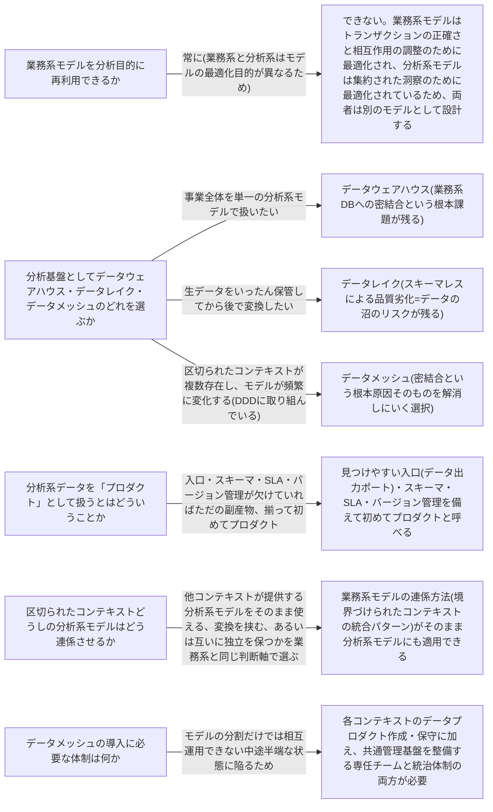

# data-mesh

---

## 概要

### この概念が答える判断

- 複数の業務領域の分析データを、全社で一つの分析基盤にまとめるべきか
- 業務系(トランザクション処理)のモデルを、そのまま分析用途に転用してよいか
- 分析用データの品質・スキーマ・バージョン管理は誰が責任を持つべきか
- 区切られたコンテキストという考え方は、分析系データの設計にも適用できるか

データメッシュは、境界づけられたコンテキストが業務系モデルの境界と保護を定義するのと同じ発想を、分析系モデルの所有権とスキーマの境界に適用する、分析系データに対するドメイン駆動設計の適用である。

---

## 原則

- 業務系モデル(トランザクション処理・OLTP)と分析系モデル(分析処理・OLAP)は設計の目的が異なる。
- 業務系モデルはヒト・モノ・コトの相互作用を正確に記録・調整するために設計され粒度は個々の記録単位で細かい。
- 分析系モデルは事業活動のパフォーマンスに関する洞察を得るために設計され、集約されているほうが効率的に扱える。
- 目的が違えば最適なモデルの形も違うため、業務系モデルをそのまま分析目的に再利用することはできない。
- 分析系モデルを構築する際によく使われる基本要素が、事実テーブル(Facts:何が起きたかを記録し追記のみで変更・削除しない)と特性テーブル(Dimensions:事実の属性・性質を記述し高度に正規化して柔軟な検索を支援する)である。
- この二種類のテーブルを事実テーブル中心に配置する構造が星形スキーマであり、特性テーブルをさらに細かく正規化したものが雪の結晶形スキーマである。
- 分析系データを扱う伝統的な基盤には二つの型があり、データウェアハウスは全社のデータを単一の分析系モデルに変換して集約する方式、データレイクは変換前の生データをいったんそのまま保管する方式である。
- どちらも事業全体のあらゆる分析ニーズを単一モデル・単一基盤で満たそうとするという同じ前提に立っており、この前提が規模の拡大とともに破綻する(データウェアハウスは業務系DBへの密結合でETLが壊れやすくなり、データレイクはスキーマ管理の欠如でデータの沼と化す)。
- データメッシュはこの前提を捨て、単一の分析系モデルを目指さず、区切られたコンテキストごとに分析系モデルを分割して所有させる。
- 分析系モデルの所有権の境界は、業務系モデルの境界(境界づけられたコンテキストの境界)と自然に一致する。

---

## 分類

| 分類 | 特徴 |
|---|---|
| データウェアハウス | 全社のデータを単一の分析系モデルに変換して集約する方式。業務系DBへの密結合によりETLが壊れやすい |
| データレイク | 変換前の生データをいったんそのまま保管する方式。スキーマ管理の欠如により規模拡大とともにデータの沼と化すリスクがある |
| データメッシュ | 単一の分析系モデルを目指さず、区切られたコンテキストごとに分析系モデルを分割して所有させる方式。所有権の境界は業務系モデルの境界と一致する |
| 事実テーブル(Facts) | 何が起きたかを記録し、追記のみで変更・削除しない分析系モデルの基本要素 |
| 特性テーブル(Dimensions) | 事実の属性・性質を記述し、高度に正規化して柔軟な検索を支援する分析系モデルの基本要素 |

---

## 判断基準

---

## 実例

架空のオンライン書店には、注文管理・在庫管理・顧客サポートという3つの境界づけられたコンテキストが存在する。当初、経営陣は全社の売上・在庫・問い合わせ状況を一つのダッシュボードで見たいという要望から、3つのコンテキストの業務系DBから夜間バッチでデータを抽出し単一の分析用データベースに変換して書き出すETLパイプラインを構築した(データウェアハウス方式)。運用を始めると、注文管理チームが業務系テーブルのカラム名を変更するたびにETLスクリプトが壊れるという問題が起きた。ETLが注文管理コンテキストの内部実装(テーブル構造)に直接依存していたためである。この課題に対しデータメッシュの発想を導入し、注文管理コンテキストのチームは自分たちの業務系モデルとは別に、注文の事実テーブル(注文ID・商品・数量・金額・発生日時)と顧客・書籍という特性テーブルからなる星形スキーマの分析系モデルを設計し、安定したスキーマを持つ分析用エンドポイントとして他コンテキストに公開する。在庫管理・顧客サポートの各コンテキストも同様に自分の分析系モデルを自分の責任で設計・公開する。経営陣が見たい全社ダッシュボードは3つのコンテキストが公開する分析系モデルを組み合わせて構築される。各コンテキストの業務系テーブルの内部変更がETLを壊す心配はなくなる一方、3つの分析系モデルの整合性・アクセス方法を揃えるためのルール作りを担う横断チームが新たに必要になる。

---

## アンチパターン

| アンチパターン | 問題点 |
|---|---|
| 業務系DBをETLが直接参照する | 業務系システムのテーブル構造は内部の実装詳細であり公開インターフェースではない。ETLがテーブルを直接参照すると、テーブル設計の些細な変更がETLを壊す。区切られたコンテキストが公開する分析用インターフェースを経由してデータを取得すべき |
| 全社の分析データを一つのモデルに統合しようとする | 全社を一つの業務系モデルで表現しようとする失敗と同じ構図であり、業務領域ごとに分析系モデルを分割しコンテキストの境界と揃えるべき |
| データレイクをスキーマレスのまま放置する | 取り込み時にスキーマ管理を行わないと規模の拡大とともにデータの意味が誰にも分からないデータの沼と化し、価値ある分析データを抽出するコストが跳ね上がる |
| 分析系データをプロダクトとして管理しない | 明確な所有者・SLA・バージョン管理を欠いた分析系データは品質と信頼性を維持できない。各コンテキストのチームが自分の分析データプロダクトに責任を持つ体制を整えるべき |

---

## 出典・根拠の透明性

本ファイルの原則・判断の分岐点・アンチパターンは、『ドメイン駆動設計をはじめよう』が扱う分析系データ設計に関する一般原則を要約・再構成したものであり、本文の直接引用ではない。書籍固有の例示(特定の業界・特定の図版)はあえて用いず、教材専用の架空ドメイン(オンライン書店の販売分析データプロダクト)の実例に置き換えている。

---

## 関連概念

| 関連概念 | 関係 |
|---|---|
| bounded-context | 分析系モデルの所有権の境界が一致する対象 |
| context-integration | 業務系モデルの連係方法が分析系モデルにも同様に適用できる |
| architecture-patterns | CQRSにより同じデータから複数の分析系モデルを並行生成できる |
| subdomain | 分析系データの分割単位は業務領域の分割に対応する |
| domain-model | 業務系モデルと分析系モデルは目的が異なり別途設計が必要 |
| event-driven-architecture | イベントは分析系モデルへの取り込み元になり得る |
