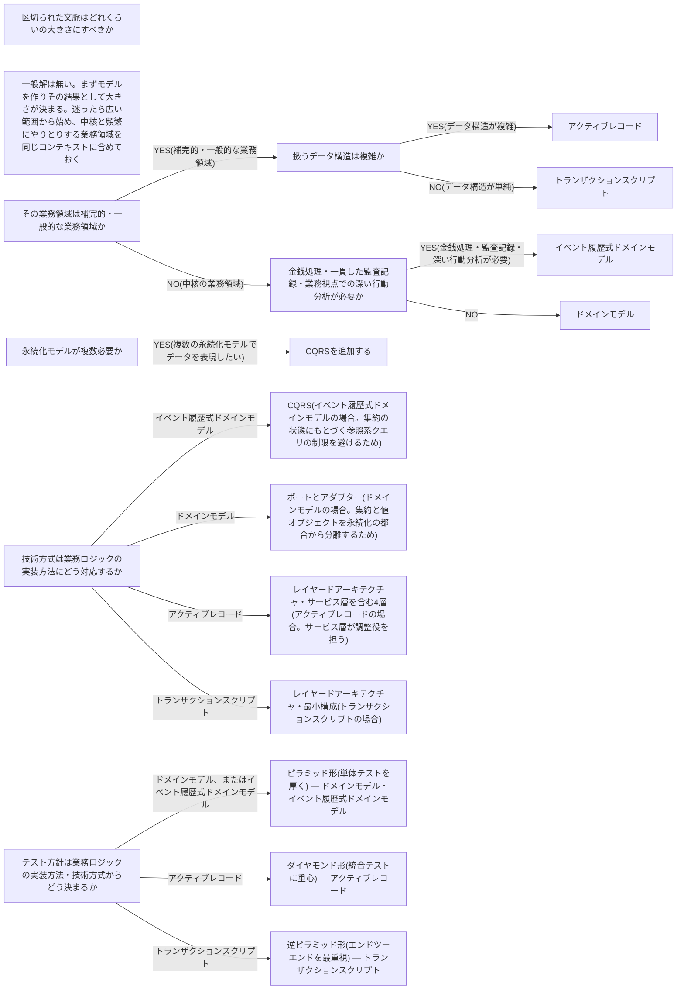

# design-heuristics

---

## 概要

### この概念が答える判断

- 区切られた文脈(コンテキスト)はどれくらいの大きさで区切ればよいか
- 業務ロジックはどう実装すればよいか(トランザクションスクリプト/アクティブレコード/ドメインモデル/イベント履歴式ドメインモデル)
- 業務ロジックの実装方法が決まったとき、技術方式(レイヤードアーキテクチャ/ポートとアダプター/CQRS)とテスト方針(ピラミッド/ダイヤモンド/逆ピラミッド)はどう決まるか
- サブドメインの分類(中核・一般・補完)と、実装方法・技術方式・テスト方針の選択に食い違いがあるとき、何を疑うべきか

コンテキストの大きさ・業務ロジックの実装方法・技術方式・テスト方針を連鎖的に決定する経験則(ヒューリスティクス)を扱う。前段の判断が後段の判断の前提になる。

---

## 原則

- これらは数学的に証明された定理ではなく経験則(ヒューリスティクス)である。
- 完全性は保証されないが実務で判断の手がかりを絞り込むのに役立つ。
- 大量の情報の中から複雑さの根源に関わる手がかりに焦点を当て、それ以外の雑音を遮断するための実践的な問題解決手法だと捉えるとよい。
- 経験則が扱う対象は、さまざまな業務活動に共通する本質的な特性(複雑か単純か、中核か周辺か)と、その特性に応じた設計判断(区切りの広さ・実装方法・技術方式・テスト方針)の2点に集約される。
- これらは連鎖しており、区切られた文脈の大きさ、業務ロジックの実装方法、技術方式、テスト方針の順に、前の判断が後の判断の前提になる。
- したがって後段の判断に迷ったときは、前段の判断(特にサブドメイン分類)を疑い直すことが多くの場合の近道になる。

---

## 分類

| 分類 | 特徴 |
|---|---|
| トランザクションスクリプト | 業務ロジックが単純でCRUD中心の補完的・一般的業務領域向け。技術方式は最小構成のレイヤードアーキテクチャ(3層)、テスト方針は逆ピラミッド形 |
| アクティブレコード | 扱うデータ構造が複雑な補完的・一般的業務領域向け。技術方式はサービス層を含む4層のレイヤードアーキテクチャ、テスト方針はダイヤモンド形 |
| ドメインモデル | 中核の業務領域向け(金銭処理・一貫した監査記録・深い行動分析が不要な場合)。技術方式はポートとアダプター、テスト方針はピラミッド形 |
| イベント履歴式ドメインモデル | 中核の業務領域向け(金銭処理・一貫した監査記録・業務視点での深い行動分析が必要な場合)。技術方式はCQRS、テスト方針はピラミッド形 |

---

## 判断基準

---

## 実例

オンライン書店の注文に関わる業務領域を経験則に沿って判定する。まず決済は中核の業務領域と判断された(この書店は独自の後払い決済プランを差別化要因にしている)。中核なので頻繁にやりとりする注文も同じコンテキストに含めることを検討し、モデルを育てながら実際に境界を引く。次に業務ロジックの実装方法を選ぶ。決済は金銭処理そのものであり一貫した監査記録も要求されるためイベント履歴式ドメインモデルを選択する。一方、同じコンテキスト内でも注文履歴の閲覧は入力データの表示が中心でユビキタス言語も一覧を返す・詳細を返すというCRUD的な説明に終始するため、こちらは単純なトランザクションスクリプトのままでよいと判断し、決済の複雑な実装を注文履歴にまで引きずられて適用しない。技術方式は実装方法から自動的に決まり、決済(イベント履歴式ドメインモデル)はCQRSを採用し、注文履歴(トランザクションスクリプト)は最小構成のレイヤードアーキテクチャのままにする。テスト方針も同様に、決済はピラミッド形(単体テストで不変条件と金額計算を厚く検証)、注文履歴は逆ピラミッド形(画面表示までのE2Eを主軸に)とする。この例が示すのは、同じコンテキストの中でも業務領域ごとに実装方法・技術方式・テスト方針が異なってよいということである。決済が中核だからといって、注文履歴にまで同じ重厚な設計を適用する必要はない。

---

## アンチパターン

| アンチパターン | 問題点 |
|---|---|
| 大きさから区切られた文脈を決める | マイクロサービスにするから小さく割る、モノリスだから大きくまとめる、のように実装形態の方針を先に決めてからモデルを当てはめるのは順序が逆である。モデルが先、大きさは結果 |
| すべての業務領域に同じ実装方法を使う | チームがイベント履歴式ドメインモデルに習熟しているからといって単純な業務領域にまでそれを適用すると、不要な複雑さと保守コストを持ち込むだけになる。業務領域ごとに経験則で使い分ける方が効率的 |
| 補完的な業務領域に凝ったドメインモデルを使う | 業務ロジックが単純な補完領域に手の込んだ設計を持ち込むと、複雑さに見合わない保守コストだけが残る |
| サブドメイン分類と実装方法の不一致を放置する | 中核なのにトランザクションスクリプト、補完なのにイベント履歴式ドメインモデルといった不一致に気づいても放置すると、後段の技術方式・テスト方針の選択もつられて不適切になる。不一致に気づいた時点でサブドメイン分類自体を疑い直すべき |

---

## 出典・根拠の透明性

本ファイルの原則・判断の分岐点・アンチパターンは、『ドメイン駆動設計をはじめよう』が扱う一般原則(区切られた文脈の大きさ・業務ロジックの実装方法・技術方式・テスト方針を連鎖的に決定する考え方)を要約・再構成したものであり、本文の直接引用・書籍固有の図版・逸話は用いていない。実例は教材専用の架空ドメイン(オンライン書店)に置き換えている。

---

## 関連概念

| 関連概念 | 関係 |
|---|---|
| subdomain | 業務領域のカテゴリー(中核・一般・補完)。本経験則の出発点 |
| bounded-context | 区切られた文脈の設計。大きさの判断の対象 |
| business-logic-simple | トランザクションスクリプト・アクティブレコードの詳細 |
| domain-model | ドメインモデルの詳細 |
| event-sourced-domain-model | イベント履歴式ドメインモデルの詳細 |
| architecture-patterns | 技術方式(レイヤードアーキテクチャ・ポートとアダプター・CQRS)の詳細 |
