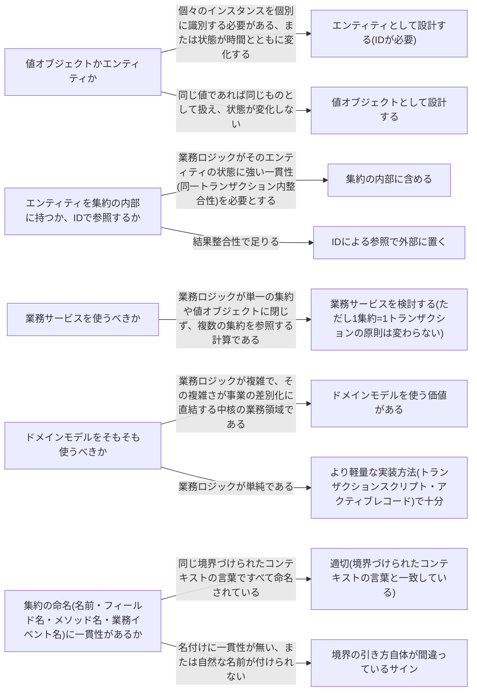

# domain-model

---

## 概要

### この概念が答える判断

- この概念は値オブジェクトか、エンティティか
- このエンティティは集約の内部に持つべきか、IDで参照すべきか
- 複数の集約にまたがる計算ロジックはどこに書くべきか
- そもそもドメインモデルを使うべきか、もっと単純な実装でよいか

複雑な業務ロジックを持つ中核の業務領域で、業務ルールをコード上に直接・明示的に表現するための実装方法。値オブジェクト・エンティティ・集約・業務サービスの4部品からなる。

---

## 原則

複雑な業務ロジックを持つ中核の業務領域では、業務ルールをコード上に直接・明示的に表現する「ドメインモデル」という実装方法が適している。ドメインモデルは4つの部品からなる。値オブジェクトはIDを持たず、フィールドの値の組み合わせで同一性が決まる。状態は不変で、値を変える操作は新しいインスタンスを生成する。金額・住所・期間のように「それ自体は誰でもない」概念に使う。エンティティはIDを持ち、状態が時間とともに変化するが、単独では実装せず必ず集約の一部として実装する。集約はデータの一貫性境界であり、1つの集約は1つのトランザクションで変更されるという原則を持つ。外部の集約はIDで参照し、直接オブジェクトとして保持しない。業務サービスは値オブジェクトや集約単体では表現しにくい、あるいは複数の集約にまたがる業務ロジックを記述する、状態を持たない部品である。この4部品の背後にある考え方は「不変条件をカプセル化することで複雑さを減らす」ことであり、値オブジェクトと集約が状態を変更できる経路を自分自身のメソッドだけに絞ることで、外側から見た自由度が下がり、振る舞いを予測しやすくなる。

---

## 分類

| 分類 | 特徴 |
|---|---|
| 値オブジェクト | IDを持たず、フィールドの値の組み合わせで同一性が決まる。状態は不変で、値を変える操作は新しいインスタンスを生成する。金額・住所・期間のような「それ自体は誰でもない」概念に使う。 |
| エンティティ | IDを持ち、状態が時間とともに変化する。単独では実装せず、必ず集約の一部として実装する。 |
| 集約 | データの一貫性境界。1つの集約は1つのトランザクションで変更される。外部の集約はIDで参照し、直接オブジェクトとして保持しない。 |
| 業務サービス | 値オブジェクトや集約単体では表現しにくい、あるいは複数の集約にまたがる業務ロジックを記述する。状態を持たない(ステートレス)。 |

---

## 判断基準

---

## 実例

架空の物流プラットフォームで配送1件を表すShipment集約を考える。値オブジェクトの例は配送先住所(Address)で、番地・郵便番号の組み合わせで意味が決まり、変更時は新しい住所オブジェクトに置き換える。エンティティの例は配送中に発生する「経由地点通過記録」で、各記録は固有のIDを持ち時刻・場所が更新されうるが、単独では存在せずShipment集約の内部にのみ存在する。集約のルートはShipment自身であり、外部(アプリケーション層)はShipmentのメソッドを経由してのみ内部の経由地点記録を追加・変更できる。業務サービスの例は複数の配送依頼をまとめて最適な配送ルートを計算する処理で、単一のShipmentの状態には属さず複数のShipmentと集荷担当者の空き状況を横断的に参照するため業務サービスとして実装する。業務イベントの例は配送完了時に発行する過去形のShipmentDelivered。配送先住所の変更を許可すべきかを検討した際、「配送中は住所変更に強い一貫性が必要か」という問いに基づき、配送中の住所変更はShipment集約のメソッドを通じてのみ許可する設計判断がなされた。

---

## アンチパターン

| アンチパターン | 問題点 |
|---|---|
| 基本データ型への執着 | 金額・住所・メールアドレスのような概念を単純な文字列や数値のまま扱うと、関連する業務ロジックがコードのあちこちに散らばる。値オブジェクトとして表現し、ロジックをその内部にカプセル化すべきである。 |
| エンティティを単独で実装する | エンティティは必ず集約の実装の一部として存在すべきであり、単独で実装するとデータの一貫性境界が定義できなくなる。 |
| 複数の集約にまたがるトランザクション | 複数の集約を単一トランザクションでまとめて変更しようとする設計は、多くの場合、集約の境界の引き方自体が間違っているサインである。境界を見直すか、結果整合性で対処すべきである。 |
| 集約を大きくしすぎる | 集約が大きくなるほど、パフォーマンスや同時実行性の問題が起きやすくなる。強い一貫性が必要なデータだけを含め、できるだけ小さく設計すべきである。 |
| 業務イベントの名前を過去形にしない | 業務イベントは実際に起きた出来事を表す。現在形や命令形の名前は、業務イベントではなく業務コマンドを意味してしまう。 |

---

## 出典・根拠の透明性

本ファイルの「原則」「判断の分岐点」「アンチパターン」は、『ドメイン駆動設計をはじめよう』第6章が扱う一般原則を要約・再構成したものであり、本文の直接引用ではない。書籍固有の例示・コードサンプルはあえて用いず、教材専用の架空ドメイン(物流プラットフォーム)の実例に置き換えている。

---

## 関連概念

| 関連概念 | 関係 |
|---|---|
| subdomain | ドメインモデルは中核の業務領域に使う。補完・一般的な業務領域にはトランザクションスクリプト等を使う |
| business-logic-simple | トランザクションスクリプト・アクティブレコード(単純な業務ロジック向け)との対比 |
| bounded-context | ドメインモデルは境界づけられたコンテキストの内部で実装する。同じ言葉による命名が必須 |
| ubiquitous-language | 集約・値オブジェクト・業務イベントのすべての名前を同じ言葉で命名する |
