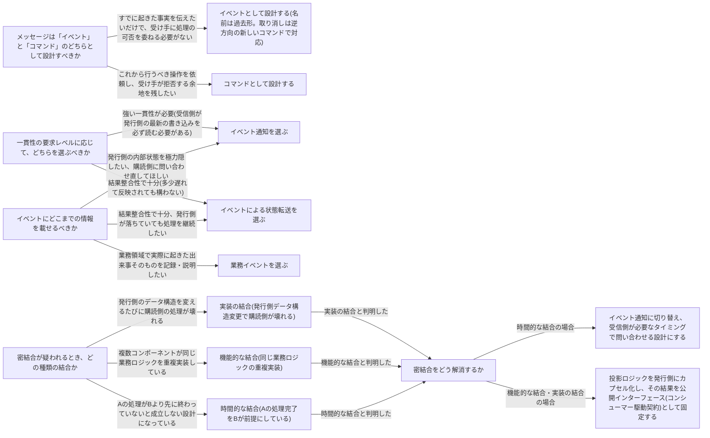

# event-driven-architecture

---

## 概要

### この概念が答える判断

- 複数のコンテキスト(サービス)が連係する必要がある。同期呼び出しではなく非同期のイベントで繋ぐべきか
- イベントを発行するとき、どこまでの情報を載せてよいか。載せすぎると何が起きるか
- 連係が知らぬ間に密結合になっている気がする。何が原因で、どう直すか
- イベント駆動型アーキテクチャとイベントソーシングは同じものか

コンポーネント間で非同期にイベントメッセージをやり取りする通信方式。境界づけられたコンテキストの公開インターフェースを設計する手段であり、コンテキスト内部の実装方式ではない。

---

## 原則

イベント駆動型アーキテクチャ(EDA)は、コンポーネント間で非同期にイベントメッセージをやり取りする通信方式である。境界づけられたコンテキストの公開インターフェースを設計する手段の一つであり、内部実装の方式ではない。これはイベントソーシング(集約の状態変化を内部でイベントとして記録する実装方式)とは範囲も役割も異なる。EDAは「コンテキストを越えてどう繋ぐか」、イベントソーシングは「コンテキストの内側でどう状態を持つか」を扱う。片方を採用したからといってもう片方を採用する必要はなく、両者は独立に選べる。EDA設計の本質は、どれだけの情報をイベントに載せるかという一点に集約される。イベントに載せる情報量の選択(イベント通知/状態転送/業務イベント)が、コンポーネント間が疎結合になるか密結合になるかを直接左右する。載せすぎれば購読側は発行側の実装詳細に依存するようになり、少なすぎれば購読側は毎回問い合わせを強いられる。

---

## 分類

| 分類 | 特徴 |
|---|---|
| イベント通知 | 購読側に「何かが起きた」ことだけ伝える最小限の情報と、詳細を取得するための参照だけを載せる。発行側の内部状態を極力隠したい場合や、購読側に常に最新状態を問い合わせ直してほしい場合に使う。 |
| イベントによる状態転送 | 変更後の完全なスナップショット、または更新されたフィールドを載せる。購読側が発行側の状態をローカルに複製し、発行側が落ちていても処理を継続できる。結果整合性で十分・耐障害性を優先する場合に使う。 |
| 業務イベント | 業務領域で実際に起きた出来事そのものを説明する情報を含めるが、発行側の内部状態をそのまま公開はしない。他の購読者がいなくても意味を持つ、業務領域の記録・説明を目的とする場合に使う。 |

---

## 判断基準

---

## 実例

集荷・配送・請求を扱う物流プラットフォームで、「配送管理」コンテキストが配送状況の変化を発行し、「通知」「請求」という別コンテキストがそれを購読する場面を考える。配送管理が発行するメッセージは「DeliveryStatusChanged」のようなイベントであり、名前は過去形にする。これは既に起きた事実であり、取り消したければ配送管理側が新しい訂正イベントを発行するしかない。通知コンテキストは配送状況が変わったことを知らせられればよく詳細な荷物情報は不要なため、イベント通知として最小限のペイロード(配送ID・新しいステータス・詳細への参照)だけを載せる。請求コンテキストは配送完了時点の重量・距離・時間帯といった課金計算に必要なデータを継続的に複製しておきたいため、イベントによる状態転送として課金計算に必要なフィールドをペイロードに含める。もし配送管理が内部処理ステップまで丸ごとイベントとして公開すると、通知・請求の両方が配送管理の内部実装に依存する実装の結合が生じる。また「請求は通知側の処理が終わったあとに集計しなければならない」という順序前提を待機時間の調整だけで担保しようとすると時間的な結合になり、ネットワーク遅延や障害時に破綻する。この場合、請求側がイベント通知を受け取った際に必要になったタイミングで配送管理に最新状態を問い合わせる設計に直す。

---

## アンチパターン

| アンチパターン | 問題点 |
|---|---|
| 業務イベントをそのまま他コンテキストとの通信に使う | 発行側の内部状態を説明しきる情報を含む業務イベントを無制限に公開すると、購読側は実装の詳細に密結合する。公開する業務イベントを絞り込むか、イベント通知・状態転送に置き換えるべきである。 |
| 遅延(待機時間)で時間的な結合を解決しようとする | 「一定時間待てば先行処理が終わっている」という前提は、ネットワーク遅延・高負荷・障害のもとで容易に破綻する。受信側が必要になったときに問い合わせる設計に変えるべきである。 |
| イベントカテゴリーを使い分けずすべてを同じ粒度で公開する | イベント通知・状態転送・業務イベントは目的が異なる。目的を考えずに一律の粒度を選ぶと、密結合と過剰な情報公開のどちらかに寄る。 |
| EDAとイベントソーシングを同じものとして扱う | EDAはコンポーネント間の通信方式、イベントソーシングは境界づけられたコンテキスト内部の実装方式であり独立に採否を決められる。同一視すると内部実装の都合を外部インターフェースにそのまま漏らす原因になる。 |

---

## 出典・根拠の透明性

本ファイルの「原則」「判断の分岐点」「アンチパターン」は、『ドメイン駆動設計をはじめよう』が扱うイベント駆動型アーキテクチャに関する一般原則(イベントとコマンドの区別・3つのイベントカテゴリー・3種の密結合とその解消法)を要約・再構成したものであり、本文の直接引用ではない。書籍固有の実例(特定の企業シナリオやペイロード例)はあえて用いず、教材専用の架空ドメイン(物流プラットフォーム)の実例に置き換えている。

---

## 関連概念

| 関連概念 | 関係 |
|---|---|
| bounded-context | EDAは境界づけられたコンテキストの公開インターフェースを設計する手段 |
| communication | 送信箱(Outbox)・サーガ・プロセスマネージャーはEDAの信頼性を確保するための補完的な仕組み |
| event-sourced-domain-model | イベントソーシングはEDAとは異なる、コンテキスト内部の実装方式 |
| microservices | 公開インターフェースを小さく保つための連係パターンと関連する |
