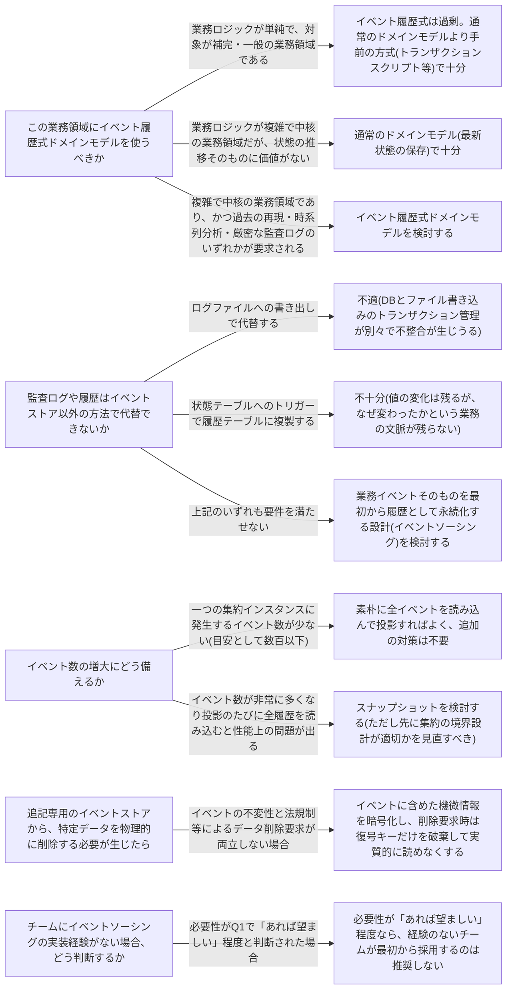

# event-sourced-domain-model

---

## 概要

### この概念が答える判断

- 集約の状態は最新値だけ保存すればよいのか、それとも状態が変化した経緯そのものを残すべきか
- 過去のある時点で集約がどんな状態だったかを、あとから正確に再現する必要があるか
- 監査ログ・分析・検索など、同じデータから複数の見方を導きたい場合、どう永続化を設計するか

集約の「今の状態」を直接保存するのではなく、状態を変化させた業務イベントの履歴を保存し、その履歴を順番に適用(投影)することで状態を再構築する設計方式。永続化されたイベント列そのものが唯一の情報源(source of truth)になる。

---

## 原則

- イベント履歴式ドメインモデルとは、集約の「今の状態」を直接保存するのではなく、状態を変化させた業務イベントの履歴を保存し、その履歴を順番に適用(投影)することで状態を再構築する設計方式である。
- 永続化されたイベント列そのものが「真実を語る唯一の情報源」(source of truth)になる。
- 従来のドメインモデルと部品(値オブジェクト・集約・業務イベント)は同じであり、対象領域も同様に複雑な業務ロジックを持つ中核の業務領域である。
- 違いは永続化の対象が「状態」か「状態が変化した経緯」かという一点にある。
- 状態は、イベント列に対して変換ロジック(投影)を順に適用することで導出される。
- 投影ロジックは一つに固定されない——同じイベント履歴から、最新状態を導く投影・検索用の索引を導く投影・分析用の集計を導く投影など、目的ごとに異なる投影ロジックを追加できる。
- これが「一つの情報源から複数の見方を導ける」という利点の根拠になっている。

---

## 分類

| 分類 | 特徴 |
|---|---|
| 最新状態投影 | イベント列から現在の状態(最新ステータス等)を導く投影ロジック。 |
| 索引投影 | 検索用の索引を導く投影ロジック。 |
| 分析投影 | 集計・分析用のビューを導く投影ロジック(例: リードタイム分析)。 |

---

## 判断基準

---

## 実例

配送1件のライフサイクルを、状態ではなくイベント履歴として持つ場合を考える。集荷完了・輸送開始・拠点通過・配達完了という時系列のイベント列(shipment-id・event・at等のフィールドを持つ)を記録する。このイベント列に対して、目的の異なる複数の投影ロジックを用意できる。現在状態の投影は最後のイベントだけを見て「配達完了」という現在ステータスを導く。経路分析の投影は「拠点通過」イベントだけを集めて、この荷物がどの中継拠点を通ったかの経路を再構成する。リードタイム分析の投影は「集荷完了」と「配達完了」の時刻差を集計し、配送全体の所要時間の傾向を分析する。同じイベント履歴から複数の投影が導けること自体がこの方式の中心的な利点である一方、イベント数が増えるほど投影の計算コストは増し、イベントの構造(スキーマ)を後から変えることは状態テーブルの列を変えるより難しいという欠点も同時に持つ。

---

## アンチパターン

| アンチパターン | 問題点 |
|---|---|
| 補完・一般の業務領域にイベント履歴式ドメインモデルを使う | 「事業活動の視点で設計判断する」という原則から外れる。目の前の課題を解決するのに必要な理由がなく、より単純な方式で解決できる場合、学習コスト・技術的複雑さ・モデル発展性の低さといった欠点だけが表面化する。 |
| ログファイルを唯一の監査ログとして使う | データベースへの書き込みとファイルへの書き込みのトランザクション管理が分離しているため、一貫性が保証されない。 |
| 状態変更の「理由」を記録しない | DBトリガーによる履歴複製は項目の変化内容だけを記録し、変更の背景にある業務の文脈を失う。理由が記録されていなければ、後から新しい投影ロジックを追加しても有効な洞察を引き出せない。 |
| イベントのスキーマ変更を状態テーブルの列変更と同じ感覚で行う | イベントは原則不変であり、一度永続化した構造を変えることは状態テーブルの変更よりはるかに難しい課題であることを軽視してはならない。 |

---

## 出典・根拠の透明性

本ファイルの「原則」「判断の分岐点」「アンチパターン」は、『ドメイン駆動設計をはじめよう』が扱う一般原則(イベントソーシングの考え方・投影・利点欠点・よくある質問)を要約・再構成したものであり、本文の直接引用ではない。書籍固有の具体的な逸話・企業名・図版は用いず、教材専用の架空ドメイン(物流プラットフォーム)の実例に置き換えている。

---

## 関連概念

| 関連概念 | 関係 |
|---|---|
| domain-model | イベント履歴式ドメインモデルの基礎となる部品(値オブジェクト・集約・業務イベント)は同じ |
| business-logic-simple | トランザクションスクリプト・アクティブレコードとの実装方式比較 |
| subdomain | イベント履歴式ドメインモデルを検討する対象は中核の業務領域に限られる |
