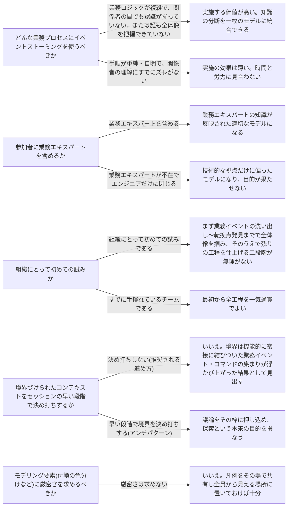

# event-storming

---

## 概要

### この概念が答える判断

- 業務プロセスの全体像を、参加者全員が同じ形で理解できていない。どう揃えるか
- 集約や境界づけられたコンテキストの区切りを、実装に着手する前にどう発見するか
- 業務エキスパートと開発者の間で、同じ言葉がまだ噛み合っていない状態をどう解消するか

業務プロセスのモデルを短時間で作り上げるための協調型ワークショップ。成果物そのものより、そのモデルを全員で一緒に作り上げる過程に主な価値がある。

---

## 原則

- イベントストーミングとは、業務プロセスのモデルを短時間で作り上げるための協調型ワークショップである。
- 成果物(できあがったモデルや境界の一覧)そのものより、そのモデルを全員で一緒に作り上げる過程に主な価値がある。
- 対象の業務領域に関わりうる関係者(開発者・業務エキスパート・プロダクトオーナー・テスター・UI/UXデザイナー・サポート担当など、知識を持つ人なら誰でも)が一堂に会し、大きな面(壁・オンラインボード)と色分けした付箋を使い、「実際に業務で何が起きているか」を時系列に沿って可視化していく。
- 同じ面に向かって同じ言葉で議論すること自体が、ユビキタス言語を形成する場になる。
- 進め方は厳密なルールではなく指針であり、状況に応じて省略・簡略化してよい。
- ただし典型的な流れは、業務イベントの洗い出しから始まり、時系列整理、コマンド・アクター・集約の発見を経て、最後に境界づけられたコンテキストの候補を見出す、という順に情報を積み重ねていく点は共通している。

---

## 分類

| 分類 | 特徴 |
|---|---|
| 業務イベントの洗い出し(発散的な洗い出し) | 参加者それぞれが思いつく限りの業務イベントを付箋に書き出す、重複や粒度のばらつきを気にしない発散フェーズ。 |
| 時系列整理 | 洗い出した業務イベントを時系列に並べ、正常系・代替シナリオ・転換イベント(プロセスの性質が明確に切り替わる瞬間)を見つける。 |
| コマンド・アクター・ポリシーの発見 | 誰が何のコマンドを実行するか、自動化ポリシー(暗黙のルール)を発見する。 |
| 集約の発見 | 一連のコマンドとイベントが密接に結びついたまとまりを集約の候補として確認する。 |
| 境界づけられたコンテキストの候補 | 機能的に密接に結びついた業務イベント・コマンドの集まりから、最終的に見出される文脈の区切り。 |

---

## 判断基準

---

## 実例

架空のレストラン予約プラットフォームを運営するチームが、「予約」まわりの業務が複雑化し、エンジニアと店舗運営担当の間で用語や前提がずれてきたことを受け、半日のイベントストーミングを企画した。参加者はソフトウェアエンジニア2名、プロダクトオーナー1名、店舗側の業務エキスパート1名、サポート担当1名の計5名。発散的な洗い出しでは「予約が仮登録された」「予約が確定された」「予約がキャンセルされた」など、粒度を気にせず付箋を貼り出した。時系列整理の段階で、正常系(仮登録→確定→来店確認)を軸に並べたところ、店舗側の業務エキスパートから「確定後にも席の変更は頻繁に起きる」という指摘が出て、代替シナリオが追加された。転換イベントとして「予約が確定された」と「来店確認が完了した」の2つが浮かび上がった。コマンドとアクターの洗い出しでは、「予約を確定する」コマンドが通常は店舗スタッフの手動実行だが一定条件下では自動確定されることが判明し、業務エキスパートも当初意識していなかった自動化ポリシーが発見された。集約の発見では「予約」に関する一連のコマンドとイベントが一つのまとまりとして扱えることが確認された一方、「無断キャンセルの記録」や「店舗の評価スコア算出」は別枠に切り出された。最終的に「予約管理」と「利用実績・評価」の2つの境界づけられたコンテキスト候補が、ワークショップを通じて参加者全員が実感した結果として発見された。

---

## アンチパターン

| アンチパターン | 問題点 |
|---|---|
| 最初から境界づけられたコンテキストを決めようとする | イベントストーミングの目的は探索と知識共有にある。境界は工程の終盤で自然に浮かび上がるものであり、最初に決め打ちすると議論をその枠に押し込め、モデリング活動そのものの価値が失われる。 |
| エンジニアだけで実施する | 業務エキスパートなど実務の知識を持つ関係者が参加しなければ、技術的な視点に偏ったモデルしかできあがらない。「同じ言葉を作る」という本来の目的も達成できない。 |
| 業務イベントを現在形・未来形で書く | 業務イベントはすでに起きた出来事を表すため必ず過去形で表現する。現在形や未来形で書くと、事実なのか仕様なのかが曖昧になり後工程の議論が混乱する。 |
| 単純で自明な業務プロセスに対して実施する | 関係者の理解がすでに揃っている、複雑さのない業務領域にイベントストーミングを持ち込んでも、時間と労力に見合う発見は得られない。 |

---

## 出典・根拠の透明性

本ファイルの「原則」「判断の分岐点」「アンチパターン」は、『ドメイン駆動設計をはじめよう』が扱うイベントストーミングの一般的な進め方・考え方を要約・再構成したものであり、本文の直接引用ではない。書籍固有の具体例・図版・逸話はあえて用いず、教材専用の架空ドメイン(レストラン予約プラットフォーム)の実例に置き換えている。

---

## 関連概念

| 関連概念 | 関係 |
|---|---|
| ubiquitous-language | イベントストーミングを通じて参加者の間に作られる同じ言葉 |
| bounded-context | イベントストーミングの終盤で発見される境界の候補 |
| domain-model | イベントストーミングで発見される集約は、ドメインモデルの集約に対応する |
| event-sourced-domain-model | イベントストーミングの成果物は、イベント履歴式ドメインモデルの実装土台として使える |
| subdomain | 業務領域の区切りを特定する手がかりとしてイベントストーミングを使うことがある |
