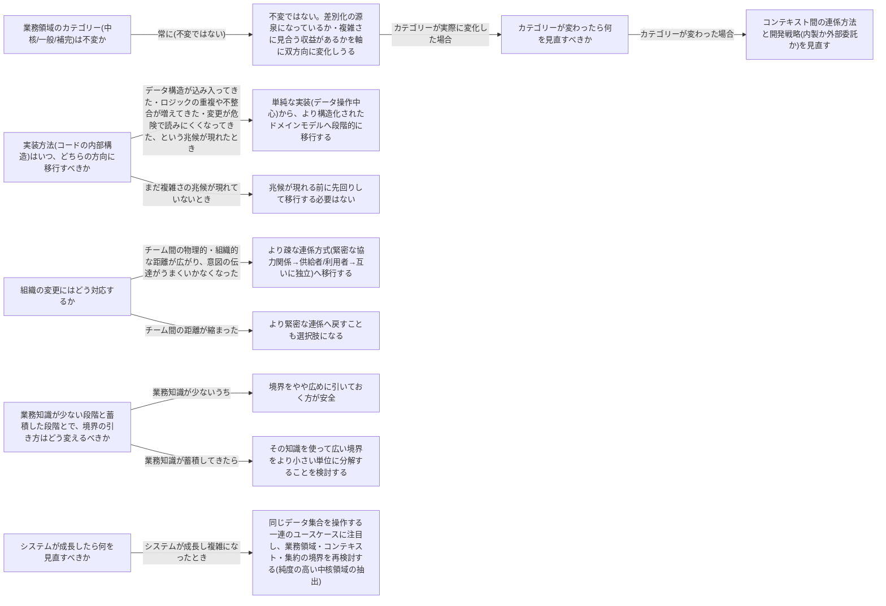

# evolving-design

---

## 概要

### この概念が答える判断

- 業務領域のカテゴリー(中核/一般/補完)は最初に決めたら固定なのか、それとも事業の変化に応じて見直すべきか
- 実装方法(単純なデータ操作中心の実装から、より構造化されたドメインモデルへ、等)は、いつ・どちらの方向に移行すべきか
- 組織やチーム構成が変わったとき、コンテキスト間の連係方法をどう見直すべきか
- 業務知識が乏しい初期段階と、知識が蓄積した段階とで、境界の引き方はどう変えるべきか
- システムが成長して複雑になってきたとき、何を見直すべきか

DDDにおける設計は一度確定させて終わりのものではなく、事業活動・組織・業務知識・システムの成長という複数の変化のベクトルに応じて継続的に見直されるべきものである。

---

## 原則

- DDDにおける設計は、一度確定させて終わりのものではない。
- 事業活動・組織・業務知識・システムの成長という複数の変化のベクトルに応じて、継続的に見直されるべきものである。
- よい設計とは「今の状況に対して適切な設計」であって、将来のあらゆる変化を先読みして作り込む設計ではない。
- 変化を恐れて設計を凍結すると、モデルは徐々に実態と乖離し、変更のたびに危険を伴うようになる。
- 同時に、変化への対応を急ぎすぎるのも誤りである。
- 重要なのは「変化にどう対応するか」よりも先に「変化の兆候をどう検知するか」であり、まだ現れていない変化を先回りして複雑な設計を持ち込むことは、それ自体が不必要な複雑さの原因になる。

---

## 分類

| 分類 | 特徴 |
|---|---|
| 業務領域カテゴリーの変化 | 中核/一般/補完は差別化の源泉になっているか・複雑さに見合う収益があるかを軸に双方向に変化しうる。 |
| 実装方法の変化 | 業務ロジックの複雑さの増大に応じて、単純なデータ操作中心の実装からドメインモデルへ段階的に移行する。 |
| 組織の変化 | チーム間の距離の変化に応じて、コンテキスト間の連係方式(緊密な協力/供給者・利用者/互いに独立)を見直す。 |
| 業務知識の蓄積 | 知識が少ない段階では境界を広めに引き、知識が蓄積したら小さい単位に分解する。 |
| システムの成長 | 同じデータ集合を操作する一連のユースケースに注目し、業務領域・コンテキスト・集約の境界を再検討する。 |

---

## 判断基準

---

## 実例

最初のFoliostoreは、書籍を自社在庫として仕入れて販売するだけの単一事業者だった。「配送」は自社倉庫からの発送のみ、「価格」は自社が決める定価のみを意味していた。事業拡大に伴い、Foliostoreは複数の出品者(サードパーティ)が自分の書籍を出品できるマーケットプレイスへと進化する。ここで「配送」「価格」の意味が二重化し、当初は自社完結の一般的なオペレーション(在庫管理)だった部分が、出品者との連係を仲介する新しい中核的関心事(マーケットプレイス基盤)へと育っていった。当初、注文処理は単純なデータ操作で足りていたが、出品者ごとの手数料計算・在庫引当ロジック・返品時の返金按分など業務ルールが積み上がるにつれ、データの不整合とロジックの重複が目立つようになり、注文まわりのロジックは不変な値を表現するオブジェクトと集約(注文)を中心にしたドメインモデルへと段階的に移行された。マーケットプレイス化に伴い出品者向け機能を担当する新しいチームが立ち上がり、当初は緊密に協力していた両チームだったが開発のリズムがずれ始めたため、「出品者向けAPI」という明示的な連係点を挟み、供給者・利用者の関係へと連係方法を見直した。事業拡大の初期段階では「出品者管理」も「注文管理」も一つの広いコンテキストとして扱っていたが、業務知識が蓄積し出品者の与信審査・契約管理という関心事が明確になった段階で、別のコンテキストとして切り出した。サービス規模が拡大するにつれ「注文」集約が配送状況・レビュー・在庫予約まで抱え込むようになり肥大化したため、同じデータ集合を操作するユースケースを洗い出した結果、「在庫予約」は独立した集約として切り出され、「注文」集約は本来の関心事(注文の成立と支払い)に絞り込まれた。

---

## アンチパターン

| アンチパターン | 問題点 |
|---|---|
| カテゴリーが変わっても設計を変えない | 中核が一般化したのに社内開発体制を維持し続けたり、補完が中核化したのに単純な実装のまま放置したりすると、競争力の獲得やコスト最適化の機会を失う。 |
| 業務知識が少ない段階で境界を細かく切りすぎる | 業務の輪郭がまだはっきりしないうちに細かい境界を引くと、後から間違いに気づいて引き直すコストが、実装済みの物理的な境界を割り直すコストとして跳ね返ってくる。最初は広めに境界を引き、知識が増えてから分割する方が安全である。 |
| 成長に応じた境界の再検討を怠る | 集約やコンテキストが「何にでも手を出して、どれも中途半端」な状態のまま放置される。定期的に「同じデータを操作する一連のユースケース」を洗い出し境界を再点検する必要がある。 |
| 実装方法の移行を、兆候が現れる前に先回りでやってしまう | まだ複雑さの兆候が現れていないのに最初から高度に構造化された実装を採用すると、不必要な複雑さを事前に持ち込むことになる。移行は兆候が現れてから行う方がよい。 |

---

## 出典・根拠の透明性

本ファイルの「原則」「判断の分岐点」「アンチパターン」は、『ドメイン駆動設計をはじめよう』第11章が扱う一般原則(業務領域カテゴリーの変化・実装方法の見直し・組織変更・業務知識・システムの成長という複数の変化のベクトル)を要約・再構成したものであり、本文の直接引用ではない。書籍固有の企業例・逸話・図版は用いず、教材専用の架空ドメイン(オンライン書店からマーケットプレイスへの進化)に置き換えている。

---

## 関連概念

| 関連概念 | 関係 |
|---|---|
| subdomain | 業務領域のカテゴリー(中核・一般・補完)とその変化 |
| bounded-context | 区切られた文脈の設計と境界の見直し |
| context-integration | カテゴリー変化・組織変更に伴う連係方法の見直し |
| design-heuristics | 業務ロジックの実装方法の選択に関する経験則 |
