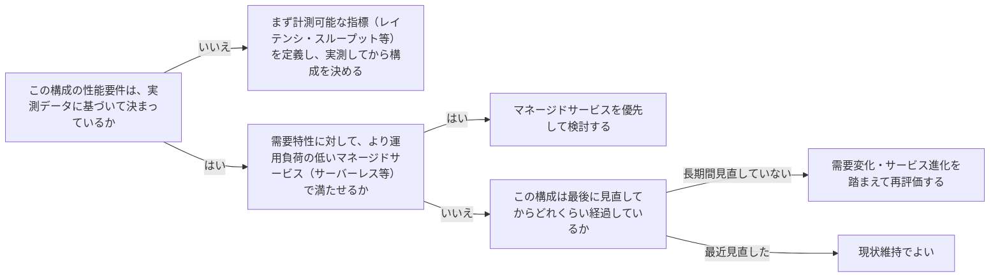

# performance-efficiency

---

## 概要

### この概念が答える判断

- 性能要件をどう決めるべきか？
- どのインスタンスタイプ・サービスを選ぶべきか、経験や勘で決めてよいか？
- 一度決めた構成は見直さなくてよいか？

性能効率とは、リソースを効率的に使い、需要の変化やアーキテクチャの進化に応じて効率性を維持する設計原則である。

---

## 原則

- 性能効率は「勘」ではなくデータに基づいて判断する。
- まず計測可能な指標（レイテンシ・スループット等）を集め、その上でアーキテクチャの選択（コンピュート・ストレージ・データベース・ネットワークの種類）を決める。
- クラウドの強みは、より高次のマネージドサービス（自前で運用しなくてよいもの）を使うことで、専門知識が無くても高度な技術（機械学習・分析等）を利用できる点にある。
- 構成は一度決めたら固定ではなく、需要の変化やクラウドサービス自体の進化に応じて定期的に見直す。
- 実験のコストが低い（環境を素早く作り直せる）というクラウドの特性を活かし、複数の構成を試してから決める、という進め方も選択肢に入る。

---

## 分類

| 分類 | 特徴 |
|---|---|
| コンピュート選択 | 需要特性（バーストが多いか常時稼働か等）に応じたインスタンス・サーバーレス等の選定 |
| ストレージ選択 | アクセスパターン（頻繁な読み書きか、アーカイブか）に応じた選定 |
| データベース選択 | データの形（リレーショナル・キーバリュー・グラフ等）に応じた選定 |
| ネットワーク選択 | レイテンシ要件・地理的分散に応じた選定 |

---

## 判断基準

---

## 実例

架空の物流プラットフォーム「ShipFast」で、配送記録の検索機能を実装する際、当初は「経験上これがよい」でリレーショナルDBの全文検索機能を使う案だったが、実際のアクセスパターン（配送IDでのピンポイント検索が9割）を計測したところ、キーバリュー型のマネージドサービスの方がシンプルかつ低コストで満たせることが分かり、構成を変更した。

---

## アンチパターン

| アンチパターン | 問題点 |
|---|---|
| 実測データなしに「経験上これがよい」で構成を決める | 実際の需要特性と合わない構成を選び、後から性能問題が発覚する |
| 一度決めた構成を見直さない | クラウドサービス自体が進化しているのに古い構成のまま使い続け、より効率的な選択肢を逃す |
| 自前運用にこだわりマネージドサービスを検討しない | 運用負荷が不必要に高くなり、専門知識が無い分野の機能を使う機会を逃す |

---

## 出典・根拠の透明性

AWS Well-Architected FrameworkのPerformance Efficiency Pillarが扱う設計原則（データ駆動の判断・マネージドサービスの活用・定期的な見直し）をAIが要約・再構成したものであり、本文の直接引用ではない。

---

## 関連概念

| 関連概念 | 関係 |
|---|---|
| reliability-targets-and-error-budgets | どちらも計測データに基づく判断という点で関連する |
