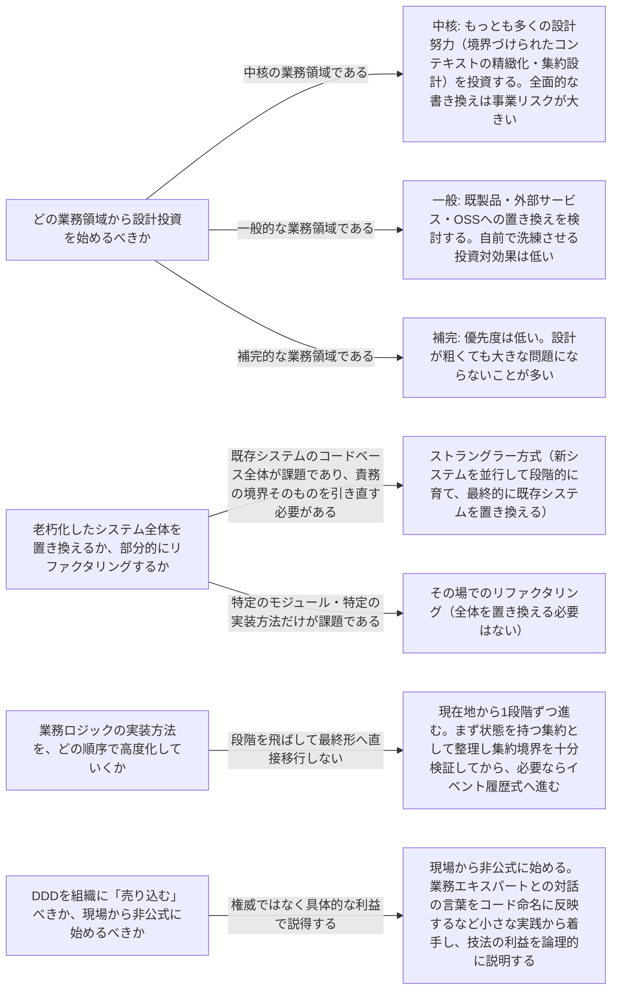

# real-world-ddd

---

## 概要

### この概念が答える判断

- 既存の(レガシーな)システムにDDDを取り入れたいが、何から手をつければよいか
- DDDの技法をすべて導入する余裕がない。一部だけ使うのはDDDとして正しいのか
- 老朽化したシステムを置き換えるとき、一気に書き直すべきか、段階的に進めるべきか
- DDDを組織にどう広めるべきか。トップダウンで導入方針を決めるべきか

既存の稼働中システムにDDDを段階的に適用するための現実的な導入原則。どの業務領域に設計投資を集中し、どのように安全に移行し、組織にどう根付かせるかを扱う。

---

## 原則

ドメイン駆動設計の適用は「すべての技法を採用する」か「まったく採用しない」かの二択ではない。DDDが提供する技法群——戦略的な分析・境界づけられたコンテキスト・集約設計・イベント履歴式モデリング等——はそれぞれ独立に価値を持ち、状況に応じて一部だけを取り入れても十分に効果がある。DDDが特に効果を発揮するのは、新規開発よりもむしろ、すでに稼働しており事業への貢献が実証済みだが技術的負債が積み上がったシステムに取り組む場面である。動いている実績があるからこそ、その設計を洗練させる投資が正当化しやすい。現実世界での導入は、常に事業活動の理解と既存システムの構造の理解という2つの調査から始まる。前者は「どの業務領域が競争優位の源泉か」を明らかにし、後者は「その業務領域が現在どう実装されているか」を明らかにする。この2つが揃って初めて、どこにどれだけの設計努力を投資すべきかが判断できる。そして改善の実行は、常に大きな一括の書き換えではなく、小さく安全な一歩の積み重ねとして進める。論理的な境界(名前空間・モジュール)を業務領域の境界に合わせるところから始め、必要に応じて物理的な境界(独立したコンテキスト・サービス)へと発展させていく。

---

## 判断基準

---

## 実例

老朽化した物流プラットフォームを例にとる。集荷・配送・請求という業務がひとつの巨大なコードベースに同居しており、「配送状況の追跡」ロジックが複数のモジュールに重複して実装されている。事業活動を調べると、「配送の効率的な経路計画」が競合他社に対する差別化要因（中核）であり、「請求書発行」は業界標準的な業務（一般）、「配送完了通知」は必須だが差別化を生まない業務（補完）だとわかった。既存システムの構造を調べると、中核であるはずの経路計画ロジックが請求処理と同じモジュールに密結合した形で実装されており、複数のチームが同じモジュールを同時に変更していることがわかった。これは中核の業務領域を複数チームが共同で触っているという不適切な関係であり、優先的に解決すべき課題として特定された。このケースではコードベース全体の責務境界を引き直す必要があると判断し、ストラングラー方式を選択する。まず「経路計画」を担う新しいコンテキストを既存システムの前段に置いたファサード越しに少しずつ追加していく。既存システムは緊急の修正を除いて機能追加を停止し、経路計画に関するリクエストは新しいコンテキストへ、それ以外は引き続き既存システムへとファサードが振り分ける。新しいコンテキストが十分に機能を引き継いだ段階で請求・通知についても同様に切り出しを進め、最終的に既存システムを退役させる。移行の初期段階では新旧コンテキストが同じデータベースを一時的に共有することも許容する——「ひとつのコンテキストにひとつのデータベース」という原則よりも、移行中の連携の複雑化を避けることを優先する判断である。

---

## アンチパターン

| アンチパターン | 問題点 |
|---|---|
| 「すべてかゼロか」の二極化思考 | DDDの技法をすべて導入しなければDDDを実践したことにならない、という考え方は誤り。状況に合わせて必要な技法だけを選んで使ってよい |
| 老朽化したシステムの全面的な書き換え | 一から書き直そうとする試みは成功率が低く経営判断としても支持を得にくい。期待できる効果よりも失敗のリスクが上回りやすい |
| 業務ロジックの実装方法を段階を飛ばして高度化する | 状態を持つ集約の段階を経ずにいきなりイベント履歴式のモデリングへ移行しようとすると、誤ったトランザクション境界（集約境界）を持ち込む危険がある |
| 権威に訴えてDDDを導入しようとする | 「本にそう書いてあるから」という説得のしかたは機能しない。それぞれの設計判断がもたらす具体的な利益を論理的に説明する方が受け入れられやすい |

---

## 出典・根拠の透明性

本ファイルの「原則」「判断の分岐点」「アンチパターン」は、『ドメイン駆動設計をはじめよう』が扱う「現実世界での適用」に関する一般原則を要約・再構成したものであり、本文の直接引用ではない。書籍固有の例示(特定の業界・特定の組織図・特定の図版)はあえて用いず、教材専用の架空ドメイン(物流プラットフォーム)の実例に置き換えている。

---

## 関連概念

| 関連概念 | 関係 |
|---|---|
| subdomain | 業務領域カテゴリー(中核・一般・補完)の特定 |
| bounded-context | 区切られた文脈の設計と、論理的境界から物理的境界への発展 |
| context-integration | コンテキスト間の連係方法の見直し |
| event-storming | 失われた業務知識を取り戻す手段 |
| evolving-design | 業務ロジックの実装方法を段階的に高度化する手順 |
| design-heuristics | 実装方法と技術方式の選択に関する経験則 |
