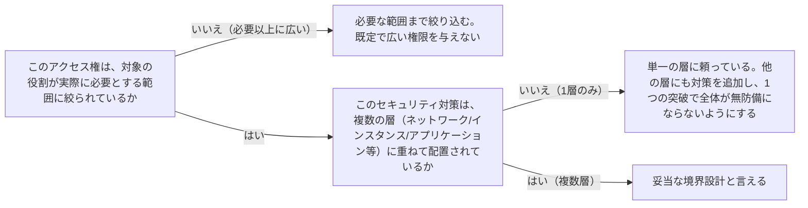

# security-boundary-and-least-privilege

---

## 概要

### この概念が答える判断

- このサービス・利用者にどこまでのアクセス権を与えるべきか？
- セキュリティ対策は1箇所に集中させてよいか、複数箇所に分けるべきか？
- 権限の見直しはいつ・どうやって行うべきか？

最小権限の原則（必要な範囲だけにアクセス権を絞る）と多層防御（複数の層でセキュリティ対策を重ねる）という、確立されたセキュリティ境界設計の原則。

---

## 原則

- 最小権限の原則とは、利用者・サービス・ロールに対して、その役割の遂行に必要な範囲のアクセス権だけを与え、それ以上は与えないという設計方針である。
- 長期間有効な認証情報（固定のパスワード・APIキー等）は漏洩時の影響が大きいため、可能な限り一時的な認証情報に置き換える。
- 多層防御とは、ネットワークの境界・ロードバランサー・個々のインスタンス・OS・アプリケーション・コードといった複数の層それぞれにセキュリティ対策を配置する考え方であり、1つの層の対策が破られても他の層が防御を続けられる状態を作る。
- 単一の防御層だけに頼ると、その層が突破された時点で無防備になる。

---

## 分類

| 分類 | 特徴 |
|---|---|
| 最小権限の原則 (Least Privilege) | 役割の遂行に必要な範囲だけのアクセス権を与える。長期間有効な認証情報は避ける |
| 多層防御 (Defense in Depth) | ネットワーク境界・ロードバランサー・インスタンス・OS・アプリケーション・コードの各層にセキュリティ対策を重ねる |

---

## 判断基準

---

## 実例

架空の物流プラットフォーム「ShipFast」で、配送状況を集計するバッチ処理サービスに、当初はデータベース全体への読み書き権限が与えられていた。実際に必要なのは配送記録テーブルの読み取りのみだったため、権限を読み取り専用・対象テーブル限定に絞り込んだ（最小権限の原則）。またAPIの防御はロードバランサーでの流量制限だけに頼っていたが、加えて各インスタンス側でも異常リクエストを検知する仕組みを追加し、ロードバランサーの防御が突破されても被害が広がらないようにした（多層防御）。

---

## アンチパターン

| アンチパターン | 問題点 |
|---|---|
| 運用の便宜のため広い権限を既定で与える | 実際に必要な範囲を超えた権限が漏洩・誤操作した際の被害範囲を不必要に広げる |
| 長期間有効な固定の認証情報をそのまま使い続ける | 認証情報が漏洩した場合、失効させるまでの間ずっと悪用され続けるリスクがある |
| 単一の防御層（例: ロードバランサーの流量制限のみ）に全面的に依存する | その層が突破・誤設定された瞬間、他に防御手段が無く無防備になる |

---

## 出典・根拠の透明性

AWS Well-Architected FrameworkのSecurity Pillarが扱う最小権限の原則・多層防御の一般原則をAIが要約・再構成したものであり、本文の直接引用ではない。単一の権威ある出典ではなく、広く確立されたクラウドセキュリティ実務知見として扱う。

---

## 関連概念

| 関連概念 | 関係 |
|---|---|
| reliability-targets-and-error-budgets | どちらもPlatformSpecが扱う非機能要件の判断基準という点で並列の関係 |
