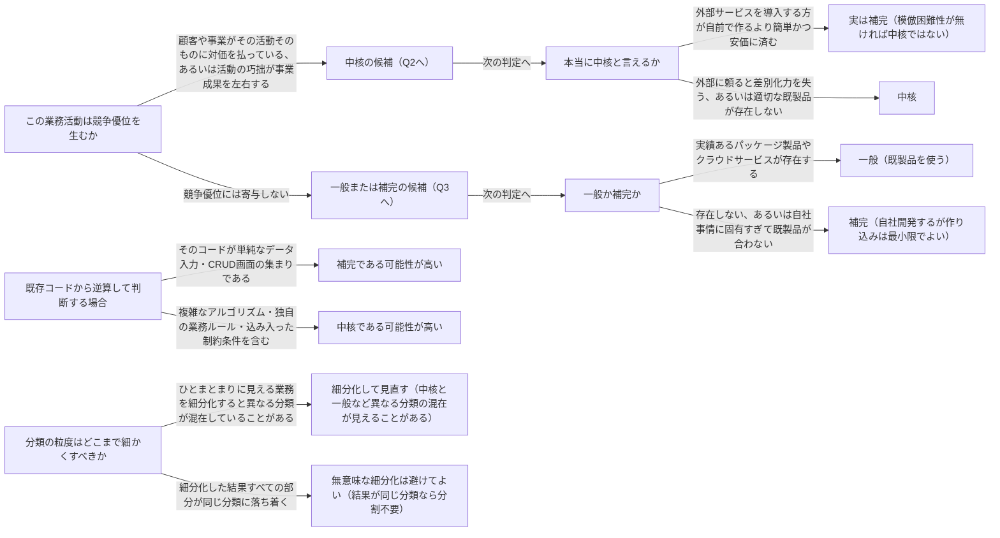

# subdomain

---

## 概要

### この概念が答える判断

- この業務活動は自社で作り込むべきか、既製品やパッケージに任せてよいか
- この業務活動は競合他社との差別化に直結しているか
- サブドメインの分類は、粒度をどこまで細かくすれば見えてくるのか
- 分類の見直しは、いつ・何をきっかけに起きるか

企業の事業活動を中核・一般・補完に分類し、どの業務活動を自社で作り込み、どれを既製品やパッケージに任せるべきかを判断するための投資判断の道具。

---

## 原則

- 業務領域（サブドメイン）とは、企業の事業活動全体を細分化した個々の業務活動の単位である。
- すべての業務領域が連動することで顧客への価値提供が成立する。
- サブドメインは中核・一般・補完の3つに分類される。
- 中核は競合他社との差別化を生み出す業務活動で、他社が容易に模倣できない独自の製品・サービス・業務プロセスが対象であり、単純であれば競合にすぐ追いつかれるため必然的に複雑になる。
- 継続的な革新が求められ「完成」がなく、社内開発が必須で、外部委託やパッケージ利用は事業の存続に関わる戦略的リスクになる。
- 一般はどの企業も同じやり方で解決している業務活動であり、競争優位は生まないが事業運営には不可欠で「何をすべきかは既にわかっている」領域である。
- 実績あるパッケージ製品やクラウドサービスで賄えることが多く、自社開発するより既製品を使う方が費用対効果に優れる。
- 補完は事業を支えるが競争優位は生まない業務活動で、ロジックが単純（多くはCRUDやETLのような定型操作）であり、他社も同じように容易に実現できる。
- 社内開発でもよいが外部委託も有力な選択肢であり、育成段階の技術者に任せる場としても使える。
- 分類は一度決めたら固定ではなく、市場環境や技術の一般化が進むことで、かつて中核だった業務が一般や補完に変わることがある（自社開発が必須だった機能が時間の経過とともに標準的なパッケージ機能に置き換わっていく、といった変化が典型例）。
- サブドメイン分類は「自社で作り込むべきか、既製品に任せてよいか」という投資判断のための道具であり、その業務活動が顧客体験・事業価値にとって重要かどうかを測る道具ではない。
- 一般・補完に分類されたからといって事業価値への貢献度が低いとは限らない——分類が問うのは「差別化に効くか」であって「重要か」ではない。

---

## 分類

| 分類 | 特徴 |
|---|---|
| 中核（Core） | 競合他社との差別化を生み出す業務活動。他社が容易に模倣できない独自の製品・サービス・業務プロセスが対象で、必然的に複雑になり継続的な革新が求められる。社内開発が必須で外部委託やパッケージ利用は事業存続に関わる戦略的リスクになる |
| 一般（Generic） | どの企業も同じやり方で解決している業務活動。競争優位は生まないが事業運営には不可欠。実績あるパッケージ製品やクラウドサービスで賄える方が費用対効果に優れる |
| 補完（Supporting） | 事業を支えるが競争優位は生まない業務活動。ロジックが単純（CRUDやETLのような定型操作）で他社も容易に実現できる。社内開発でも外部委託でもよい |

---

## 判断基準

---

## 実例

集荷・配送・請求を扱う物流プラットフォームを想定する。中核は配送ルートの最適化アルゴリズムと集荷から配達までのリアルタイム追跡で、「荷物が今どこにあり次にどう動かすのが最適か」を扱う独自ロジックであり競合との差別化そのものになる。単純な実装では他社にすぐ追いつかれるため継続的な改善が要る。一般は請求・会計処理、認証・認可で、多くの企業が同じ課題を抱えており実績あるクラウド会計サービスやID基盤で賄える。補完は配送先住所の形式検証（住所の表記ゆれをチェックし整形するだけの機能）で、ロジックは単純なルールの集まりであり他社も同程度の労力で実現できる。ここで「顧客サポート」のような大きな括りをそのまま一つの分類にあてはめると誤りやすい。物流プラットフォームの「配送サポート窓口」は、内部では「どの担当者に案件を割り振るか」という判断ロジックは差別化に関わるため中核である一方、「電話をかける・記録する」という定型作業は一般、「シフト管理」は補完、というように異なる分類が混在している。細分化して初めてこの違いが見える。逆に、ある社内ヘルプデスクシステムを「チケット管理」「検索」「通知」に分割してみても、分割後の全パーツが同じく一般に分類されるなら、その分割は設計判断を何も変えない無意味な細分化として避けてよい。

---

## アンチパターン

| アンチパターン | 問題点 |
|---|---|
| 中核の業務を外部委託・パッケージ購入で済ませる | 短期的にはコストを抑えられて見えるが、変更のたびに外部依存を通す必要が生じ、事業目標の実現を自社でコントロールできなくなる。長期的には事業の存続に関わるリスクになる |
| 組織図や部門名だけでサブドメインを決める | 部門名の単位は粗すぎる判断になりやすい。重要な違いは業務の細部に隠れており、細分化して初めて中核・一般・補完の混在が見えてくる |
| 意味のない細分化をやりすぎる | 分割した結果すべての部分が分割前と同じ分類に落ち着くなら、その分割は設計判断を何も変えていない。分割してもしなくても扱いが同じなら細分化はやめてよい |

---

## 出典・根拠の透明性

本ファイルの「原則」「判断の分岐点」「アンチパターン」は、『ドメイン駆動設計をはじめよう』第1章が扱うサブドメインの一般原則（中核・一般・補完の3分類とその判断基準）を要約・再構成したものであり、本文の直接引用ではない。書籍固有の実例（特定業界の企業例・図版）はあえて用いず、教材専用の架空ドメイン（物流プラットフォーム）の実例に置き換えている。

---

## 関連概念

| 関連概念 | 関係 |
|---|---|
| business-domain | サブドメインを含む事業全体の領域 |
| bounded-context | サブドメインをソフトウェアとして実装する境界 |
| subdomain-evolution | サブドメインのカテゴリーは変化する（中核→一般など） |
