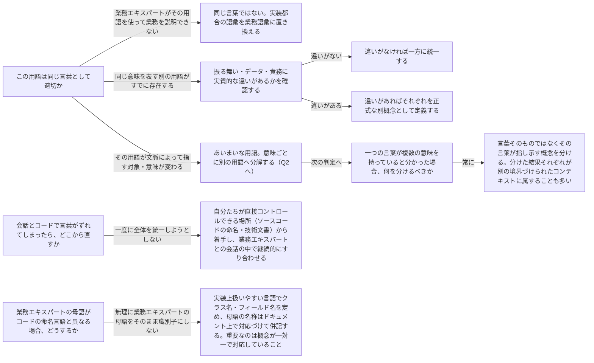

# ubiquitous-language

---

## 概要

### この概念が答える判断

- この用語は業務エキスパートに通じる言葉になっているか、それとも技術者だけの隠語になっていないか
- 同じ綴りの言葉が、部署や工程によって微妙に違う意味で使われている。分けるべきか、そのままでよいか
- 会話・要件定義・テスト・コードで、言葉の使い方がずれてきた。何から手をつけるべきか

業務エキスパートと開発者が同じ語彙で事業活動を語れる状態を作り、維持するための原則。会話・要件・テスト・コードの言葉の一貫性を扱う。

---

## 原則

- 同じ言葉とは、業務エキスパートと開発者が同じ語彙・同じ言い回しで事業活動を語れる状態を指す。
- 業務知識が要求分析担当者やプロダクト責任者といった「翻訳者」を経由して開発者に伝わるほど、伝聞のたびに意図が少しずつ欠落し、最終的に業務課題を解いていないソフトウェアができあがる。
- 同じ言葉は、この翻訳の連鎖そのものを断ち切るための手法である。
- 同じ言葉が成立するための条件は次の3つに要約できる。
- 第一に業務用語のみで構成すること——シングルトンやファクトリーパターンのような実装都合の語彙を持ち込まず、業務エキスパートが理解できない語は同じ言葉ではない。
- 第二に一語一義（一貫性）——一つの用語には一つの意味しか持たせず、同じ綴りの言葉が文脈によって違う意味を指すなら、その言葉はすでに複数の概念を隠し持っている。
- 第三に同義語を作らないこと——同じ意味を指す語が複数あるなら一つに統一するが、指しているものの振る舞いや責務が実際に異なるならあえて別語を立てるべきであり、これは同義語の乱立ではなく正しい書き分けである。
- 同じ言葉は一度整えれば終わりではなく、会話・要件・テスト・コードのすべての場所で同時に育て続ける対象である。

---

## 分類

同じ語彙を維持するという原則そのものに下位分類は無い。

---

## 判断基準

---

## 実例

オンライン書店で「注文（Order）」という言葉を例に考える。マーケティング担当者が「注文」と言うとき、それは主に「顧客が購入の意思表示をした事実」を指す——キャンペーンの効果測定やレコメンドの起点として関心があるのは注文が確定した瞬間そのものである。一方、物流担当者が「注文」と言うとき、関心があるのは「今どの倉庫にあり、いつ出荷され、いつ届くか」という状態の推移である。前者にとって注文は確定した時点で完結する事実であり、後者にとって注文は出荷準備中・出荷済み・配達完了と状態を遷移し続けるモノである。これは文脈によって指す対象が変わるあいまいな用語の典型であり、両者を無理に一つの「Order」概念に押し込めるのではなく、マーケティング視点の「注文（購入イベントの記録）」と物流視点の「出荷（配送状態を持つモノ）」を、それぞれ別の言葉として書き分けるべき状況である。どちらの言葉を採用するにせよ、「マーケティング担当者が話す注文」と「物流担当者が話す注文」が同じ一語で指されている限り、開発者はどちらの意味でその語が使われているかを都度推測せざるを得ず、これ自体が同じ言葉が壊れているサインである。

---

## アンチパターン

| アンチパターン | 問題点 |
|---|---|
| 翻訳者を間に挟む | 業務エキスパートと開発者の間に要件定義担当者やプロダクト責任者を挟み、両者が直接対話しない状態。伝聞のたびに意図が変質し、同じ言葉が育つ機会そのものが失われる |
| コードだけを業務語彙に合わせる | 会話やドキュメントでは別の言い回しを使いながらコードの識別子だけを業務用語にする。会話とコードの言葉がずれると議論の内容とコードの振る舞いを突き合わせられなくなる |
| あいまいな用語をそのままモデル化する | 文脈によって意味が変わる用語に気づきながら分解せずに一つのクラス・一つのフィールドとして実装してしまう。意味の衝突がそのままバグや設計の混乱として表面化する |

---

## 出典・根拠の透明性

本ファイルの「原則」「判断の分岐点」「アンチパターン」は、『ドメイン駆動設計をはじめよう』が扱う同じ言葉（ユビキタス言語）に関する一般原則を要約・再構成したものであり、本文の直接引用ではない。書籍固有の実例（特定業界の逸話・図版）はあえて用いず、教材専用の架空ドメイン（オンライン書店）の実例に置き換えている。

---

## 関連概念

| 関連概念 | 関係 |
|---|---|
| domain-expert | 同じ言葉の源泉。業務エキスパートの用語と考え方がベース |
| bounded-context | 同じ言葉が有効な範囲を定義する境界 |
| business-domain | 同じ言葉が対象とする事業活動の全体像 |
