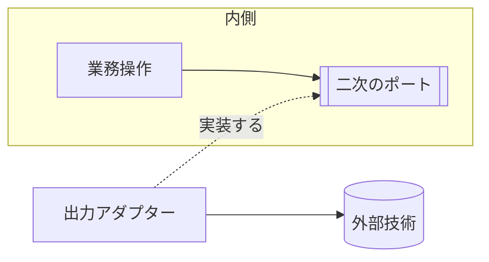

# 依存の向きと反転

## 概要

**依存は外側から内側へ向き、内側が外側を必要とするときだけ反転させる。**

**反転は、二次の相手に向かう側にだけ在る。**
原文が反転を語るのは、そこ1か所だけである——
`These show how to create swappable **secondary actor** adapters`。
一次の相手（向こうが会話を始める側）には、反転が要らない。

## 構成要素

| 要素 | 責務 | 知ってよいもの | 知ってはならないもの |
|---|---|---|---|
| 内側 | 業務の判断を持つ（業務モデル・業務操作）。**入出力をしない** | 言語の標準機能 | 外部技術、外側の要素 |
| 外側 | 外部との入出力を持つ（入力アダプター・出力アダプター） | 内側、外部技術 | ─ |
| **一次のポート** | **向こうが始める会話の形。**外の技術を知らない | 内側 | 実装技術 |
| 二次のポート | 内側が外側へ求める機能の宣言 | 内側 | 実装技術 |

## 依存の許可

| 参照元 ＼ 参照先 | 内側 | 外側 | 一次のポート | 二次のポート |
|---|---|---|---|---|
| 内側 | 可 | 不可 | 可 | 可 |
| 外側 | 可 | **アダプターどうしは不可** | 可 | 可（満たす） |
| 一次のポート | 可 | 不可 | ─ | 不可 |
| 二次のポート | 可 | 不可 | 不可 | ─ |

**アダプターどうしは、互いを知らない。**
1つのポートに複数のアダプターが差さるので（`There will typically be multiple adapters for any one port`）、
**片方が片方を参照すると、差し替えたときに巻き込まれる。**
共有したいものは、アダプターの共通置き場へ出す。

## 依存関係図

**宣言は内側、実装は外側に置く。**
この分離が反転であり、破線の矢印がその実装を表す。
**これは二次の側だけの話である。**一次の側は、アダプターがポートの形へ写して渡すだけで、反転しない。

## 境界を越えるデータ

| 境界 | 渡す形 | 変換する場所 |
|---|---|---|
| 外部 → 入力アダプター | 接続先の生の形式 | 入力アダプター |
| 入力アダプター → 一次のポート | 一次のポートが定める型 | 変換しない |
| 内側 → 二次のポート | 業務モデルの型 | 変換しない |
| 二次のポート → 外部技術 | 技術固有の形式 | 出力アダプター |

## 違反したとき

| 違反 | 現れ方 | 直し方 |
|---|---|---|
| 内側が外部技術の型を引数に取る | 依存検査で落ちる | 業務モデルの型へ置き換え、変換を外側へ移す |
| ポートが技術の語彙で宣言されている | レビューで気づく | 業務の語彙へ言い換える |
| 反転が無いまま、内側が外側を直接呼ぶ | 依存検査で落ちる | 二次のポートを立てる |
| **内側が入出力をする** | 依存検査で落ちる | **入出力を外側へ上げる。**`main` は直接テストできないので、そこにロジックを残すと確かめられなくなる |
| **アダプターどうしが依存する** | 依存検査で落ちる | 共有部分を、アダプターの共通置き場へ出す |

## 適用範囲外

| 何を | どの層が決めるか |
|---|---|
| 依存の向きを何で守るか（可視性・モジュール） | 言語 × アーキテクチャ |
| ディレクトリ構成 | 言語 × アーキテクチャ |
| 反転を実行時にどう結ぶか | 言語 × アーキテクチャ |

## 委譲する判断

| 委譲する判断 | 委譲先 | 委譲する理由 |
|---|---|---|
| ポートの粒度（1機能ごとか、まとめるか） | 用途 | 外部との契約の数で決まる |
| アダプターの共通置き場をどこに作るか | 言語 × アーキテクチャ | 言語の仕組みで変わる |

## 出典

| 種類 | 原典 | 版・取得日 | 何を裏づけるか |
|---|---|---|---|
| 文献 | Alistair Cockburn "Hexagonal Architecture" https://alistair.cockburn.us/hexagonal-architecture/ | 2026-09-07 全文で確認（`These show how to create swappable secondary actor adapters`） | 反転は、二次の相手に向かう側にだけ在る |
| 文献 | 同上（`There will typically be multiple adapters for any one port`） | 2026-09-07 | 1つのポートに複数のアダプターが差さる |
| 規格 | The Rust Programming Language ch.12 https://doc.rust-lang.org/book/ch12-03-improving-error-handling-and-modularity.html | 2026-09-07 全文で確認（`this structure lets you` 1か所。原文は `Because you can’t test the `main` function directly, this structure lets you test all of your program’s logic by moving it out of the `main` function`） | 入出力を外側へ上げる理由 |