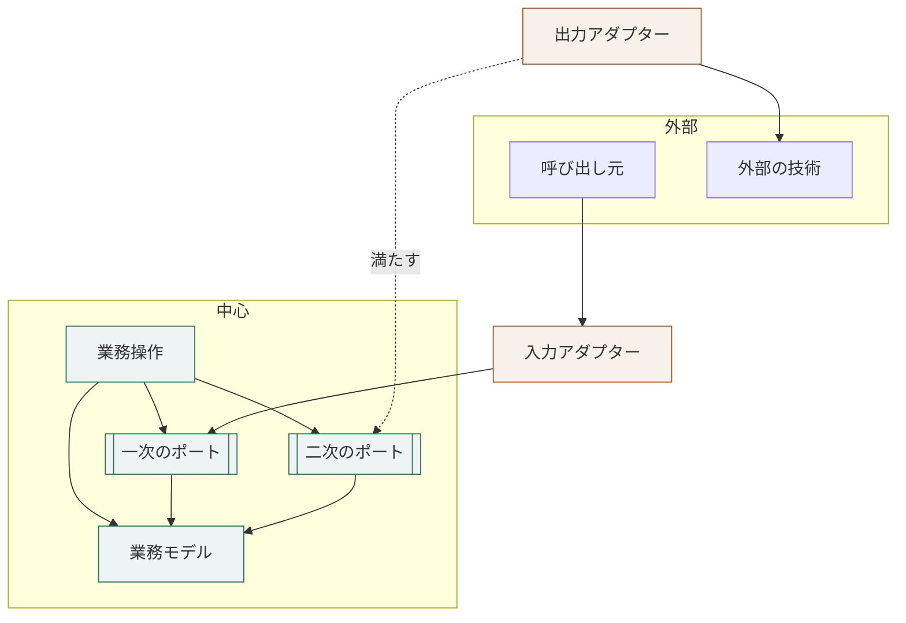

# ヘキサゴナル構成の構成要素

## 層との関係

**層の絵で描けないのではない。**
原文は同じ構成を3層の絵に対応づけている——
`Figure 3 shows the same application mapped to a three-layer architectural drawing`。
`In the three-layer architecture, FIT sits in the top layer and the mock sits in the bottom layer`。

**否定しているのは、一列に並べた絵だけである。**理由は2つ書かれている。

| 原文 | 何が起きるか |
|---|---|
| `people tend not to take the "lines" in the layered drawing seriously. They let the application logic leak across the layer boundaries` | 線が守られず、業務の判断が外側へ漏れる |
| `there may be more than two ports to the application, so that the architecture does not fit into the one-dimensional layer drawing` | **ポートは2つとは限らない。**3つ以上あると一列に並ばない |

**六角形は、その一列の絵から離れるために選ばれている**——
`to get away from the one-dimensional layered picture and all that evokes`。

**だからこの規約は、要素を上下に並べた「層」として数えない。**
**先に決まるのは内と外であり、ポートの数は決まっていない**——
`It doesn't appear that there is any particular damage in choosing the "wrong" number of ports`。

## 概要

**業務の判断を中心に置き、外部との入出力を外周へ寄せる。**

原文が要点を1つに絞っている——`the primary purpose of this pattern is to focus on the
inside-outside asymmetry, pretending briefly that all external items are identical
from the perspective of the application`。**内と外の非対称だけが要点である。**

## 構成要素

| 要素 | 責務 | 知ってよいもの | 知ってはならないもの |
|---|---|---|---|
| 業務モデル | 業務の語彙・規則・不変条件を持つ | 言語の標準機能 | 他のすべての要素、外部技術 |
| 業務操作 | 業務の手続きを組み立てる | 業務モデル、ポート | アダプターの実装 |
| **一次のポート** | **向こうが始める会話1つぶんの形を定める。**外の技術を知らない | 業務モデル | 実装技術 |
| 二次のポート | **こちらが駆動する会話**の形を宣言する | 業務モデル | 実装技術 |
| 入力アダプター | 外部からの呼び出しを、一次のポートの形へ写す | 一次のポート、外部技術 | 業務モデルの内部 |
| 出力アダプター | 二次のポートを、実装技術で満たす | 二次のポート、外部技術 | 業務操作の内部 |

**ポートは、会話の目的で分かれる。方向で分かれるのではない。**
原文——`A port identifies a purposeful conversation`。
一次と二次を分けるのは、**誰が会話を始めるか**である——
`The distinction between primary and secondary lies in who triggers or is in charge of the conversation`。

**ポートの protocol は、API の形をとる。**
原文——`The protocol takes the form of an application program interface (API)`。
**呼び出しの約束の型（`trait` ・ `interface`）とは書いていない。**
言語のどの仕組みで表すかは、下の層が決める。

**二次のポートは、無くてよい。**
原文はポートの数を定めていない——
`It doesn't appear that there is any particular damage in choosing the "wrong" number of ports,
so that remains a matter of intuition`。
外へ何も求めない道具は、一次のポートだけを持つ。

## 依存の許可

| 参照元 ＼ 参照先 | 業務モデル | 業務操作 | 一次のポート | 二次のポート | 入力アダプター | 出力アダプター |
|---|---|---|---|---|---|---|
| 業務モデル | ─ | 不可 | 不可 | 不可 | 不可 | 不可 |
| 業務操作 | 可 | ─ | 可 | 可 | 不可 | 不可 |
| 一次のポート | 可 | 不可 | ─ | 不可 | 不可 | 不可 |
| 二次のポート | 可 | 不可 | 不可 | ─ | 不可 | 不可 |
| 入力アダプター | 可 | 可 | 可 | 不可 | ─ | 不可 |
| 出力アダプター | 可 | 不可 | 不可 | 可（満たす） | 不可 | ─ |

**1つのポートに、アダプターは何個でも差さる。**
原文——`There will typically be multiple adapters for any one port,
for various technologies that may plug into that port`。

## 依存関係図



**矢印の向きが依存の向きである。**実線は参照、破線は「満たす」を表す。
**出力アダプターから二次のポートへの矢印だけが逆を向く**のは、そこだけ依存が反転しているためである。
**一次の側には反転が無い**——入力アダプターが、一次のポートの形へ写して渡すだけである。

## 境界を越えるデータ

| 境界 | 渡す形 | 変換する場所 |
|---|---|---|
| 呼び出し元 → 入力アダプター | 外部の形式（JSON など） | 入力アダプター |
| 入力アダプター → 一次のポート | 一次のポートが定める型 | 入力アダプター |
| 業務操作 → 二次のポート | 業務モデルの型 | 変換しない |
| 二次のポート → 出力アダプター | 業務モデルの型 | 出力アダプター |

## ディレクトリ構成

```
src/
  model/        業務モデル
  application/  業務操作と、ポートの宣言
  adapter/
    inbound/    入力アダプター
    outbound/   出力アダプター
```

**この並びは、一例である。**言語のどの仕組みで表すかは下の層が決める——
Rust なら crate で分ける（`lang.rust + arch.hexagonal` の規約）。

## 違反したとき

| 違反 | 現れ方 | 直し方 |
|---|---|---|
| 業務モデルが外部技術を参照する | 静的解析の依存検査で落ちる | 技術を二次のポートの背後へ移す |
| 業務操作が出力アダプターを直接参照する | 同上 | 二次のポートを立て、実装をアダプターへ移す |
| **接続先ごとのアダプターが、業務操作を参照する** | 同上 | **アダプターは一次のポートの形へ写すだけにする** |
| 入力アダプターが業務モデルを組み立てる | レビューで気づく | 組み立てを業務操作へ移す |

## 適用範囲外

| 何を | どの層が決めるか |
|---|---|
| 構成要素を言語のどの仕組みで表すか | 言語 × アーキテクチャ |
| どの構成要素を実際に持つか | 用途 |
| 構成要素をまたぐ呼び出しの同期・非同期 | 用途 |

## 委譲する判断

| 委譲する判断 | 委譲先 | 委譲する理由 |
|---|---|---|
| ポートの置き場所 | 言語 × アーキテクチャ | 宣言できる場所は言語の仕組みで変わる |
| **ポートを、言語のどの仕組みで表すか** | 言語 × アーキテクチャ | **原文は `API の形` としか言っていない。**列挙と `match` でも、`trait` でも満たせる |
| 業務操作の粒度 | 用途 | 外部との契約の粒度で決まる |

## 出典

| 種類 | 原典 | 版・取得日 | 何を裏づけるか |
|---|---|---|---|
| 文献 | Alistair Cockburn "Hexagonal Architecture"<br>https://alistair.cockburn.us/hexagonal-architecture/ | 2026-09-07 全文で確認（`port` 76か所 ・ `adapter` 53か所） | ポートとアダプター |
| 文献 | 同上（`A port identifies a purposeful conversation`） | 2026-09-07 | ポートは会話の目的で分かれる |
| 文献 | 同上（`The distinction between primary and secondary lies in who triggers or is in charge of the conversation`） | 2026-09-07 | 一次と二次の分け方 |
| 文献 | 同上（`It doesn't appear that there is any particular damage in choosing the "wrong" number of ports`） | 2026-09-07 | 二次のポートは無くてよい |