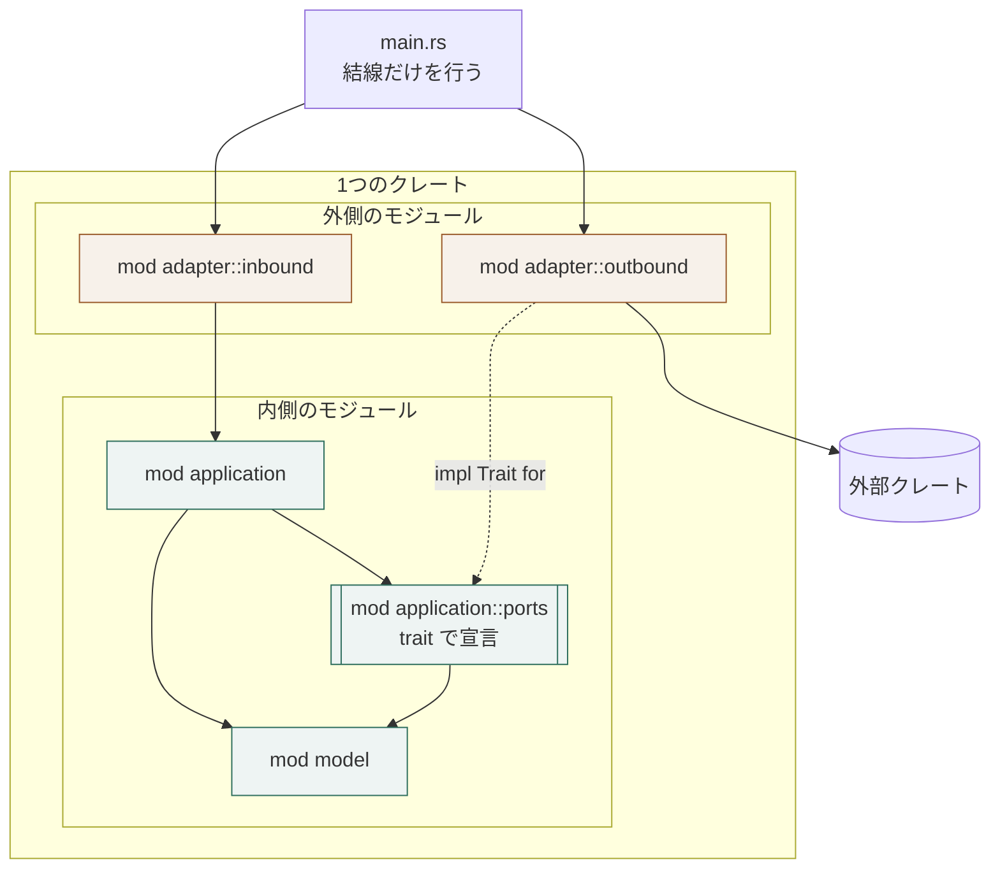

# Rust における構成要素の表し方

## 概要

**構成要素をモジュールかクレートで表し、依存の向きをその宣言で守る。**

**分け方は2通りある。**どちらを採るかは用途が決める（`適用範囲外`）。

| 分け方 | 依存の向きを守る手段 | 向く場面 |
|---|---|---|
| 1つのクレートの中で、モジュールに分ける | 可視性（`pub(crate)`）とモジュールの階層 | 要素が少なく、1つの成果物で足りるとき |
| **クレートに分ける（`workspace`）** | **`Cargo.toml` の依存宣言** | **アダプターが接続先ごとに増えるとき。**宣言に無い依存は、そもそも書けない |

## 構成要素

| 要素 | 責務 | 知ってよいもの | 知ってはならないもの |
|---|---|---|---|
**モジュールに分ける場合**

| 要素 | 責務 | 知ってよいもの | 知ってはならないもの |
|---|---|---|---|
| `model` モジュール | 業務モデル | 標準ライブラリ | 他のモジュール、外部クレート |
| `application` モジュール | 業務操作とポートの宣言 | `model` | `adapter` |
| `application::ports` | 二次のポートをトレイトで宣言する | `model` | 実装クレート |
| `adapter::inbound` | 入力アダプター | `application`、外部クレート | `model` の非公開要素 |
| `adapter::outbound` | 二次のポートの実装 | `application::ports`、外部クレート | `application` の内部 |

**クレートに分ける場合**

| 要素 | 責務 | 知ってよいもの | 知ってはならないもの |
|---|---|---|---|
| ポートの形のクレート | ポートが定める型を持つ。**形の正が1か所に在る**（`HX-TB-05`） | 標準ライブラリ、直列化の基盤 | 他のすべて、外部技術、接続先 |

**ポートが2つ以上あるなら、形のクレートも2つ以上になる。**
`HX-TB-05` が求めるのは「1つの形の正が1か所に在る」ことであって、
すべての形が1つのクレートに集まることではない。
**依存が標準ライブラリだけで済むクレートは、アダプターではなく形である。**

| 業務操作のクレート | ポートの形の上の処理 | ポートの形 | アダプター、外部技術 |
| アダプターのクレート（接続先ごと） | 外部の形式を、ポートの形へ写す関数を公開する | ポートの形、その接続先の技術 | 業務操作、他のアダプター |
| ポートのクレート | **アダプターを集め、同じ形で呼べるようにする**（`HX-TB-06`） | ポートの形、アダプター | 業務操作の内部 |
| 入力アダプターのクレート | 外部からの呼ばれ方を、一次のポートの呼び出しへ写す。**接続の仕方ごとに1つ** | すべて | ─ |

## 表し方の対応

| 要素 | Rust の仕組み | 補足 |
|---|---|---|
| 要素 | Rust の仕組み | 補足 |
|---|---|---|
| 内側 | `model` ・ `application` モジュール、またはクレート | 外部クレートを取り込まない |
| **一次のポートの形** | **型（`struct` ・ `enum`）** | **`trait` は要らない。**向こうが会話を始めるので、反転が無い |
| **一次のポート** | **列挙と `match` による静的な振り分け** | **接続先を足すと `match` が非網羅になり、コンパイルが落ちる** |
| 二次のポート | `trait` の宣言 | 業務の語彙で名付ける |
| 二次のポートの実装 | `impl Trait for` | `adapter::outbound` に置く |
| 外側 | `adapter` モジュール、またはアダプターのクレート | 外部クレートを使ってよい唯一の場所 |
| 依存の向き | 可視性とモジュールの階層、または `Cargo.toml` の依存宣言 | 宣言に無い参照は、そもそも書けない |
| 反転の結線 | `main.rs` での注入 | **二次のポートが在るときだけ**要る |
| 型を2か所に書かない | 形の正から生成する | 手で二重に書くと、必ず片方が古くなる |

**ポートを `trait` にするか、列挙と `match` にするか。**
原文はポートの protocol を `API の形` としか定めていないので、どちらでも満たせる。
**判断は、外から接続先を足せるようにするかどうかで決まる。**
Rust の教科書が基準を書いている——
列挙は `a perfectly good solution when our interchangeable items are a fixed set of types
that we know when our code is compiled`、
トレイトオブジェクトは `sometimes we want our library user to be able to extend the set of types
that are valid in a particular situation` のときである。

## 依存の許可

| 参照元 ＼ 参照先 | `model` | `application` | `application::ports` | `adapter` |
|---|---|---|---|---|
| `model` | ─ | 不可 | 不可 | 不可 |
| `application` | 可 | ─ | 可 | 不可 |
| `application::ports` | 可 | 不可 | ─ | 不可 |
| `adapter` | 可 | 可 | 可（実装する） | ─ |

## 依存関係図



## 境界を越えるデータ

| 境界 | 渡す形 | 変換する場所 |
|---|---|---|
| `adapter::inbound` → `application` | `application` が定める入力の構造体 | `adapter::inbound` |
| `application` → `application::ports` | `model` の型 | 変換しない |
| `adapter::outbound` → 外部クレート | 技術固有の型 | `adapter::outbound` |

## ディレクトリ構成

```
src/
  main.rs                結線（依存の注入）だけを行う
  lib.rs                 モジュールの公開範囲を宣言する
  model/mod.rs           業務モデル
  application/
    mod.rs               業務操作
    ports.rs             二次のポート（trait）
  adapter/
    inbound/mod.rs       入力アダプター
    outbound/mod.rs      出力アダプター
```

**クレートに分ける場合**

```
Cargo.toml               members = ["crates/*", "adapters/*"]
crates/
  <ポートの形>/           型と、その正（schema など）
  <業務操作>/             ポートの形の上の処理
  <ポート>/               アダプターを集め、同じ形で呼ぶ
  <入力アダプター>/        バイナリを持つ。ここだけが入出力をする
adapters/
  <接続先>/               外部の形式を、ポートの形へ写す
```

**`src/lib.rs` と `src/main.rs` は Cargo の既定である**——
`The default library file is src/lib.rs. The default executable file is src/main.rs.`

## 依存の向きを守る手段

| 手段 | 内容 |
|---|---|
| 可視性 | `model` と `application` の内部は `pub(crate)` までにとどめ、外部へ公開しない |
| **依存の宣言** | **クレートに分けたなら、`Cargo.toml` に書かない依存は使えない。**外部クレートはアダプターからのみ引く |
| 結線 | 二次のポートの差し込みは `main.rs` で行い、`application` は trait だけを受け取る |
| 検査 | `cargo tree` で依存木を出し、内側に外部クレートが現れないかを見る |
| **網羅** | **一次のポートを列挙で表したなら、接続先を足すと `match` が落ちる**（`E0004`） |

## 違反したとき

| 違反 | 現れ方 | 直し方 |
|---|---|---|
| `model` が外部クレートを使う | 参照の一覧に外部クレートが出る | 二次のポートを立て、実装を `adapter::outbound` へ移す |
| `application` が具体型を受け取る | レビューで気づく | trait の引数へ替え、`main.rs` で結ぶ |
| `adapter::inbound` が `model` を組み立てる | レビューで気づく | 組み立てを `application` へ移す |

## 適用範囲外

| 何を | どの層が決めるか |
|---|---|
| クレートを分けるかどうか | 用途 |
| バイナリを何本に束ねるか | 用途 |
| 非同期にするかどうか | 用途 |
| **一次のポートを、列挙で表すかトレイトで表すか** | 用途 |

## 委譲する判断

| 委譲する判断 | 委譲先 | 委譲する理由 |
|---|---|---|
| trait を静的に解決するか、動的に解決するか | 用途 | 起動の回数と性能の要求で決まる |

## 出典

| 種類 | 原典 | 版・取得日 | 何を裏づけるか |
|---|---|---|---|
| 規格 | Rust Reference / Visibility and privacy<br>https://doc.rust-lang.org/reference/visibility-and-privacy.html | 2026-09-07 取得 | crate 内の可視性 |
| 文献 | Rust API Guidelines `C-STRUCT-PRIVATE`<br>https://rust-lang.github.io/api-guidelines/naming.html | 2026-09-07 全文で確認（`Structs have private fields`） | 欄を非公開にする |
| 規格 | Cargo Book / Package Layout<br>https://doc.rust-lang.org/cargo/guide/project-layout.html | 2026-09-07 全文で確認（`The default library file is src/lib.rs`） | `src/lib.rs` と `src/main.rs` の既定 |
| 規格 | Cargo Book / Workspaces<br>https://doc.rust-lang.org/cargo/reference/workspaces.html | 2026-09-07 全文で確認（`A workspace is a collection of one or more packages`） | クレートに分ける形 |
| 規格 | The Rust Programming Language ch.18<br>https://doc.rust-lang.org/book/ch18-02-trait-objects.html | 2026-09-07 全文で確認（`a perfectly good solution when our interchangeable items are a fixed set of types that we know when our code is compiled`） | 列挙とトレイトオブジェクトの選び方 |
| ─ | 規格 | Cargo Book / Package Layout（`Other executables can be placed in` ── 続けて `src/bin/` を挙げる）<br>https://doc.rust-lang.org/cargo/guide/project-layout.html | 2026-09-08 全文で確認 | バイナリの本数を Cargo は縛らない |
