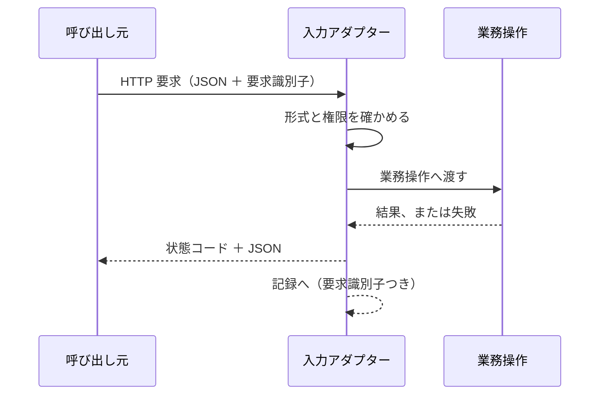

# バックエンドAPI の契約

## 概要

**呼び出し元とのやり取りを、経路・形式・状態コード・版で定める。**

## 契約の内容

| 項目 | 定め |
|---|---|
| 入力 | HTTP の要求。本文は JSON。文字符号化は UTF-8 |
| 出力 | JSON。成功も失敗も同じ形の外枠で返す |
| 成否の伝え方 | HTTP の状態コード。本文の欄では伝えない |
| 診断 | 応答に混ぜない。記録として別に出す |
| 上限 | 本文は 1 MiB。1要求の処理は 30 秒 |
| 識別 | 要求ごとに識別子を受け取り、応答と記録の両方へ載せる |

## 状態コードの対応

| 状態 | コード | 本文 |
|---|---|---|
| 成功（本文あり） | 200 | 結果 |
| 成功（作成した） | 201 | 作成した資源 |
| 入力が契約に合わない | 400 | 失敗の種別と、どの欄かの一覧 |
| 認可されていない | 401 ／ 403 | 失敗の種別のみ |
| 対象が無い | 404 | 失敗の種別のみ |
| 衝突した | 409 | 失敗の種別と、衝突した対象 |
| こちらの失敗 | 500 | 失敗の種別のみ。内部の詳細を出さない |

## やり取りの流れ

## 境界を越えるデータ

| 境界 | 渡す形 | 変換する場所 |
|---|---|---|
| 呼び出し元 → 入力アダプター | JSON | 入力アダプター |
| 入力アダプター → 業務操作 | 業務操作が定める入力の型 | 入力アダプター |
| 業務操作 → 呼び出し元 | 業務モデルの型 → 応答の型 | 入力アダプター |

## 版と互換

| 項目 | 定め |
|---|---|
| 版の示し方 | 経路に含める（`/v1/...`） |
| 互換を保つ範囲 | 欄の追加は互換とする。欄の削除・意味の変更は互換を壊す |
| 壊す変更の扱い | 新しい版を並走させ、旧版の停止日を先に知らせる |

## 違反したとき

| 違反 | 現れ方 | 直し方 |
|---|---|---|
| 失敗を 200 で返す | 呼び出し元が失敗に気づかない | 状態コードの対応表に従う |
| 内部の詳細を 500 の本文に載せる | 内部構造が外へ漏れる | 種別だけを返し、詳細は記録へ |
| 版を上げずに欄の意味を変える | 呼び出し元が壊れる | 新しい版を立てる |

## 適用範囲外

| 何を | どの層が決めるか |
|---|---|
| 業務の処理内容 | 業務モデル・業務操作 |
| HTTP を扱うライブラリ | この用途の技術構成 |

## 委譲する判断

| 委譲する判断 | 委譲先 | 委譲する理由 |
|---|---|---|
| 失敗の本文に載せる欄の詳しさ | 実装 | 呼び出し元が誰かで変わる |

## 出典

| 種類 | 原典 | 版・取得日 | 何を裏づけるか |
|---|---|---|---|
| 規格 | HTTP セマンティクス https://www.rfc-editor.org/rfc/rfc9110.txt | 2026-09-06 取得 | 状態コードの意味 |
| 規格 | 失敗の応答形式 https://www.rfc-editor.org/rfc/rfc9457.txt | 2026-09-06 取得 | 失敗の応答の形 |