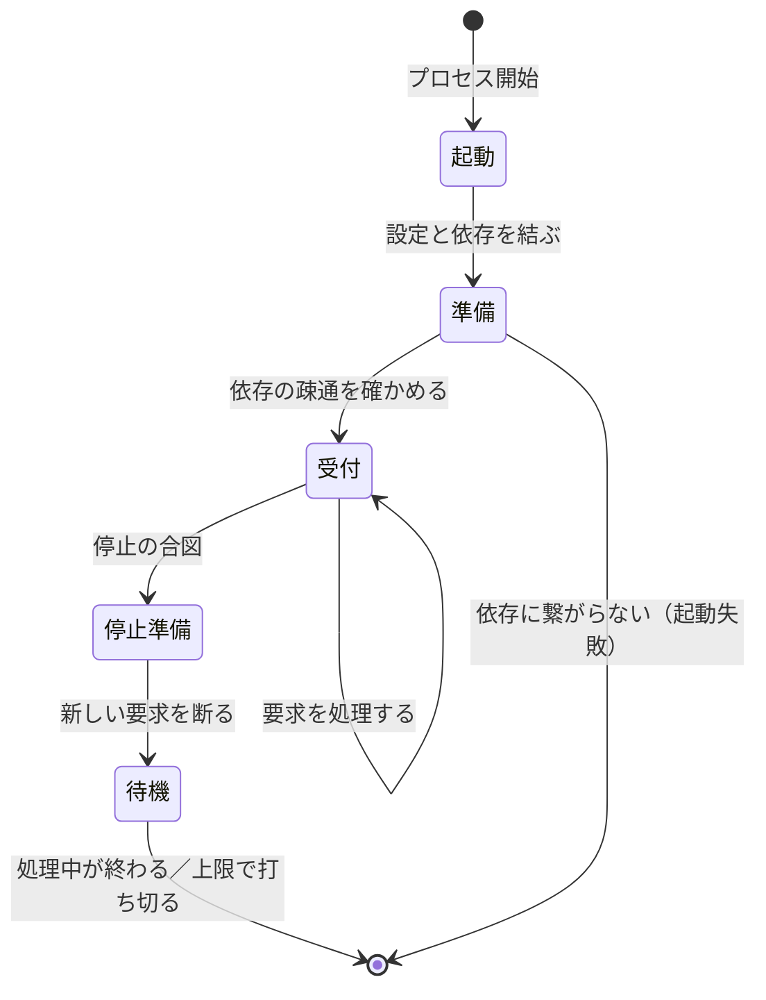

# バックエンドAPI の起動と終了

## 概要

**常駐し、受け付けを止めてから、処理中の要求を終わらせて落ちる。**

## 状態の移り

## 起動と終了の定め

| 項目 | 定め |
|---|---|
| 起動の契機 | 常駐。プロセスの起動時に1度だけ準備する |
| 準備で確かめること | 設定が揃っていること。依存への疎通 |
| 起動失敗の扱い | 受け付けを始めず、終了コードを立てて落ちる |
| 生存の申告 | 生きているかと、受け付けられるかを別々に返す |
| 停止の合図 | `SIGTERM` を受けたら、新しい要求を断る |
| 処理中の扱い | 上限（30 秒）まで待ち、超えたら打ち切る |
| 状態の持ち越し | プロセス内に持たない。必要な状態は外の記憶に置く |

## 資源

| 資源 | 確保する場所 | 解放する場所 |
|---|---|---|
| 接続の集まり | 準備の段 | 停止準備の後 |
| 一時ファイル | 使う直前 | 使い終わった時点 |
| 記録の書き出し | 準備の段 | 終了直前に出し切る |

## 違反したとき

| 違反 | 現れ方 | 直し方 |
|---|---|---|
| 停止時に処理中を打ち切る | 呼び出し元に失敗が返る | 受け付けを止めてから待つ |
| 生存の申告が「受け付けられるか」と同じ | 準備中に要求が届く | 2つを分けて返す |
| プロセス内に状態を持つ | 台数を増やすと結果が変わる | 外の記憶へ移す |

## 適用範囲外

| 何を | どの層が決めるか |
|---|---|
| 何台で動かすか | 運用（この規約の外） |
| 業務の処理内容 | 業務操作 |

## 委譲する判断

| 委譲する判断 | 委譲先 | 委譲する理由 |
|---|---|---|
| 処理中を待つ上限の秒数 | 実装 | 要求の重さで変わる |

## 出典

| 種類 | 原典 | 版・取得日 | 何を裏づけるか |
|---|---|---|---|
| 規格 | POSIX のシグナル https://12factor.net/disposability | 2026-09-06 取得 | 停止の合図 |
| 文献 | The Twelve-Factor App https://12factor.net/disposability | 2026-09-06 取得 | 廃棄容易性 |