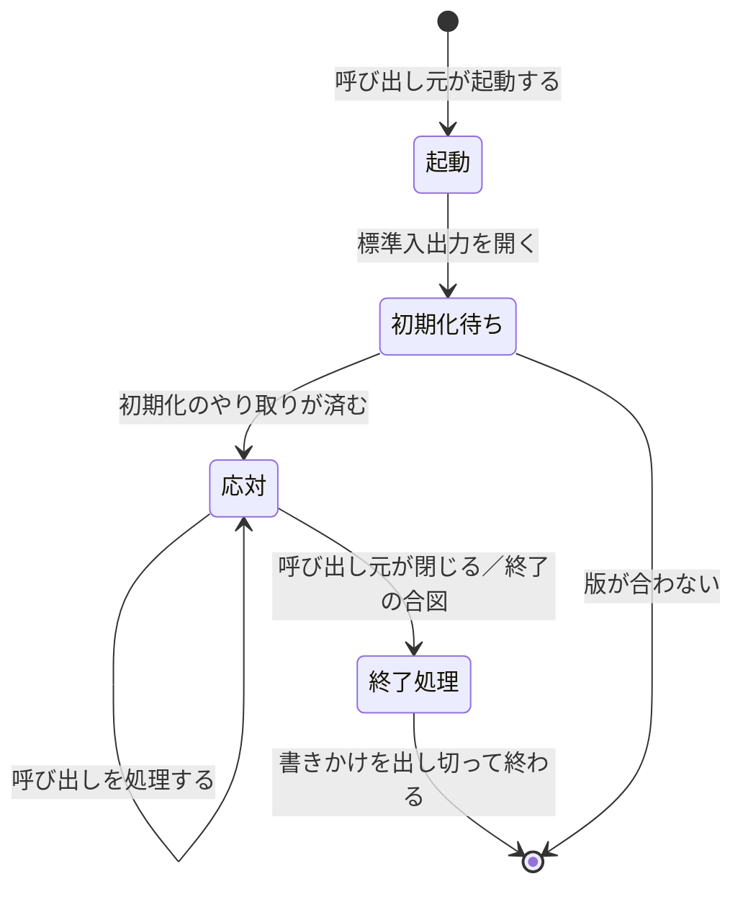

# MCP サーバーの起動と終了

## 概要

**接続のあいだ常駐し、呼び出し元が閉じたら終わる。**

## 状態の移り

## 起動と終了の定め

| 項目 | 定め |
|---|---|
| 起動の契機 | 呼び出し元が子プロセスとして起動する |
| 常駐 | する。接続が閉じるまで生きる |
| 初期化 | 版と能力のやり取りが済むまで、呼び出しを受け付けない |
| 状態の持ち越し | 接続の中では保持してよい。接続をまたいでは持ち越さない |
| 終了の合図 | 標準入力が閉じたとき、または終了の要求 |
| 中断されたとき | 書きかけのメッセージを捨て、標準エラーへ理由を残す |

## 資源

| 資源 | 確保する場所 | 解放する場所 |
|---|---|---|
| 標準入出力 | 起動時 | 終了処理 |
| 開いたファイル・接続 | 呼び出しの中 | 呼び出しの終わり |

## 違反したとき

| 違反 | 現れ方 | 直し方 |
|---|---|---|
| 初期化の前に呼び出しを受ける | 版の食い違いが後で出る | 初期化が済むまで待つ |
| 標準入力が閉じても残る | プロセスが溜まる | 閉じたら終わる |

## 適用範囲外

| 何を | どの層が決めるか |
|---|---|
| 能力の中身 | 業務操作 |
| 失敗の型 | 言語 |

## 委譲する判断

| 委譲する判断 | 委譲先 | 委譲する理由 |
|---|---|---|
| 接続の中で保持する状態の範囲 | 実装 | 能力の性質で決まる |

## 出典

| 種類 | 原典 | 版・取得日 | 何を裏づけるか |
|---|---|---|---|
| 規格 | Model Context Protocol の仕様 https://modelcontextprotocol.io/specification/2025-06-18/basic/lifecycle | 2026-09-06 取得 | 生存期間 |