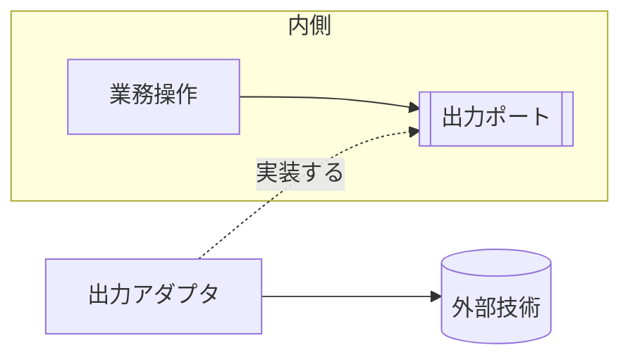

# 依存の向きと反転

## 概要

**依存は外側から内側へ向き、内側が外側を必要とするときだけ反転させる。**

## 構成要素

| 要素 | 責務 | 知ってよいもの | 知ってはならないもの |
|---|---|---|---|
| 内側 | 業務の判断を持つ（業務モデル・業務操作） | 言語の標準機能 | 外部技術、外側の要素 |
| 外側 | 外部との入出力を持つ（入力アダプタ・出力アダプタ） | 内側、外部技術 | ─ |
| 出力ポート | 内側が外側へ求める機能の宣言 | 内側 | 実装技術 |

## 依存の許可

| 参照元 ＼ 参照先 | 内側 | 外側 | 出力ポート |
|---|---|---|---|
| 内側 | 可 | 不可 | 可 |
| 外側 | 可 | 可 | 可（実装する） |
| 出力ポート | 可 | 不可 | ─ |

## 依存関係図

**宣言は内側、実装は外側に置く。**
この分離が反転であり、破線の矢印がその実装を表す。

## 境界を越えるデータ

| 境界 | 渡す形 | 変換する場所 |
|---|---|---|
| 内側 → 出力ポート | 業務モデルの型 | 変換しない |
| 出力ポート → 外部技術 | 技術固有の形式 | 出力アダプタ |

## 違反したとき

| 違反 | 現れ方 | 直し方 |
|---|---|---|
| 内側が外部技術の型を引数に取る | 依存検査で落ちる | 業務モデルの型へ置き換え、変換を外側へ移す |
| 出力ポートが技術の語彙で宣言されている | レビューで気づく | 業務の語彙へ言い換える |
| 反転が無いまま、内側が外側を直接呼ぶ | 依存検査で落ちる | 出力ポートを立てる |

## 適用範囲外

| 何を | どの層が決めるか |
|---|---|
| 依存の向きを何で守るか（可視性・モジュール） | 言語 × アーキテクチャ |
| ディレクトリ構成 | 言語 × アーキテクチャ |
| 反転を実行時にどう結ぶか | 言語 × アーキテクチャ |

## 委譲する判断

| 委譲する判断 | 委譲先 | 委譲する理由 |
|---|---|---|
| 出力ポートの粒度（1機能ごとか、まとめるか） | 用途 | 外部との契約の数で決まる |

## 出典

| 種類 | 原典 | 版・取得日 | 照合する文字列 |
|---|---|---|---|
| 文献 | Robert C. Martin "The Dependency Inversion Principle" https://alistair.cockburn.us/hexagonal-architecture/ | 2026-09-05 取得 | `Ports and Adapters` |