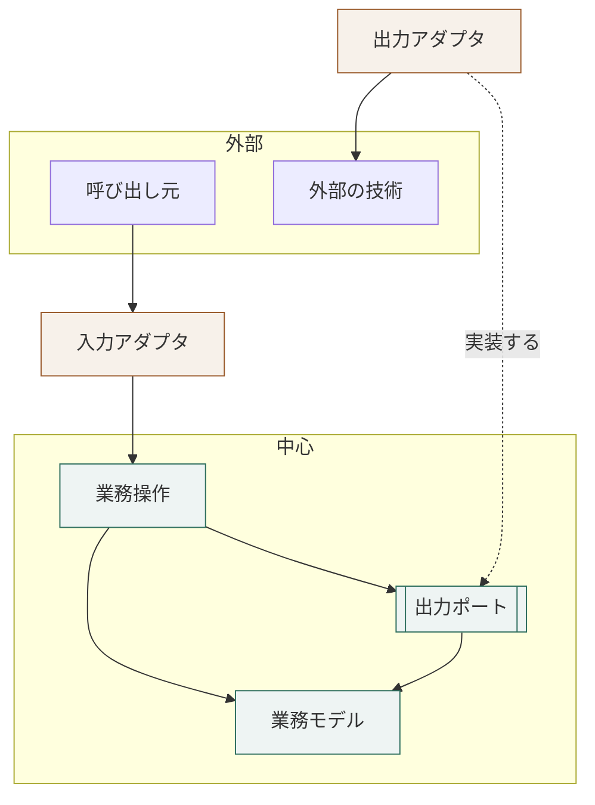

# ヘキサゴナル構成の層

## 概要

**業務の判断を中心に置き、外部との入出力を外周へ寄せる。**

## 構成要素

| 要素 | 責務 | 知ってよいもの | 知ってはならないもの |
|---|---|---|---|
| 業務モデル | 業務の語彙・規則・不変条件を持つ | 言語の標準機能 | 他のすべての要素、外部技術 |
| 業務操作 | 業務の手続きを組み立て、境界の入出力の形を定める | 業務モデル、出力ポート | 入力アダプタ、出力アダプタの実装 |
| 出力ポート | 業務操作が外部へ求める機能を、呼び出しの形で宣言する | 業務モデル | 実装技術 |
| 入力アダプタ | 外部からの呼び出しを、業務操作へ渡す | 業務操作、外部技術 | 業務モデルの内部 |
| 出力アダプタ | 出力ポートを、実装技術で満たす | 出力ポート、外部技術 | 業務操作の内部 |

## 依存の許可

| 参照元 ＼ 参照先 | 業務モデル | 業務操作 | 出力ポート | 入力アダプタ | 出力アダプタ |
|---|---|---|---|---|---|
| 業務モデル | ─ | 不可 | 不可 | 不可 | 不可 |
| 業務操作 | 可 | ─ | 可 | 不可 | 不可 |
| 出力ポート | 可 | 不可 | ─ | 不可 | 不可 |
| 入力アダプタ | 可 | 可 | 不可 | ─ | 不可 |
| 出力アダプタ | 可 | 不可 | 可（実装する） | 不可 | ─ |

## 依存関係図



**矢印の向きが依存の向きである。**
実線は参照、破線は実装を表す。**
出力アダプタから出力ポートへの矢印だけが逆向きに見えるのは、依存が反転しているためである。**

## 境界を越えるデータ

| 境界 | 渡す形 | 変換する場所 |
|---|---|---|
| 呼び出し元 → 入力アダプタ | 外部の形式（JSON など） | 入力アダプタ |
| 入力アダプタ → 業務操作 | 業務操作が定める入力の型 | 入力アダプタ |
| 業務操作 → 出力ポート | 業務モデルの型 | 変換しない |
| 出力ポート → 出力アダプタ | 業務モデルの型 | 出力アダプタ |

## ディレクトリ構成

```
src/
  model/        業務モデル
  application/  業務操作と、出力ポートの宣言
  adapter/
    inbound/    入力アダプタ
    outbound/   出力アダプタ
```

## 違反したとき

| 違反 | 現れ方 | 直し方 |
|---|---|---|
| 業務モデルが外部技術を参照する | 静的解析の依存検査で落ちる | 技術を出力ポートの背後へ移す |
| 業務操作が出力アダプタを直接参照する | 同上 | 出力ポートを立て、実装をアダプタへ移す |
| 入力アダプタが業務モデルを組み立てる | レビューで気づく | 組み立てを業務操作へ移す |

## 適用範囲外

| 何を | どの層が決めるか |
|---|---|
| 層を言語のどの仕組みで表すか | 言語 × アーキテクチャ |
| どの層を実際に持つか | 用途 |
| 層をまたぐ呼び出しの同期・非同期 | 用途 |

## 委譲する判断

| 委譲する判断 | 委譲先 | 委譲する理由 |
|---|---|---|
| 出力ポートの置き場所 | 言語 × アーキテクチャ | 宣言できる場所は言語の仕組みで変わる |
| 業務操作の粒度 | 用途 | 外部との契約の粒度で決まる |

## 出典

| 種類 | 原典 | 版・取得日 | 何を裏づけるか |
|---|---|---|---|
| 文献 | Alistair Cockburn "Hexagonal Architecture"<br>https://alistair.cockburn.us/hexagonal-architecture/ | 2026-09-06 取得 | ポートとアダプタ |