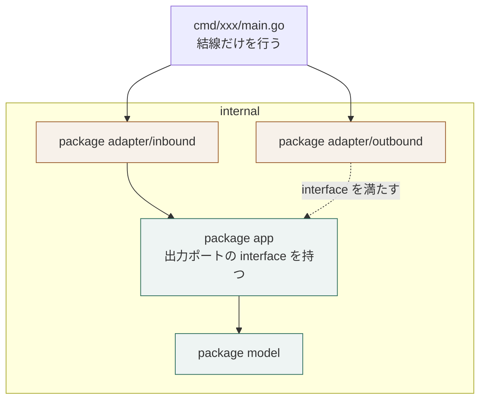

# Go における層の表し方

## 概要

**層をパッケージで表し、依存の向きは import で守る。抽象は使う側のパッケージが定める。**

## 構成要素

| 要素 | 責務 | 知ってよいもの | 知ってはならないもの |
|---|---|---|---|
| `internal/model` パッケージ | 業務モデル | 標準ライブラリ | 他のパッケージ、外部モジュール |
| `internal/app` パッケージ | 業務操作と出力ポートの宣言 | `internal/model` | `internal/adapter` |
| `internal/adapter/inbound` | 入力アダプタ | `internal/app`、外部モジュール | `internal/model` の内部 |
| `internal/adapter/outbound` | 出力ポートの実装 | `internal/app`、外部モジュール | `internal/app` の内部 |
| `cmd/<名前>` | 結線と起動 | すべて | ─ |

## 表し方の対応

| アーキテクチャ側の要素 | Go の仕組み | 補足 |
|---|---|---|
| 業務モデル | `internal/model` パッケージ | 他のパッケージを import しない |
| 業務操作 | `internal/app` パッケージ | 出力ポートを **自分の側で** interface として定める |
| 出力ポート | `internal/app` の中の interface | 実装側には置かない |
| 入力アダプタ | `internal/adapter/inbound/<技術>` | 外部技術を import してよい |
| 出力アダプタ | `internal/adapter/outbound/<技術>` | interface を満たす具体型を置く |
| 結線 | `cmd/<名前>/main.go` | 実装を選び、業務操作へ渡す |

## 依存の許可

| 参照元 ＼ 参照先 | `model` | `app` | `adapter` | `cmd` |
|---|---|---|---|---|
| `model` | ─ | 不可 | 不可 | 不可 |
| `app` | 可 | ─ | 不可 | 不可 |
| `adapter` | 可 | 可 | ─ | 不可 |
| `cmd` | 可 | 可 | 可 | ─ |

## 依存の向きを守る手段

| 手段 | 内容 |
|---|---|
| `internal/` | 外部モジュールから参照できなくする |
| import の向き | `app` は `adapter` を import しない。**interface は使う側（`app`）が持つ** |
| 結線 | 実装の選択は `cmd` だけで行う |
| 検査 | 依存の向きを検査する道具を CI で走らせる（`go list -deps` の突き合わせでもよい） |

## 依存関係図



## 境界を越えるデータ

| 境界 | 渡す形 | 変換する場所 |
|---|---|---|
| 外部 → 入力アダプタ | 外部の形式（JSON など） | 入力アダプタ |
| 入力アダプタ → 業務操作 | `app` が定める入力の構造体 | 入力アダプタ |
| 業務操作 → 出力ポート | `model` の型 | 変換しない |

## ディレクトリ構成

```
cmd/<名前>/main.go          結線
internal/
  model/                   業務モデル
  app/                     業務操作と、出力ポートの interface
  adapter/
    inbound/<技術>/         入力アダプタ
    outbound/<技術>/        出力アダプタ
```

## 違反したとき

| 違反 | 現れ方 | 直し方 |
|---|---|---|
| `app` が `adapter` を import する | 依存の検査で落ちる | interface を `app` 側へ置き、実装を `adapter` へ移す |
| interface を実装側のパッケージに置く | レビューで気づく | 使う側へ移す（Go では使う側が定める） |
| `model` が外部技術を import する | 依存の検査で落ちる | 変換を `adapter` へ移す |

## 適用範囲外

| 何を | どの層が決めるか |
|---|---|
| モジュールを分けるかどうか | 用途 |
| 実行時の依存 | 用途 |

## 委譲する判断

| 委譲する判断 | 委譲先 | 委譲する理由 |
|---|---|---|
| `internal/` を使うか、モジュールを分けるか | 用途 | 公開の範囲で決まる |

## 出典

| 種類 | 原典 | 版・取得日 | 照合する文字列 |
|---|---|---|---|
| 規格 | Go Modules Reference（`internal` の可視性）<br>https://go.dev/ref/mod | 2026-09-05 取得 | `internal` |
| 文献 | Go Code Review Comments（インターフェースは使う側が定める）<br>https://go.dev/wiki/CodeReviewComments | 2026-09-05 取得 | `interfaces` |