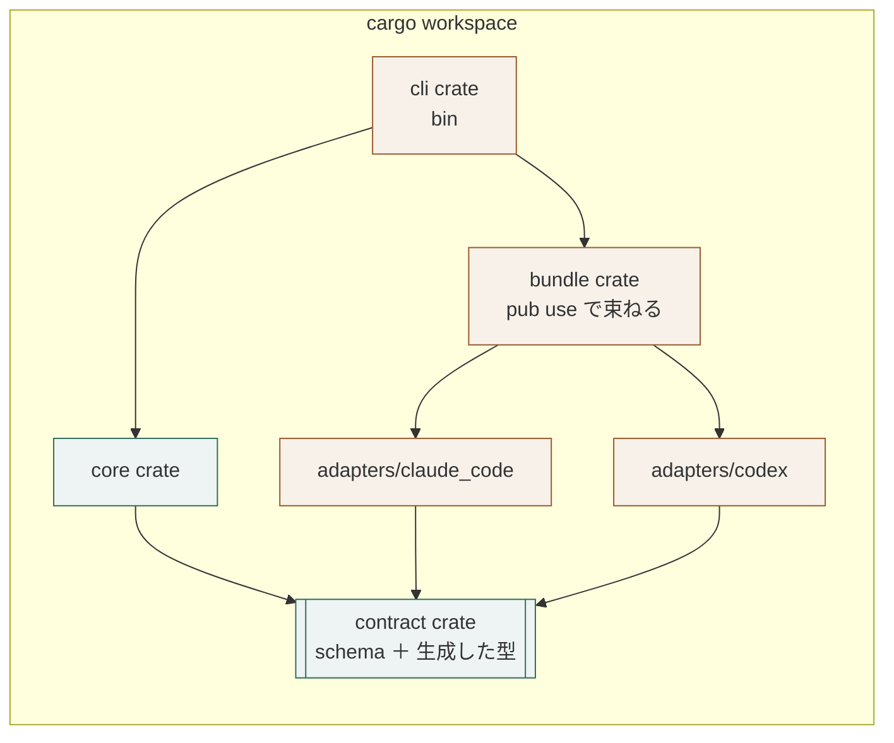

# Rust における要素の表し方（データ契約の構成）

## 概要

**要素を crate で分け、依存の向きを `Cargo.toml` で守る。**
モジュールの可視性ではなく、crate の依存宣言そのものが検査になる。

## 構成要素

| 要素 | 責務 | 知ってよいもの | 知ってはならないもの |
|---|---|---|---|
| `contract` crate | schema と、そこから生成した型を持つ | 標準ライブラリ、直列化の基盤 | 他の crate、接続先の技術 |
| `core` crate | データ契約の上の処理 | `contract` | `adapters/*`、`bundle` |
| `adapters/<接続先>` crate | 生の入力を `contract` の型へ写す関数を公開する | `contract`、その接続先の技術 | `core`、他の adapter |
| `bundle` crate | adapter を `pub use` で集め、静的に振り分ける | `contract`、`adapters/*` | `core` の内部 |
| `cli` crate | 実行の口。バイナリを持つ | すべて | ─ |

## 依存の許可

| 参照元 ＼ 参照先 | `contract` | `core` | `adapters/*` | `bundle` |
|---|---|---|---|---|
| `contract` | ─ | 不可 | 不可 | 不可 |
| `core` | 可 | ─ | 不可 | 不可 |
| `adapters/*` | 可 | 不可 | ─ | 不可 |
| `bundle` | 可 | 不可 | 可 | ─ |
| `cli` | 可 | 可 | 不可 | 可 |

## 依存関係図



## 表し方の対応

| 要素 | Rust の仕組み | 補足 |
|---|---|---|
| データ契約 | crate ＋ 生成した型 | schema から型を作り、手で書かない |
| 中心の処理 | crate 内の関数 | trait を置かない |
| 写し手 | crate が公開する関数 | `pub fn normalize(raw) -> Result<T>` の形にそろえる |
| 束ね | `pub use` と列挙による静的な振り分け | `dyn` を使わない |
| 依存の向き | `Cargo.toml` の依存宣言 | 宣言に無い依存は、そもそも書けない |

## 境界を越えるデータ

| 境界 | 渡す形 | 変換する場所 |
|---|---|---|
| 外部 → `adapters/*` | 接続先の生の形式（JSON など） | `adapters/*` |
| `adapters/*` → `core` | `contract` の型 | 変換しない |

## ディレクトリ構成

```
Cargo.toml            [workspace] members = ["crates/*", "adapters/*"]
crates/
  contract/           依存を持たない
  core/               contract にだけ依存する
  bundle/             contract と adapters/* に依存する
  cli/                bin を持つ
adapters/
  common/             写し手が共有する助け
  <接続先>/           contract にだけ依存する
```

## 依存の向きを守る手段

| 手段 | 内容 |
|---|---|
| 依存の宣言 | `Cargo.toml` に書いた crate しか参照できない。宣言そのものが検査になる |
| 依存の確認 | `cargo tree` で、`core` から adapter へ辺が伸びていないことを見る |
| 可視性 | 各 crate が公開するのは、`normalize` と契約の型だけにとどめる |
| 束ねの静的な振り分け | 列挙で分岐し、`dyn` を使わない。接続先を足し忘れると、網羅の検査が落ちる |

## 違反したとき

| 違反 | 現れ方 | 直し方 |
|---|---|---|
| `core` が adapter に依存する | `cargo tree` と `Cargo.toml` で見える | 分岐を写し手へ移す |
| `contract` が接続先の型を持つ | 同上 | 型を生成し直し、写し手で変換する |
| 束ねが `dyn` で振り分ける | レビューで気づく | 列挙による静的な振り分けへ替える |

## 適用範囲外

| 何を | どの層が決めるか |
|---|---|
| どの接続先を持つか | 用途 |
| 型を生成する道具 | 言語 |

## 委譲する判断

| 委譲する判断 | 委譲先 | 委譲する理由 |
|---|---|---|
| crate を publish するか、workspace 内に留めるか | 用途 | 配布の形で決まる |

## 出典

| 種類 | 原典 | 版・取得日 | 照合する文字列 |
|---|---|---|---|
| 規格 | Cargo Book / Workspaces<br>https://doc.rust-lang.org/cargo/reference/workspaces.html | 2026-09-05 取得 | `[workspace]` |
| 規格 | Cargo Book / Dependency resolution<br>https://doc.rust-lang.org/cargo/reference/workspaces.html | 2026-09-05 取得 | `dependencies` |