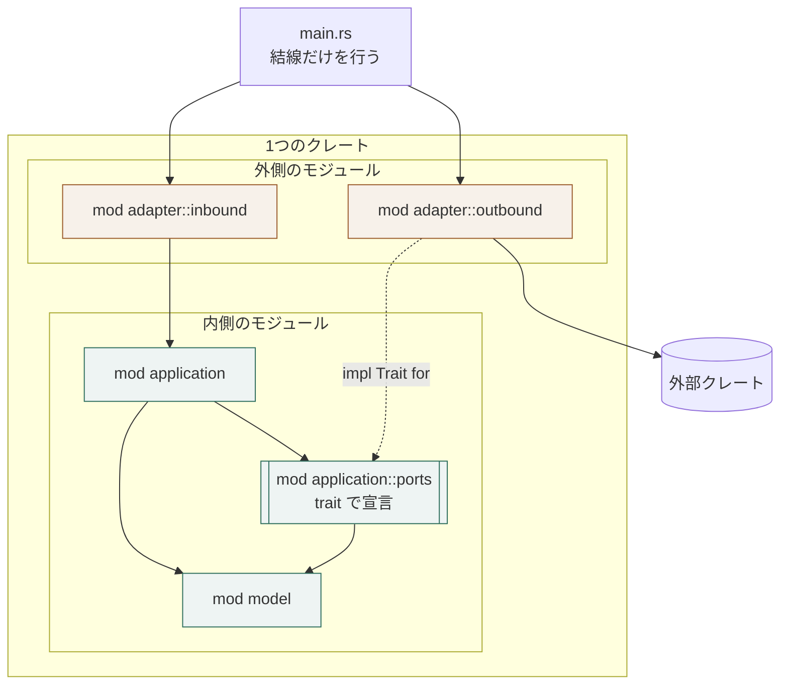

# Rust における層の表し方

## 概要

**層をモジュールで表し、依存の向きを可視性で守る。**

## 構成要素

| 要素 | 責務 | 知ってよいもの | 知ってはならないもの |
|---|---|---|---|
| `model` モジュール | 業務モデル | 標準ライブラリ | 他のモジュール、外部クレート |
| `application` モジュール | 業務操作と出力ポートの宣言 | `model` | `adapter` |
| `application::ports` | 出力ポートをトレイトで宣言する | `model` | 実装クレート |
| `adapter::inbound` | 入力アダプタ | `application`、外部クレート | `model` の非公開要素 |
| `adapter::outbound` | 出力ポートの実装 | `application::ports`、外部クレート | `application` の内部 |

## 表し方の対応

| 要素 | Rust の仕組み | 補足 |
|---|---|---|
| 内側 | `model` ・ `application` モジュール | 外部クレートを取り込まない |
| 出力ポート | `trait` の宣言 | 業務の語彙で名付ける |
| 出力ポートの実装 | `impl Trait for` | `adapter::outbound` に置く |
| 外側 | `adapter` モジュール | 外部クレートを使ってよい唯一の場所 |
| 依存の向き | 可視性（`pub(crate)`）とモジュールの階層 | 宣言に無い参照は、そもそも書けない |
| 反転の結線 | `main.rs` での注入 | 内側は具体型を知らない |

## 依存の許可

| 参照元 ＼ 参照先 | `model` | `application` | `application::ports` | `adapter` |
|---|---|---|---|---|
| `model` | ─ | 不可 | 不可 | 不可 |
| `application` | 可 | ─ | 可 | 不可 |
| `application::ports` | 可 | 不可 | ─ | 不可 |
| `adapter` | 可 | 可 | 可（実装する） | ─ |

## 依存関係図



## 境界を越えるデータ

| 境界 | 渡す形 | 変換する場所 |
|---|---|---|
| `adapter::inbound` → `application` | `application` が定める入力の構造体 | `adapter::inbound` |
| `application` → `application::ports` | `model` の型 | 変換しない |
| `adapter::outbound` → 外部クレート | 技術固有の型 | `adapter::outbound` |

## ディレクトリ構成

```
src/
  main.rs                結線（依存の注入）だけを行う
  lib.rs                 モジュールの公開範囲を宣言する
  model/mod.rs           業務モデル
  application/
    mod.rs               業務操作
    ports.rs             出力ポート（trait）
  adapter/
    inbound/mod.rs       入力アダプタ
    outbound/mod.rs      出力アダプタ
```

## 依存の向きを守る手段

| 手段 | 内容 |
|---|---|
| 可視性 | `model` と `application` の内部は `pub(crate)` までにとどめ、外部へ公開しない |
| 依存の宣言 | 外部クレートは `adapter` のモジュールからのみ使う |
| 結線 | 実装の差し込みは `main.rs` で行い、`application` は trait だけを受け取る |
| 検査 | `cargo modules` などで、モジュール間の参照を出して確認する |

## 違反したとき

| 違反 | 現れ方 | 直し方 |
|---|---|---|
| `model` が外部クレートを使う | 参照の一覧に外部クレートが出る | 出力ポートを立て、実装を `adapter::outbound` へ移す |
| `application` が具体型を受け取る | レビューで気づく | trait の引数へ替え、`main.rs` で結ぶ |
| `adapter::inbound` が `model` を組み立てる | レビューで気づく | 組み立てを `application` へ移す |

## 適用範囲外

| 何を | どの層が決めるか |
|---|---|
| クレートを分けるかどうか | 用途 |
| 非同期にするかどうか | 用途 |

## 委譲する判断

| 委譲する判断 | 委譲先 | 委譲する理由 |
|---|---|---|
| trait を静的に解決するか、動的に解決するか | 用途 | 起動の回数と性能の要求で決まる |

## 出典

| 種類 | 原典 | 版・取得日 | 何を裏づけるか |
|---|---|---|---|
| 規格 | Rust Reference / Visibility and privacy<br>https://doc.rust-lang.org/reference/visibility-and-privacy.html | 2026-09-06 取得 | crate 内の可視性 |
| 文献 | Rust API Guidelines C-STRUCT-PRIVATE<br>https://rust-lang.github.io/api-guidelines/naming.html | 2026-09-06 取得 | 欄を非公開にする |