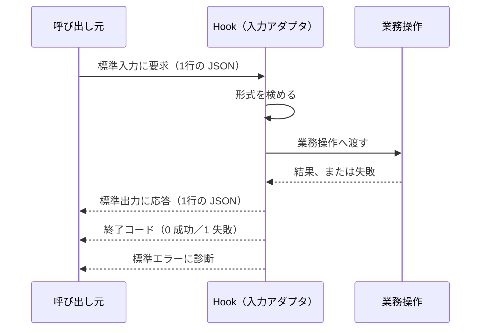

# Hook の契約

## 概要

**呼び出し元が渡すものと、こちらが返すものを、標準入出力の上で定める。**

## 構成要素

| 要素 | 責務 | 知ってよいもの | 知ってはならないもの |
|---|---|---|---|
| 要求 | 呼び出し元が標準入力へ渡す内容 | 呼び出し元の仕様 | こちらの内部構造 |
| 応答 | こちらが標準出力へ返す内容 | 呼び出し元の仕様 | ─ |
| 終了状態 | 処理の成否を、終了コードで伝える | 呼び出し元の仕様 | ─ |
| 診断出力 | 人が読む記録を標準エラーへ出す | ─ | 応答の形式 |

## やり取りの流れ

## 境界を越えるデータ

| 境界 | 渡す形 | 変換する場所 |
|---|---|---|
| 呼び出し元 → Hook | 1行の JSON | 入力アダプタ |
| Hook → 業務操作 | 業務操作が定める入力の型 | 入力アダプタ |
| Hook → 呼び出し元 | 1行の JSON、終了コード | 入力アダプタ |

## 契約の内容

| 項目 | 定め |
|---|---|
| 入力 | 標準入力から1行の JSON を読む。改行で終端する |
| 出力 | 標準出力へ1行の JSON を書く。それ以外を出さない |
| 終了コード | 成功は `0`、要求の不備は `1`、内部の失敗は `2` |
| 診断 | 人が読む内容は標準エラーへ出す。標準出力へ混ぜない |
| 上限 | 要求の大きさは 1 MiB を超えない |

## 版と互換

| 項目 | 定め |
|---|---|
| 版の示し方 | 応答に版の欄を持たせ、呼び出し元が解釈できる欄だけを読む |
| 欄を足すとき | 既定値を持たせて足す。呼び出し元が知らない欄は無視される前提で書く |
| 欄を消すとき | 消さない。使わなくなった欄は、値を空にして残す |
| 壊れる変更 | 終了コードの意味を変えること。変えるなら、呼び出し元の設定と同時に入れ替える |

## 違反したとき

| 違反 | 現れ方 | 直し方 |
|---|---|---|
| 標準出力へ診断を混ぜる | 呼び出し元が応答を解釈できない | 診断を標準エラーへ移す |
| 失敗時に終了コード `0` を返す | 呼び出し元が失敗に気づかない | 終了コードの対応表に従う |

## 適用範囲外

| 何を | どの層が決めるか |
|---|---|
| 業務の処理内容 | 業務モデル・業務操作 |
| JSON の直列化に使うライブラリ | この用途のツール規約 |
| 標準入出力を読み書きする場所（ファイル構成） | 言語 × アーキテクチャ |

## 委譲する判断

| 委譲する判断 | 委譲先 | 委譲する理由 |
|---|---|---|
| 応答に含める欄 | 実装 | 業務操作の結果によって変わる |

## 出典

| 種類 | 原典 | 版・取得日 | 照合する文字列 |
|---|---|---|---|
| 規格 | 呼び出し元の Hook 仕様 https://docs.claude.com/en/docs/claude-code/hooks | 2026-09-05 取得 | `stdout` |