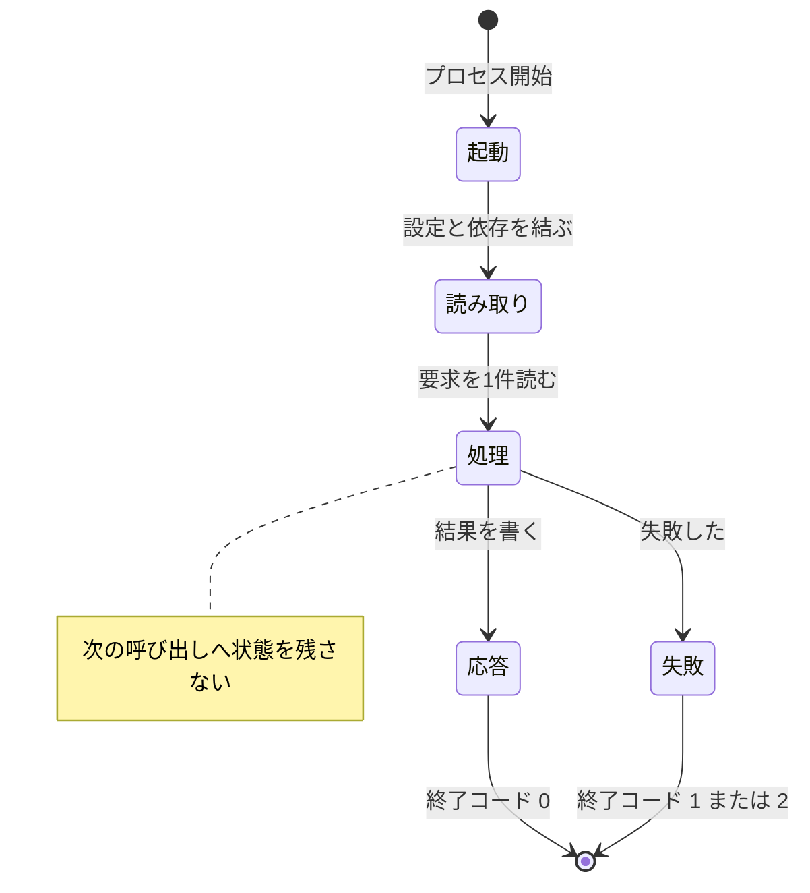

# Hook の起動と終了

## 概要

**呼び出しごとに起動し、応答を返して終了する。状態を次の呼び出しへ持ち越さない。**

## 構成要素

| 要素 | 責務 | 知ってよいもの | 知ってはならないもの |
|---|---|---|---|
| 起動処理 | 設定を読み、依存を結ぶ | 環境変数、設定ファイル | 業務の判断 |
| 処理 | 要求を1件処理する | 業務操作 | 前回の呼び出しの結果 |
| 終了処理 | 出力を書き切り、終了コードを返す | ─ | ─ |

## 状態の移り

## 境界を越えるデータ

| 境界 | 渡す形 | 変換する場所 |
|---|---|---|
| 環境 → 起動処理 | 環境変数と設定ファイル | 起動処理 |
| 処理 → 終了処理 | 応答と終了コード | 処理 |

## 起動と終了の定め

| 項目 | 定め |
|---|---|
| 起動時間 | 100 ms 以内に応答を書き始める |
| 常駐 | しない。呼び出しごとに終了する |
| 状態 | プロセスの外へ書かない。一時ファイルを残さない |
| 設定 | 起動時に1度だけ読む。処理の途中で読み直さない |
| 中断 | 中断の合図を受けたら、書きかけの出力を捨てて終了コード `2` で終わる |

## 資源

| 資源 | 確保する場所 | 手放す場所 | 手放し損ねたときの現れ方 |
|---|---|---|---|
| 標準入出力 | 起動処理 | プロセスの終了 | 出力が書き切られず、呼び出し元が空を読む |
| 一時ファイル | 使わない | ─ | 残っていれば、次の呼び出しが前回の状態を読む |
| 外部への接続 | 処理の中で1件ごと | 同じ処理の中 | 呼び出しのたびに接続が積み上がる |
| 子プロセス | 使わない | ─ | 親が終わっても残り、呼び出し元が待たされる |

## 違反したとき

| 違反 | 現れ方 | 直し方 |
|---|---|---|
| 一時ファイルが残る | 次の呼び出しが前回の状態を読む | 書き込みをやめるか、終了時に消す |
| 起動が遅い | 呼び出し元が待たされる | 起動時の読み込みを減らす |

## 適用範囲外

| 何を | どの層が決めるか |
|---|---|
| 業務の処理内容 | 業務操作 |
| 失敗の型 | 言語 |
| 起動処理を置くファイル | 言語 × アーキテクチャ |

## 委譲する判断

| 委譲する判断 | 委譲先 | 委譲する理由 |
|---|---|---|
| 設定の読み取り先 | 実装 | 配布の形で変わる |

## 出典

| 種類 | 原典 | 版・取得日 | 照合する文字列 |
|---|---|---|---|
| 規格 | 呼び出し元の Hook 仕様（実行のされ方） https://docs.claude.com/en/docs/claude-code/hooks | 2026-09-05 取得 | `exit code` |