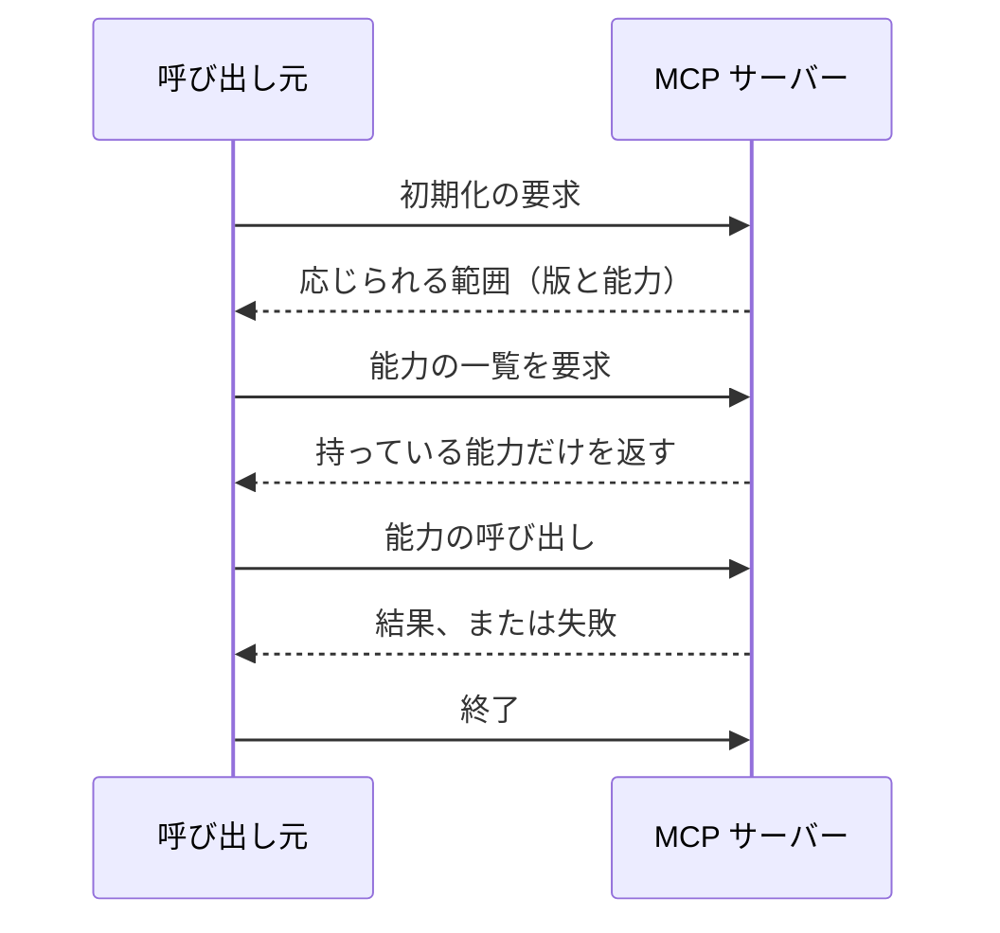

# MCP サーバーの契約

## 概要

**呼び出し元と、決められた手順で能力をやり取りし、その形は仕様が定める。**

## 契約の内容

| 項目 | 定め |
|---|---|
| 経路 | 標準入出力（`stdio`）。1行1メッセージ |
| 形式 | JSON-RPC 2.0 のメッセージ |
| 手順 | 初期化 → 能力の提示 → 呼び出し → 終了 |
| 提示する能力 | 道具・資源・指示のうち、実際に持つものだけを申告する |
| 成否の伝え方 | JSON-RPC の結果と失敗の欄。プロセスの終了コードでは伝えない |
| 診断 | 標準エラーへ出す。標準出力へ混ぜない |
| 上限 | 1メッセージの大きさと、1呼び出しの時間に上限を置く |

## やり取りの流れ

## 境界を越えるデータ

| 境界 | 渡す形 | 変換する場所 |
|---|---|---|
| 呼び出し元 → 入力アダプタ | JSON-RPC のメッセージ | 入力アダプタ |
| 入力アダプタ → 中心の処理 | 中心が定める入力の型 | 入力アダプタ |
| 中心の処理 → 呼び出し元 | 中心の型 → 応答の型 | 入力アダプタ |

## 版と互換

| 項目 | 定め |
|---|---|
| 版の示し方 | 初期化のやり取りで、対応する版を申告する |
| 互換を保つ範囲 | 能力の追加は互換とする。能力の削除・引数の意味の変更は互換を壊す |
| 壊す変更の扱い | 対応する版を上げ、旧版の扱いを明記する |

## 違反したとき

| 違反 | 現れ方 | 直し方 |
|---|---|---|
| 標準出力へ診断を混ぜる | 呼び出し元がメッセージを解釈できない | 診断を標準エラーへ移す |
| 持っていない能力を申告する | 呼び出しが失敗する | 申告を実際に持つものだけにする |
| 失敗をプロセスの終了で伝える | 呼び出し元が接続を失う | JSON-RPC の失敗の欄で返す |

## 適用範囲外

| 何を | どの層が決めるか |
|---|---|
| 提供する能力の中身 | 業務モデル・中心の処理 |
| JSON-RPC を扱うライブラリ | この用途の技術構成 |

## 委譲する判断

| 委譲する判断 | 委譲先 | 委譲する理由 |
|---|---|---|
| 能力の粒度 | 実装 | 呼び出し元の使い方で決まる |

## 出典

| 種類 | 原典 | 版・取得日 | 何を裏づけるか |
|---|---|---|---|
| 規格 | Model Context Protocol の仕様 https://modelcontextprotocol.io/specification/2025-06-18 | 2026-09-06 取得 | やり取りの形式 |
| 規格 | JSON-RPC 2.0 https://www.jsonrpc.org/specification | 2026-09-06 取得 | JSON-RPC 2.0 |