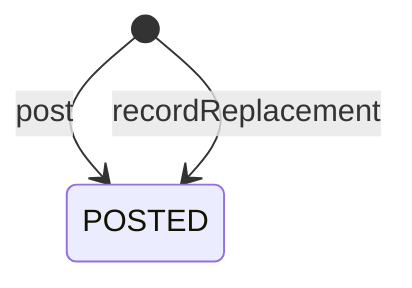

# 閲覧者が残したコメントそのものを守る集約：agg-comment

## 概要

- 閲覧者が共有アーティファクトに残したコメント1件を扱う集約。誰が何を言い、どういう判定だったのかを守る。
- コメントは共有アーティファクトとは別に数え切れず増えるため、共有アーティファクトの内側には置かない。共有アーティファクトをIDで指し示すだけの関係に留める。

---

## 集約ルート

Comment

### 外部参照（ID）

- SharedArtifact

---

## エンティティ

### Comment（集約ルート）

閲覧者が残したコメント1件の内容と判定を守る集約ルート

| 属性 | 型 |
|---|---|
| commentId | CommentId |
| kind | EntryKind |
| targetArtifactId | ArtifactId |
| author | AuthorName |
| body | CommentBody |
| verdict | Verdict |
| parentId | CommentId |
| postedAt | string |

---

## 値オブジェクト

### CommentId

| 表す値 | 振る舞い |
|---|---|
| コメント1件を一意に指すID | 不変。投稿する側が投稿の瞬間に決める。他のコメントと重ならない。 |

| 属性 | 型 |
|---|---|
| value | string |

### AuthorName

| 表す値 | 振る舞い |
|---|---|
| コメントを残した人の名乗り | 不変。あらかじめ登録された人物を指すものではなく、その場で名乗った文字列にすぎない。同じ名乗りが別人であることを妨げない。 |

| 属性 | 型 |
|---|---|
| value | string |

### CommentBody

| 表す値 | 振る舞い |
|---|---|
| コメントの本文 | 不変。常に文字として扱い、書かれた内容を組み立ての指示として解釈しない。 |

| 属性 | 型 |
|---|---|
| text | string |

### Verdict

| 表す値 | 振る舞い |
|---|---|
| コメントに添える判定 | 不変。ただの意見か、この方向でよいか、直してほしいかの3つのいずれか。 |

| 属性 | 型 |
|---|---|
| value | string |

### EntryKind

| 表す値 | 振る舞い |
|---|---|
| 並びに載る1件が、閲覧者のコメントなのか、差し替えの区切りなのか | 不変。閲覧者が残したものは『コメント』、中身の差し替えに伴って仕組みが残したものは『区切り』になる。区切りには名乗りも判定も無い。 |

| 属性 | 型 |
|---|---|
| value | string |

---

## 不変条件

| ルール | 守り方 | 根拠 |
|---|---|---|
| コメントの内容と判定は、投稿された後に常に変わらない | guard | - 後から書き換えられると、合意の記録として読めなくなるため。誰が何時点で何を言ったかが動かないことに、記録としての価値がある。<br>- 名乗りだけで投稿できる以上、他人のコメントを書き換えられる余地を残すと、記録そのものが信用できなくなる。 |
| コメントの本文は、常に文字として扱われる | guard | - 誰でも投稿できる本文を組み立ての指示として解釈すると、閲覧している人の画面が投稿者に乗っ取られるため。 |
| 返信先として指せるのは、常に同じ共有アーティファクトに付いたコメントだけである | guard | - 別の共有アーティファクトのコメントへ返信できると、やり取りの筋道が読めなくなるため。 |
| 共有アーティファクトの中身が差し替えられても、それまでのコメントは常に残る | guard | - 指摘を受けて直し、また見てもらうという往復のために、指摘そのものが残っている必要があるため。<br>- 差し替えの時点が区切りとして読み取れるため、どの指摘が差し替え前のものかは判別できる。 |

---

## ライフサイクル



### 遷移

| from | to | command | 条件 |
|---|---|---|---|
| [*] | POSTED | post | 対象の共有アーティファクトが開ける状態であること |
| [*] | POSTED | recordReplacement | 対象の共有アーティファクトの中身が差し替えられたこと |

---

## コマンド

### post

名乗りと本文と判定を添えてコメントを残す。残した後は変えられない。

| 前提 | 後 | 発行イベント |
|---|---|---|
| None | POSTED |  |

### recordReplacement

中身が差し替えられたことを、コメントと同じ並びに1件の区切りとして残す。閲覧者ではなく仕組みが残すため、名乗りも判定も持たない。どの指摘が差し替え前のものかは、この区切りでしか読み取れない。

| 前提 | 後 | 発行イベント |
|---|---|---|
| None | POSTED |  |

---

## 不変条件シナリオ

### 背景

共有アーティファクトAが公開されており、閲覧者が閲覧トークンを持っている。

### 投稿したコメントは後から変えられない

| 分類 | 観点 |
|---|---|
| 異常系 | 状態遷移: 記録としての不変性を確かめる |

```gherkin
Scenario: 投稿したコメントは後から変えられない
  Given 閲覧者が共有アーティファクトAにコメントを1件残している
  When 同じIDで別の内容のコメントを残そうとする
  Then 元のコメントは変わらない
```

### 本文は文字として扱われる

| 分類 | 観点 |
|---|---|
| 異常系 | 事前条件: 投稿された本文が組み立ての指示として解釈されないことを確かめる |

```gherkin
Scenario: 本文は文字として扱われる
  Given 閲覧者が組み立ての指示に見える文字列を本文に含めてコメントを残す
  When そのコメントが他の閲覧者に示される
  Then 本文はそのままの文字として読める
  And 指示として実行されることはない
```

### 他の共有アーティファクトのコメントへは返信できない

| 分類 | 観点 |
|---|---|
| 異常系 | 事前条件: やり取りの筋道が1つの共有アーティファクトの中で閉じることを確かめる |

```gherkin
Scenario: 他の共有アーティファクトのコメントへは返信できない
  Given 共有アーティファクトBにコメントが1件ある
  When 共有アーティファクトAへのコメントとして、共有アーティファクトBのコメントを返信先に指そうとする
  Then 返信として成立しない
```

### 差し替え後もコメントは残り、区切りが読み取れる

| 分類 | 観点 |
|---|---|
| 正常系 | 計算整合: 直して見てもらう往復が成立し、かつ古い指摘が判別できることを確かめる |

```gherkin
Scenario: 差し替え後もコメントは残り、区切りが読み取れる
  Given 共有アーティファクトAに2件のコメントが残っている
  When 共有アーティファクトAの中身を差し替える
  Then 2件のコメントはいずれも残っている
  And 差し替えが行われた時点が区切りとしてコメントの並びに現れる
  And その区切りより前のコメントは差し替え前のものだと読み取れる
```
