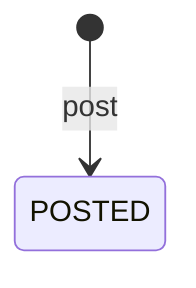

# 閲覧者が残した反応そのものを守る集約：agg-comment

## 概要

- 閲覧者が表示物に残した反応1件を扱う集約。誰が何を言い、どういう意思表示だったのかを守る。
- 反応は表示物とは別に数え切れず増えるため、表示物の内側には置かない。表示物を符丁で指し示すだけの関係に留める。

---

## 集約ルート

Comment

### 外部参照（ID）

- SharedArtifact

---

## エンティティ

### Comment（集約ルート）

閲覧者が残した反応1件の内容と意思表示を守る集約ルート

| 属性 | 型 |
|---|---|
| commentId | CommentId |
| targetSlug | Slug |
| author | AuthorName |
| body | CommentBody |
| verdict | Verdict |
| parentId | CommentId |
| postedAt | string |

---

## 値オブジェクト

### CommentId

| 表す値 | 振る舞い |
|---|---|
| 反応1件を一意に指す符丁 | 不変。投稿する側が投稿の瞬間に決める。他の反応と重ならない。 |

| 属性 | 型 |
|---|---|
| value | string |

### AuthorName

| 表す値 | 振る舞い |
|---|---|
| 反応を残した人の名乗り | 不変。あらかじめ登録された人物を指すものではなく、その場で名乗った文字列にすぎない。同じ名乗りが別人であることを妨げない。 |

| 属性 | 型 |
|---|---|
| value | string |

### CommentBody

| 表す値 | 振る舞い |
|---|---|
| 反応の本文 | 不変。常に文字として扱い、書かれた内容を組み立ての指示として解釈しない。 |

| 属性 | 型 |
|---|---|
| text | string |

### Verdict

| 表す値 | 振る舞い |
|---|---|
| 反応に添える意思表示 | 不変。ただの意見か、この方向でよいか、直してほしいかの3つのいずれか。 |

| 属性 | 型 |
|---|---|
| value | string |

---

## 不変条件

| ルール | 守り方 | 根拠 |
|---|---|---|
| 反応の内容と意思表示は、投稿された後に常に変わらない | guard | - 後から書き換えられると、合意の記録として読めなくなるため。誰が何時点で何を言ったかが動かないことに、記録としての価値がある。<br>- 名乗りだけで投稿できる以上、他人の反応を書き換えられる余地を残すと、記録そのものが信用できなくなる。 |
| 反応の本文は、常に文字として扱われる | guard | - 誰でも投稿できる本文を組み立ての指示として解釈すると、閲覧している人の画面が投稿者に乗っ取られるため。 |
| 返信先として指せるのは、常に同じ表示物に付いた反応だけである | guard | - 別の表示物の反応へ返信できると、やり取りの筋道が読めなくなるため。 |
| 表示物の中身が差し替えられても、それまでの反応は常に残る | guard | - 指摘を受けて直し、また見てもらうという往復のために、指摘そのものが残っている必要があるため。<br>- 差し替えの時点が区切りとして読み取れるため、どの指摘が差し替え前のものかは判別できる。 |

---

## ライフサイクル



### 遷移

| from | to | command | 条件 |
|---|---|---|---|
| [*] | POSTED | post | 対象の表示物が開ける状態であること |

---

## コマンド

### post

名乗りと本文と意思表示を添えて反応を残す。残した後は変えられない。

| 前提 | 後 | 発行イベント |
|---|---|---|
| None | POSTED |  |

---

## ドメインイベント

### CommentPosted

#### 発行契機

post

#### ペイロード

| 項目 | 意味 |
|---|---|
| commentId | 残された反応を指す符丁 |
| targetSlug | 反応が向けられた表示物を指す符丁 |
| verdict | 添えられた意思表示 |

---

## 不変条件シナリオ

### 背景

表示物Aが公開されており、閲覧者が合鍵を持っている。

### 投稿した反応は後から変えられない

| 分類 | 観点 |
|---|---|
| 異常系 | 状態遷移: 記録としての不変性を確かめる |

```gherkin
Given 閲覧者が表示物Aに反応を1件残している
When 同じ符丁で別の内容の反応を残そうとする
Then 元の反応は変わらない
```

### 本文は文字として扱われる

| 分類 | 観点 |
|---|---|
| 異常系 | 事前条件: 投稿された本文が組み立ての指示として解釈されないことを確かめる |

```gherkin
Given 閲覧者が組み立ての指示に見える文字列を本文に含めて反応を残す
When その反応が他の閲覧者に示される
Then 本文はそのままの文字として読める
And 指示として実行されることはない
```

### 他の表示物の反応へは返信できない

| 分類 | 観点 |
|---|---|
| 異常系 | 事前条件: やり取りの筋道が1つの表示物の中で閉じることを確かめる |

```gherkin
Given 表示物Bに反応が1件ある
When 表示物Aへの反応として、表示物Bの反応を返信先に指そうとする
Then 返信として成立しない
```

### 差し替え後も反応は残り、区切りが読み取れる

| 分類 | 観点 |
|---|---|
| 正常系 | 計算整合: 直して見てもらう往復が成立し、かつ古い指摘が判別できることを確かめる |

```gherkin
Given 表示物Aに2件の反応が残っている
When 表示物Aの中身を差し替える
Then 2件の反応はいずれも残っている
And 差し替えが行われた時点が区切りとして反応の並びに現れる
And その区切りより前の反応は差し替え前のものだと読み取れる
```
