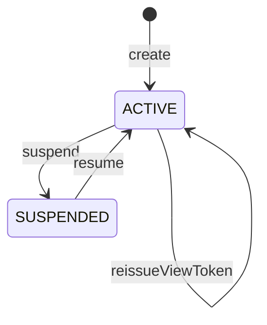

# 複数の共有アーティファクトをプロジェクトと、そのための閲覧トークンを守る集約：agg-project

## 概要

- 複数の共有アーティファクトを1つの閲覧トークンでまとめて見せるための単位を扱う集約。何が入っているかと、その閲覧トークンで何が開けるかを守る。
- 所属は人が明示的に選んだときにだけ成立する。中身に書かれた値によって所属が変わることは無い。

---

## 集約ルート

Project

### 外部参照（ID）

- SharedArtifact

---

## エンティティ

### Project（集約ルート）

プロジェクトの閲覧トークンと、入っている共有アーティファクトの一覧を守る集約ルート

| 属性 | 型 |
|---|---|
| projectId | ProjectId |
| displayName | string |
| projectKey | ProjectKey |
| viewToken | ProjectViewToken |
| status | ProjectStatus |
| owner | ProjectOwner |
| scope | ProjectScope |
| memberArtifactIds | ArtifactId[] |
| createdAt | string |

---

## 値オブジェクト

### ProjectId

| 表す値 | 振る舞い |
|---|---|
| プロジェクトを一意に指すID | 不変。作成時に発行され、以後変わらない。 |

| 属性 | 型 |
|---|---|
| value | string |

### ProjectKey

| 表す値 | 振る舞い |
|---|---|
| 人が読める短い名前 | 不変。作る人が付ける。付けなくてもよい。 |

| 属性 | 型 |
|---|---|
| value | string |

### ProjectViewToken

| 表す値 | 振る舞い |
|---|---|
| この単位に入っている共有アーティファクトをまとめて開くための閲覧トークン | 不変。作成時に一度だけ示され、以後は見返せない。個々の共有アーティファクトの閲覧トークンとは別のもので、個々の共有アーティファクトが公開を止めても失効しない。 |

| 属性 | 型 |
|---|---|
| value | string |
| issuedAt | string |

### ProjectStatus

| 表す値 | 振る舞い |
|---|---|
| この単位が開けるかどうか | 不変。ACTIVE と SUSPENDED のいずれか。 |

| 属性 | 型 |
|---|---|
| value | string |

### ProjectOwner

| 表す値 | 振る舞い |
|---|---|
| このプロジェクトを作った投稿者 | 不変。作った時点で決まり、以後変わらない。見せ方を変える操作（閲覧トークンの再発行・公開停止・再開）を行えるのは、この人と管理者だけ。 |

| 属性 | 型 |
|---|---|
| value | string |

### ProjectScope

| 表す値 | 振る舞い |
|---|---|
| 誰が共有アーティファクトを出し入れできるか | 不変。PERSONAL は持ち主だけ、SHARED は招かれた投稿者なら誰でも自分のものを出し入れできる。作るときに選び、あとから変えない（渡した相手に見えるものの前提が、渡したあとで変わらないようにするため）。 |

| 属性 | 型 |
|---|---|
| value | string |

---

## 不変条件

| ルール | 守り方 | 根拠 |
|---|---|---|
| 所属は、人が明示的に加える操作をしたときにだけ常に成立する | guard | - 所属は誰が開けるかを広げるため、中身に書かれた値で自動的に決まってはならない。書き換えるだけで他人のまとめに紛れ込めてしまう。 |
| この単位の閲覧トークンで開けるのは、常にこの単位に入っている共有アーティファクトだけである | guard | - 閲覧トークンを渡す相手に見せる範囲を、渡す側が把握できるようにするため。入っていないものまで開けると、渡した範囲が説明できなくなる。 |
| この単位の閲覧トークンは、個々の共有アーティファクトの閲覧トークンの再発行や公開停止によって常に失効しない | guard | - まとめて見せる相手と、1件だけ見せる相手は別であるため。片方の都合でもう片方の閲覧トークンが失効すると、渡し直しが際限なく発生する。 |
| この単位から共有アーティファクトを外しても、その共有アーティファクト自体は常に失われない | guard | - 外すことは、見せる範囲から取り除くことであって、消すことではないため。1件だけの閲覧トークンを渡した相手は引き続き見られてよい。 |
| この単位の公開を止めても、入っている共有アーティファクトは常にそれぞれの閲覧トークンで開ける | guard | - この単位は見せ方の束ねであって、入れ物ではないため。束ねを解いても中身が消えるわけではない。 |
| プロジェクトには、常にちょうど1人の持ち主がいる | schema | - 見せ方を変える操作は、閲覧トークンを渡した相手全員に及ぶため。誰の判断で及ぶのかが決まっていないと、止めた・再発行した理由を誰も説明できない。<br>- 持ち主が居ない状態を許すと、誰も止められないプロジェクトが生まれる。 |
| 共有の別は、作ったあと常に変わらない | guard | - 閲覧トークンを渡すとき、渡す側は『ここに何が入りうるか』を前提にして渡す相手を決めている。あとから個人から共有へ変えられると、その前提が渡したあとで崩れる。<br>- 逆に共有から個人へ変えると、既に入れた人が自分のものを外せなくなる。 |

---

## ライフサイクル



### 遷移

| from | to | command | 条件 |
|---|---|---|---|
| [*] | ACTIVE | create | 招かれた者による作成であること |
| ACTIVE | ACTIVE | addArtifact |  |
| ACTIVE | ACTIVE | removeArtifact |  |
| ACTIVE | ACTIVE | reissueViewToken |  |
| ACTIVE | SUSPENDED | suspend |  |
| SUSPENDED | ACTIVE | resume |  |

---

## コマンド

### create

プロジェクトを作り、その閲覧トークンを発行する。作った時点では何も入っていない。

| 前提 | 後 | 発行イベント |
|---|---|---|
| None | ACTIVE |  |

### addArtifact

共有アーティファクトをこの単位へ加える。人が明示的に選んだ結果としてのみ実行される。

| 前提 | 後 | 発行イベント |
|---|---|---|
| ACTIVE | ACTIVE |  |

### removeArtifact

共有アーティファクトをこの単位から外す。共有アーティファクト自体は失われず、それぞれの閲覧トークンで引き続き開ける。

| 前提 | 後 | 発行イベント |
|---|---|---|
| ACTIVE | ACTIVE |  |

### reissueViewToken

新しい閲覧トークンを発行し、それまでの閲覧トークンを使えなくする。入っている共有アーティファクトは変わらない。

| 前提 | 後 | 発行イベント |
|---|---|---|
| ACTIVE | ACTIVE |  |

### suspend

この単位を開けない状態にする。入っている共有アーティファクトはそれぞれの閲覧トークンで引き続き開ける。

| 前提 | 後 | 発行イベント |
|---|---|---|
| ACTIVE | SUSPENDED |  |

### resume

再び開けるようにする。閲覧トークンは必ず新しくなる。

| 前提 | 後 | 発行イベント |
|---|---|---|
| SUSPENDED | ACTIVE |  |

---

## ドメインイベント

### ArtifactAssignedToProject

#### 発行契機

addArtifact

#### ペイロード

| 項目 | 意味 |
|---|---|
| projectId | 加え先のプロジェクト |
| artifactId | 加えられた共有アーティファクトを指すID |

### ArtifactRemovedFromProject

#### 発行契機

removeArtifact

#### ペイロード

| 項目 | 意味 |
|---|---|
| projectId | 外し元のプロジェクト |
| artifactId | 外された共有アーティファクトを指すID |

---

## 不変条件シナリオ

### 背景

プロジェクトPが作られ、共有アーティファクトAが加えられている。

### 中身に書いた名前では所属できない

| 分類 | 観点 |
|---|---|
| 異常系 | 事前条件: 所属が人の操作によってのみ成立することを確かめる |

```gherkin
Given 共有アーティファクトBはプロジェクトPに加えられていない
When 共有アーティファクトBの中身にPの名前を分類の目印として書いて差し替える
Then 共有アーティファクトBはPに所属しないままである
And Pの閲覧トークンで共有アーティファクトBは開けない
```

### 入っていないものは開けない

| 分類 | 観点 |
|---|---|
| 異常系 | 事前条件: 閲覧トークンの及ぶ範囲が所属に限られることを確かめる |

```gherkin
Given 共有アーティファクトBはプロジェクトPに入っていない
When Pの閲覧トークンで共有アーティファクトBを開こうとする
Then 開けない
```

### 共有アーティファクトの閲覧トークンを再発行してもプロジェクト閲覧トークンは生きている

| 分類 | 観点 |
|---|---|
| 境界値 | 状態遷移: 2種類の閲覧トークンが互いに独立していることを確かめる |

```gherkin
Given 共有アーティファクトAがプロジェクトPに入っている
When 共有アーティファクトAの閲覧トークンを再発行する
Then Pの閲覧トークンは引き続き使える
And Pの閲覧トークンで共有アーティファクトAを開ける
```

### 外しても共有アーティファクトは生き続ける

| 分類 | 観点 |
|---|---|
| 正常系 | 状態遷移: 外すことが消すことではないと確かめる |

```gherkin
Given 共有アーティファクトAがプロジェクトPに入っている
When 共有アーティファクトAをPから外す
Then 共有アーティファクトAはそれ自身の閲覧トークンで引き続き開ける
And Pの閲覧トークンでは共有アーティファクトAを開けない
```

### まとめを止めても中身は開ける

| 分類 | 観点 |
|---|---|
| 境界値 | 状態遷移: 束ねを解いても中身が消えないことを確かめる |

```gherkin
Given プロジェクトPに共有アーティファクトAが入っている
When プロジェクトPの公開を止める
Then Pの閲覧トークンでは何も開けない
And 共有アーティファクトAはそれ自身の閲覧トークンで開ける
```
