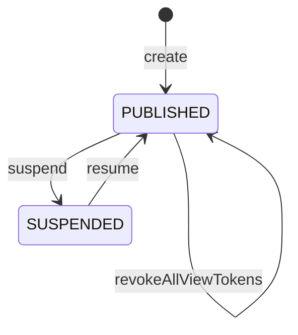

# 複数の共有アーティファクトをプロジェクトと、そのための閲覧トークンを守る集約：agg-project

## 概要

- 複数の共有アーティファクトを1つの閲覧トークンでまとめて見せるための単位を扱う集約。何が入っているかと、その閲覧トークンで何が開けるかを守る。
- 所属は人が明示的に選んだときにだけ成立する。中身に書かれた値によって所属が変わることは無い。

---

## 集約ルート

Project

### 外部参照（ID）

- SharedArtifact

---

## エンティティ

### Project（集約ルート）

プロジェクトの閲覧トークンと、入っている共有アーティファクトの一覧を守る集約ルート

| 属性 | 型 |
|---|---|
| projectId | ProjectId |
| displayName | string |
| projectKey | ProjectKey |
| status | ProjectStatus |
| owner | ProjectOwner |
| scope | ProjectScope |
| createdAt | string |
| viewTokens | ProjectViewToken[] |
| updatedAt | string |

### ProjectViewToken

このプロジェクトに入っている共有アーティファクトをまとめて開くための閲覧トークン1本。1つの配布先を表し、渡す人数は問わない。個別に無効にできるよう、集約の中で同一性を持つ

| 属性 | 型 |
|---|---|
| tokenId | ViewTokenId |
| name | string |
| fingerprint | string |
| expiresAt | ViewTokenExpiry |
| status | ViewTokenStatus |
| issuedAt | string |

---

## 値オブジェクト

### ProjectId

| 表す値 | 振る舞い |
|---|---|
| プロジェクトを一意に指すID | 不変。作成時に発行され、以後変わらない。 |

| 属性 | 型 |
|---|---|
| value | string |

### ProjectKey

| 表す値 | 振る舞い |
|---|---|
| 人が読める短い名前 | 不変。作る人が付ける。付けなくてもよい。 |

| 属性 | 型 |
|---|---|
| value | string |

### ProjectStatus

| 表す値 | 振る舞い |
|---|---|
| この単位が開けるかどうか | 不変。PUBLISHED と SUSPENDED のいずれか。共有アーティファクトと同じ語を使う——語彙は「公開停止」「再公開」を両方に用いており、同じ状態に2つの綴りを持たない。 |

| 属性 | 型 |
|---|---|
| value | string |

### ProjectOwner

| 表す値 | 振る舞い |
|---|---|
| このプロジェクトを作った投稿者 | 不変。作った時点で決まり、以後変わらない。見せ方を変える操作（閲覧トークンの発行・無効化、公開停止・再開）を行えるのは、この人と管理者だけ。 |

| 属性 | 型 |
|---|---|
| value | string |

### ProjectScope

| 表す値 | 振る舞い |
|---|---|
| 誰が共有アーティファクトを出し入れできるか | 不変。PERSONAL は持ち主だけ、SHARED は招かれた投稿者なら誰でも自分のものを出し入れできる。作るときに選び、あとから変えない（渡した相手に見えるものの前提が、渡したあとで変わらないようにするため）。 |

| 属性 | 型 |
|---|---|
| value | string |

### ViewTokenId

| 表す値 | 振る舞い |
|---|---|
| 1本の閲覧トークンを、プロジェクトの中で一意に指す識別子 | 不変。発行時に決まり、無効にしても変わらない。閲覧トークンそのものの値とは別で、こちらは持ち主が一覧で見て選ぶために使う。 |

| 属性 | 型 |
|---|---|
| value | string |

### ViewTokenExpiry

| 表す値 | 振る舞い |
|---|---|
| 1本の閲覧トークンが使えなくなる時点 | 不変。プロジェクトの閲覧トークンでは、期限を設けないことも選べる。置いておく場として使うため、回覧するものと同じ扱いにしない。期限を設けたときは、その時点を過ぎたあとに延ばすことはできない。 |

| 属性 | 型 |
|---|---|
| value | string |

### ViewTokenStatus

| 表す値 | 振る舞い |
|---|---|
| 1本の閲覧トークンが使える状態にあるかどうか | 不変。ACTIVE と REVOKED のいずれか。無効にすると REVOKED になり、元へは戻らない。 |

| 属性 | 型 |
|---|---|
| value | string |

---

## 不変条件

| ルール | 守り方 | 根拠 |
|---|---|---|
| 所属は、人が明示的に加える操作をしたときにだけ常に成立する | guard | - 所属は誰が開けるかを広げるため、中身に書かれた値で自動的に決まってはならない。書き換えるだけで他人のまとめに紛れ込めてしまう。 |
| この単位の閲覧トークンで開けるのは、常にこの単位に入っている共有アーティファクトだけである | guard | - 閲覧トークンを渡す相手に見せる範囲を、渡す側が把握できるようにするため。入っていないものまで開けると、渡した範囲が説明できなくなる。 |
| プロジェクトは、閲覧トークンそのものの値を常に保持せず、指紋だけを持つ | schema | - 渡した相手の手元にしか無い状態を保つことが、閲覧トークンが鍵として働く前提であるため。 |
| 閲覧トークンを1本無効にしても、他の閲覧トークンは常に使えたままになる | guard | - 1つの配布先を外すために他の配布先まで巻き添えで外れると、外す操作が使いにくくなり、結局使われなくなるため。 |
| 同時に有効な閲覧トークンは、常に5本を超えない。有効とは、無効にされておらず、かつ期限を過ぎていないことをいう | guard | - どれを無効にするかは持ち主が一覧から選ぶ操作であるため、選べる数に収まっている必要があるため。<br>- 共有アーティファクトと同じ仕組みで動かすため、同じ本数にそろえる。 |
| 1つのプロジェクトの中で、有効な閲覧トークンの名前は常に重ならない | guard | - 名前は、どれを無効にするかを持ち主が選ぶための手がかりであるため。 |
| プロジェクトの閲覧トークンには期限を設けないことを常に許す | schema | - プロジェクトは回覧するものではなく、置いておく場であるため。渡して終わりではないものに、必ず切れる期限を課す必然がない。<br>- この結果、共有アーティファクト側の期限はプロジェクト経由で迂回できる。恒久的に見せたいものはプロジェクトに入れる、という使い分けになる。 |
| この単位から共有アーティファクトを外しても、その共有アーティファクト自体は常に失われない | guard | - 外すことは、見せる範囲から取り除くことであって、消すことではないため。1件だけの閲覧トークンを渡した相手は引き続き見られてよい。 |
| この単位の公開を止めても、入っている共有アーティファクトは常にそれぞれの閲覧トークンで開ける | guard | - この単位は見せ方の束ねであって、入れ物ではないため。束ねを解いても中身が消えるわけではない。 |
| プロジェクトには、常にちょうど1人の持ち主がいる | schema | - 見せ方を変える操作は、閲覧トークンを渡した相手全員に及ぶため。誰の判断で及ぶのかが決まっていないと、止めた・閲覧トークンを無効にした理由を誰も説明できない。<br>- 持ち主が居ない状態を許すと、誰も止められないプロジェクトが生まれる。 |
| 共有の別は、作ったあと常に変わらない | guard | - 閲覧トークンを渡すとき、渡す側は『ここに何が入りうるか』を前提にして渡す相手を決めている。あとから個人から共有へ変えられると、その前提が渡したあとで崩れる。<br>- 逆に共有から個人へ変えると、既に入れた人が自分のものを外せなくなる。 |

---

## ライフサイクル



### 遷移

| from | to | command | 条件 |
|---|---|---|---|
| [*] | PUBLISHED | create | 招かれた者による作成であること |
| PUBLISHED | PUBLISHED | addArtifact |  |
| PUBLISHED | PUBLISHED | removeArtifact |  |
| PUBLISHED | PUBLISHED | issueViewToken | 有効な閲覧トークンが5本未満で、同じ名前の有効な閲覧トークンが無いこと |
| PUBLISHED | PUBLISHED | revokeViewToken |  |
| PUBLISHED | PUBLISHED | revokeAllViewTokens |  |
| PUBLISHED | SUSPENDED | suspend |  |
| SUSPENDED | PUBLISHED | resume |  |

---

## コマンド

### create

プロジェクトを作り、その閲覧トークンを発行する。作った時点では何も入っていない。

| 前提 | 後 | 発行イベント |
|---|---|---|
| None | ACTIVE |  |

### suspend

この単位を開けない状態にする。入っている共有アーティファクトはそれぞれの閲覧トークンで引き続き開ける。

| 前提 | 後 | 発行イベント |
|---|---|---|
| ACTIVE | SUSPENDED |  |

### resume

再び開けるようにする。止める前の閲覧トークンは、期限内で無効にされていなければそのまま使える。

| 前提 | 後 | 発行イベント |
|---|---|---|
| SUSPENDED | ACTIVE |  |

### issueViewToken

名前と期限を与えて閲覧トークンを1本発行する。それまでの閲覧トークンは使えたまま残る。期限を設けないことも選べる。同時に有効な閲覧トークンが5本あるとき、および有効な閲覧トークンと同じ名前を与えようとしたときは発行できない。あわせて、期限を過ぎた閲覧トークンの記録を取り除く。

| 前提 | 後 | 発行イベント |
|---|---|---|
| PUBLISHED | PUBLISHED |  |

### revokeViewToken

閲覧トークンを1本だけ無効にする。他の閲覧トークンは使えたまま残る。

| 前提 | 後 | 発行イベント |
|---|---|---|
| PUBLISHED | PUBLISHED |  |

### revokeAllViewTokens

有効な閲覧トークンをすべて無効にする。渡した相手を一度に全て外したいときに使う。入っている共有アーティファクトは、それぞれの閲覧トークンでは開けたまま残る。

| 前提 | 後 | 発行イベント |
|---|---|---|
| PUBLISHED | PUBLISHED |  |

### listViewTokens

有効な閲覧トークンの一覧を、名前・期限とともに返す。あわせて、期限を過ぎた閲覧トークンの記録を取り除く。閲覧トークンそのものの値は返さない。

| 前提 | 後 | 発行イベント |
|---|---|---|
|  |  |  |

---

## 不変条件シナリオ

### 背景

プロジェクトPが作られ、共有アーティファクトAが加えられている。

### 中身に書いた名前では所属できない

| 分類 | 観点 |
|---|---|
| 異常系 | 事前条件: 所属が人の操作によってのみ成立することを確かめる |

```gherkin
Scenario: 中身に書いた名前では所属できない
  Given 共有アーティファクトBはプロジェクトPに加えられていない
  When 共有アーティファクトBの中身にPの名前を分類の目印として書いて差し替える
  Then 共有アーティファクトBはPに所属しないままである
  And Pの閲覧トークンで共有アーティファクトBは開けない
```

### 入っていないものは開けない

| 分類 | 観点 |
|---|---|
| 異常系 | 事前条件: 閲覧トークンの及ぶ範囲が所属に限られることを確かめる |

```gherkin
Scenario: 入っていないものは開けない
  Given 共有アーティファクトBはプロジェクトPに入っていない
  When Pの閲覧トークンで共有アーティファクトBを開こうとする
  Then 開けない
```

### 共有アーティファクトの閲覧トークンを無効にしてもプロジェクト閲覧トークンは生きている

| 分類 | 観点 |
|---|---|
| 境界値 | 状態遷移: 2種類の閲覧トークンが互いに独立していることを確かめる |

```gherkin
Scenario: 共有アーティファクトの閲覧トークンを無効にしてもプロジェクト閲覧トークンは生きている
  Given 共有アーティファクトAがプロジェクトPに入っている
  When 共有アーティファクトAの閲覧トークンをすべて無効にする
  Then Pの閲覧トークンは引き続き使える
  And Pの閲覧トークンで共有アーティファクトAを開ける
```

### 外しても共有アーティファクトは生き続ける

| 分類 | 観点 |
|---|---|
| 正常系 | 状態遷移: 外すことが消すことではないと確かめる |

```gherkin
Scenario: 外しても共有アーティファクトは生き続ける
  Given 共有アーティファクトAがプロジェクトPに入っている
  When 共有アーティファクトAをPから外す
  Then 共有アーティファクトAはそれ自身の閲覧トークンで引き続き開ける
  And Pの閲覧トークンでは共有アーティファクトAを開けない
```

### まとめを止めても中身は開ける

| 分類 | 観点 |
|---|---|
| 境界値 | 状態遷移: 束ねを解いても中身が消えないことを確かめる |

```gherkin
Scenario: まとめを止めても中身は開ける
  Given プロジェクトPに共有アーティファクトAが入っている
  When プロジェクトPの公開を止める
  Then Pの閲覧トークンでは何も開けない
  And 共有アーティファクトAはそれ自身の閲覧トークンで開ける
```
