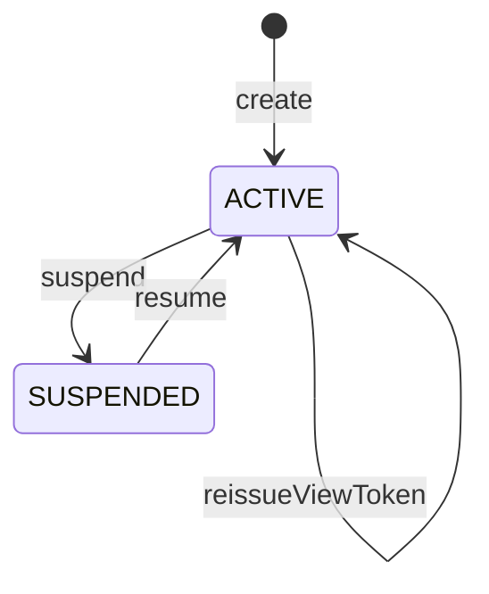

# 複数の表示物をまとめて見せる単位と、そのための合鍵を守る集約：agg-project

## 概要

- 複数の表示物を1つの合鍵でまとめて見せるための単位を扱う集約。何が入っているかと、その合鍵で何が開けるかを守る。
- 所属は人が明示的に選んだときにだけ成立する。表示物の中に書かれた値によって所属が変わることは無い。

---

## 集約ルート

Project

### 外部参照（ID）

- SharedArtifact

---

## エンティティ

### Project（集約ルート）

まとめて見せる単位の合鍵と、入っている表示物の一覧を守る集約ルート

| 属性 | 型 |
|---|---|
| projectId | ProjectId |
| displayName | string |
| projectKey | ProjectKey |
| viewToken | ProjectViewToken |
| status | ProjectStatus |
| memberSlugs | Slug[] |
| createdAt | string |

---

## 値オブジェクト

### ProjectId

| 表す値 | 振る舞い |
|---|---|
| まとめて見せる単位を一意に指す符丁 | 不変。作成時に発行され、以後変わらない。 |

| 属性 | 型 |
|---|---|
| value | string |

### ProjectKey

| 表す値 | 振る舞い |
|---|---|
| 人が読める短い名前 | 不変。作る人が付ける。付けなくてもよい。 |

| 属性 | 型 |
|---|---|
| value | string |

### ProjectViewToken

| 表す値 | 振る舞い |
|---|---|
| この単位に入っている表示物をまとめて開くための合鍵 | 不変。作成時に一度だけ示され、以後は見返せない。個々の表示物の合鍵とは別のもので、個々の表示物が公開を止めても失効しない。 |

| 属性 | 型 |
|---|---|
| value | string |
| issuedAt | string |

### ProjectStatus

| 表す値 | 振る舞い |
|---|---|
| この単位が開けるかどうか | 不変。ACTIVE と SUSPENDED のいずれか。 |

| 属性 | 型 |
|---|---|
| value | string |

---

## 不変条件

| ルール | 守り方 | 根拠 |
|---|---|---|
| 所属は、人が明示的に加える操作をしたときにだけ常に成立する | guard | - 所属は誰が開けるかを広げるため、表示物の中に書かれた値で自動的に決まってはならない。書き換えるだけで他人のまとめに紛れ込めてしまう。 |
| この単位の合鍵で開けるのは、常にこの単位に入っている表示物だけである | guard | - 合鍵を渡す相手に見せる範囲を、渡す側が把握できるようにするため。入っていないものまで開けると、渡した範囲が説明できなくなる。 |
| この単位の合鍵は、個々の表示物の合鍵の再発行や公開停止によって常に失効しない | guard | - まとめて見せる相手と、1件だけ見せる相手は別であるため。片方の都合でもう片方の合鍵が失効すると、渡し直しが際限なく発生する。 |
| この単位から表示物を外しても、その表示物自体は常に失われない | guard | - 外すことは、見せる範囲から取り除くことであって、消すことではないため。1件だけの合鍵を渡した相手は引き続き見られてよい。 |
| この単位の公開を止めても、入っている表示物は常にそれぞれの合鍵で開ける | guard | - この単位は見せ方の束ねであって、入れ物ではないため。束ねを解いても中身が消えるわけではない。 |

---

## ライフサイクル



### 遷移

| from | to | command | 条件 |
|---|---|---|---|
| [*] | ACTIVE | create | 招かれた者による作成であること |
| ACTIVE | ACTIVE | addArtifact |  |
| ACTIVE | ACTIVE | removeArtifact |  |
| ACTIVE | ACTIVE | reissueViewToken |  |
| ACTIVE | SUSPENDED | suspend |  |
| SUSPENDED | ACTIVE | resume |  |

---

## コマンド

### create

まとめて見せる単位を作り、その合鍵を発行する。作った時点では何も入っていない。

| 前提 | 後 | 発行イベント |
|---|---|---|
| None | ACTIVE |  |

### addArtifact

表示物をこの単位へ加える。人が明示的に選んだ結果としてのみ実行される。

| 前提 | 後 | 発行イベント |
|---|---|---|
| ACTIVE | ACTIVE |  |

### removeArtifact

表示物をこの単位から外す。表示物自体は失われず、それぞれの合鍵で引き続き開ける。

| 前提 | 後 | 発行イベント |
|---|---|---|
| ACTIVE | ACTIVE |  |

### reissueViewToken

新しい合鍵を発行し、それまでの合鍵を使えなくする。入っている表示物は変わらない。

| 前提 | 後 | 発行イベント |
|---|---|---|
| ACTIVE | ACTIVE |  |

### suspend

この単位を開けない状態にする。入っている表示物はそれぞれの合鍵で引き続き開ける。

| 前提 | 後 | 発行イベント |
|---|---|---|
| ACTIVE | SUSPENDED |  |

### resume

再び開けるようにする。合鍵は必ず新しくなる。

| 前提 | 後 | 発行イベント |
|---|---|---|
| SUSPENDED | ACTIVE |  |

---

## ドメインイベント

### ArtifactAssignedToProject

#### 発行契機

addArtifact

#### ペイロード

| 項目 | 意味 |
|---|---|
| projectId | 加え先のまとめて見せる単位 |
| slug | 加えられた表示物を指す符丁 |

### ArtifactRemovedFromProject

#### 発行契機

removeArtifact

#### ペイロード

| 項目 | 意味 |
|---|---|
| projectId | 外し元のまとめて見せる単位 |
| slug | 外された表示物を指す符丁 |

---

## 不変条件シナリオ

### 背景

まとめて見せる単位Pが作られ、表示物Aが加えられている。

### 中身に書いた名前では所属できない

| 分類 | 観点 |
|---|---|
| 異常系 | 事前条件: 所属が人の操作によってのみ成立することを確かめる |

```gherkin
Given 表示物Bはまとめて見せる単位Pに加えられていない
When 表示物Bの中身にPの名前を分類の目印として書いて差し替える
Then 表示物BはPに所属しないままである
And Pの合鍵で表示物Bは開けない
```

### 入っていないものは開けない

| 分類 | 観点 |
|---|---|
| 異常系 | 事前条件: 合鍵の及ぶ範囲が所属に限られることを確かめる |

```gherkin
Given 表示物Bはまとめて見せる単位Pに入っていない
When Pの合鍵で表示物Bを開こうとする
Then 開けない
```

### 表示物の合鍵を再発行してもまとめの合鍵は生きている

| 分類 | 観点 |
|---|---|
| 境界値 | 状態遷移: 2種類の合鍵が互いに独立していることを確かめる |

```gherkin
Given 表示物Aがまとめて見せる単位Pに入っている
When 表示物Aの合鍵を再発行する
Then Pの合鍵は引き続き使える
And Pの合鍵で表示物Aを開ける
```

### 外しても表示物は生き続ける

| 分類 | 観点 |
|---|---|
| 正常系 | 状態遷移: 外すことが消すことではないと確かめる |

```gherkin
Given 表示物Aがまとめて見せる単位Pに入っている
When 表示物AをPから外す
Then 表示物Aはそれ自身の合鍵で引き続き開ける
And Pの合鍵では表示物Aを開けない
```

### まとめを止めても中身は開ける

| 分類 | 観点 |
|---|---|
| 境界値 | 状態遷移: 束ねを解いても中身が消えないことを確かめる |

```gherkin
Given まとめて見せる単位Pに表示物Aが入っている
When まとめて見せる単位Pの公開を止める
Then Pの合鍵では何も開けない
And 表示物Aはそれ自身の合鍵で開ける
```
