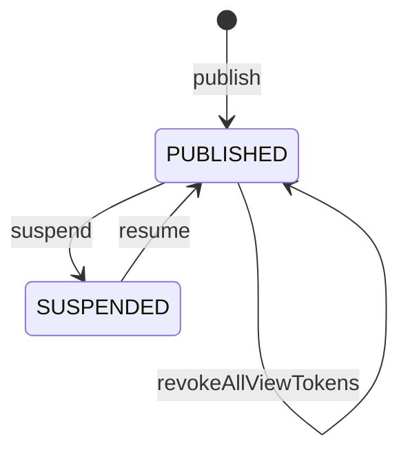

# 公開された1つの共有アーティファクトと、それを開くための閲覧トークンを守る集約：agg-shared-artifact

## 概要

- 誰かに見てもらうために公開された共有アーティファクト1件を扱う集約。公開されているか、誰が開けるか、中身が入れ替わっていないかを守る。
- 中身に何が書かれているかは解釈しない。解釈しないことが、この集約が中身を書き換えないという約束の裏返しになっている。

---

## 集約ルート

SharedArtifact

### 外部参照（ID）

- Project
- Comment

---

## エンティティ

### SharedArtifact（集約ルート）

root

| 属性 | 型 |
|---|---|
| artifactId | ArtifactId |
| displayName | string |
| contentFingerprint | string |
| viewTokens | ArtifactViewToken[] |
| status | ArtifactStatus |
| publishedBy | PublisherId |
| descriptor | ArtifactDescriptor |
| publishedAt | string |
| updatedAt | string |

### ArtifactViewToken

child

| 属性 | 型 |
|---|---|
| tokenId | ViewTokenId |
| name | string |
| fingerprint | string |
| expiresAt | ViewTokenExpiry |
| status | ViewTokenStatus |
| issuedAt | string |

---

## 値オブジェクト

### ArtifactId

| 表す値 | 振る舞い |
|---|---|
| 公開された共有アーティファクトを一意に指す短いID | 不変。公開時に発行され、以後どの操作でも変わらない。差し替えても再公開しても同じ値を保つ。中身はこの集約の外に置かれ、この値で指す。 |

| 属性 | 型 |
|---|---|
| value | string |

### ViewTokenId

| 表す値 | 振る舞い |
|---|---|
| 1本の閲覧トークンを、共有アーティファクトの中で一意に指す識別子 | 不変。発行時に決まり、無効化しても変わらない。閲覧トークンそのものの値とは別で、こちらは公開した人が一覧で見て選ぶために使う。 |

| 属性 | 型 |
|---|---|
| value | string |

### ViewTokenExpiry

| 表す値 | 振る舞い |
|---|---|
| 1本の閲覧トークンが使えなくなる時点 | 不変。共有アーティファクトの閲覧トークンでは必ず有限で、発行した時点から最長１ヶ月を超えない。省いたときは1週間になる。時点を過ぎたあとに延ばすことはできず、続けて見せたいときは新しく発行し直す。 |

| 属性 | 型 |
|---|---|
| value | string |

### ViewTokenStatus

| 表す値 | 振る舞い |
|---|---|
| 1本の閲覧トークンが使える状態にあるかどうか | 不変。ACTIVE と REVOKED のいずれか。無効にすると REVOKED になり、元へは戻らない。 |

| 属性 | 型 |
|---|---|
| value | string |

### ArtifactDescriptor

| 表す値 | 振る舞い |
|---|---|
| 共有アーティファクトに添えられた識別子・種別・題名・要約・分類の目印 | 不変。中身に書かれていれば取り出し、書かれていなければ題名だけを人が与える。種別と分類の目印は保持するだけで、値の意味を解釈しない。 |

| 属性 | 型 |
|---|---|
| documentId | string |
| docType | string |
| title | string |
| description | string |
| labels | string[] |

### ArtifactStatus

| 表す値 | 振る舞い |
|---|---|
| 公開されているかどうか | 不変。PUBLISHED と SUSPENDED のいずれか。 |

| 属性 | 型 |
|---|---|
| value | string |

### PublisherId

| 表す値 | 振る舞い |
|---|---|
| 公開した人を指す識別子 | 不変。招かれた者にのみ与えられる。 |

| 属性 | 型 |
|---|---|
| value | string |

---

## 不変条件

| ルール | 守り方 | 根拠 |
|---|---|---|
| 公開された共有アーティファクトの中身は、公開後に部分的に書き換えられることが常に無い | guard | - 受け取った側が見ているものと、公開した側が渡したつもりのものが食い違わないようにするため。<br>- 手元へ取り出したときに、公開した中身と一致することを保証するため。<br>- 中身そのものはこの集約の一貫性の境界の外にあり、共有アーティファクトはその指紋だけを持つ。どの不変条件も中身を読まないため。 |
| 共有アーティファクトは、閲覧トークンそのものの値を常に保持せず、指紋だけを持つ | schema | - 渡した相手の手元にしか無い状態を保つことが、閲覧トークンが鍵として働く前提であるため。<br>- 保管された値を見返せると、公開した人の手元からも漏れうる。 |
| 閲覧トークンは、発行された瞬間に一度だけ示され、以後は常に見返せない | guard | - 渡した相手の手元にしか無い状態を保つことが、閲覧トークンが鍵として働く前提であるため。<br>- 保持しないことと、見返せないことは別の規則である。前者が崩れなくても、発行直後の提示を何度も行えるなら同じことが起きる。 |
| 閲覧トークンの期限は常に有限で、発行した時点から最長、1ヶ月を超えない | guard | - 渡した相手を外す手立てが人手の操作だけだと、押し忘れたときに渡したものが永久に開き続けるため。<br>- 上限が無いと遠い先の時点を選べてしまい、期限があることが形だけになる。<br>- 続けて見せたい場合はまとめの側で扱う。回覧するものと、置いておく場は別の扱いにする。 |
| 期限を過ぎた閲覧トークンでは常に開けない | guard | - 期限は各配信の口が自分の時計で判定するため、無効化の伝わりを待たずに効く唯一の手立てになる。 |
| 期限を過ぎた閲覧トークンの記録は、常に残らない | guard | - 残しても無効にする対象にはならず、一覧を埋めて選びにくくするだけであるため。<br>- 見る側からは期限切れと初めから無いものを区別しないため、記録の有無は開けるかどうかに影響しない。 |
| 無効にした閲覧トークンでは常に開けず、無効にしても他の閲覧トークンは常に使えたままになる | guard | - 1つの配布先を外すために他の配布先まで巻き添えで外れると、外す操作が使いにくくなり、結局使われなくなるため。<br>- 閲覧トークン1本は1つの配布先を表し、配布先ごとに独立して止められる必要がある。 |
| 同時に有効な閲覧トークンは、常に5本を超えない。有効とは、無効にされておらず、かつ期限を過ぎていないことをいう | guard | - どれを無効にするかは公開した人が一覧から選ぶ操作であるため、選べる数に収まっている必要があるため。<br>- 閲覧トークン1本が複数の人をまとめた1つの配布先を表すため、5つの配布先を同時に持てれば足りる。これは経験則であり、実際の使われ方を見て見直しうる。<br>- 期限を過ぎたものは無効にする対象にならないため、この数には含めない。 |
| 1つの共有アーティファクトの中で、有効な閲覧トークンの名前は常に重ならない | guard | - 名前は、どれを無効にするかを公開した人が選ぶための手がかりであるため。同じ名前が2つあると、選ぶという操作そのものが成り立たない。 |
| 有効な閲覧トークンが1本も無い状態を常に許す | schema | - 全ての配布先を外したあと、まだ公開を続けるか決めていない期間があるため。<br>- この状態でも公開は止まっておらず、まとめの側からは開ける。誰にも渡していないことと、公開を止めたことは別の意味を持つ。 |
| 公開を止めている間は、どの閲覧トークンでも常に開けない | guard | - 公開を止めるのは、配布先を選ばず全ての経路を閉じたいときの手立てであるため。<br>- 閲覧トークンごとの無効化では、まとめの閲覧トークン経由の経路が残る。 |
| IDは、公開してから取り消すまで常に変わらない | schema | - 一度渡した共有URLが変わらないことが、差し替えても同じ場所で見続けられるという体験の前提になるため。 |
| 中身に書かれた分類の目印が、誰が開けるかを変えることは常に無い | guard | - 分類の目印は、公開する人が中身に自由に書ける値であるため。これが閲覧の範囲を決めるなら、書き換えるだけで見せる相手を増やせてしまう。<br>- 誰が開けるかを決めるのは、閲覧トークンとプロジェクトへの所属だけであり、いずれも人が明示的に操作した結果である。 |
| 中身を差し替えたとき、それまでに集まったコメントは常に失われない | guard | - 指摘を受けて直し、また見てもらう、という往復がこの文脈の中心にあるため。直すたびにコメントが消えると、その往復が成立しない。 |
| 共有アーティファクトには、常にちょうど1人の投稿者がいる | schema | - 投稿者が誰かを見て、差し替え・公開停止・閲覧トークンの発行と無効化を許すかどうかを決めているため。投稿者が居ない状態を許すと、誰も手入れできない共有アーティファクトが生まれる。<br>- 人を外しても共有アーティファクトが残るのは、この不変条件と引き継ぎが対になって初めて成り立つ。 |
| 投稿者を移しても、共有URL・閲覧トークン・中身・コメント・公開状態は常に変わらない | guard | - 引き継ぎは、手入れできる人を替えるだけの操作であるため。渡した相手の手元で何かが変わると、投稿者の異動という内輪の事情が閲覧者に漏れる。 |

---

## ライフサイクル



### 遷移

| from | to | command | 条件 |
|---|---|---|---|
| [*] | PUBLISHED | publish | 招かれた者による公開であること |
| PUBLISHED | PUBLISHED | replaceContent |  |
| PUBLISHED | PUBLISHED | issueViewToken | 有効な閲覧トークンが5本未満で、同じ名前の有効な閲覧トークンが無いこと |
| PUBLISHED | PUBLISHED | revokeViewToken |  |
| PUBLISHED | PUBLISHED | revokeAllViewTokens |  |
| PUBLISHED | SUSPENDED | suspend |  |
| SUSPENDED | PUBLISHED | resume |  |

---

## コマンド

### publish

文書を受け取って公開し、IDと最初の閲覧トークンを発行する。最初の閲覧トークンにも名前と期限を与えられる。中身をそのまま保持し、書き換えない。

| 前提 | 後 | 発行イベント |
|---|---|---|
|  | PUBLISHED |  |

### replaceContent

中身だけを新しいものへ丸ごと置き換える。ID・閲覧トークン・それまでのコメントを保つ。

| 前提 | 後 | 発行イベント |
|---|---|---|
| PUBLISHED | PUBLISHED |  |

### issueViewToken

名前と期限を与えて閲覧トークンを1本発行する。それまでの閲覧トークンは使えたまま残る。期限を省くと1週間になり、発行した時点から1ヶ月を超える期限は与えられない。同時に有効な閲覧トークンが5本あるとき、および有効な閲覧トークンと同じ名前を与えようとしたときは発行できない。あわせて、期限を過ぎた閲覧トークンの記録を取り除く。

| 前提 | 後 | 発行イベント |
|---|---|---|
| PUBLISHED | PUBLISHED |  |

### revokeViewToken

閲覧トークンを1本だけ無効にする。他の閲覧トークンは使えたまま残る。

| 前提 | 後 | 発行イベント |
|---|---|---|
| PUBLISHED | PUBLISHED |  |

### revokeAllViewTokens

有効な閲覧トークンをすべて無効にする。渡した相手を一度に全て外したいときに使う。公開そのものは止まらないため、まとめの側から開ける経路は残る。

| 前提 | 後 | 発行イベント |
|---|---|---|
| PUBLISHED | PUBLISHED |  |

### suspend

開けない状態にする。中身もコメントも消さない。閲覧トークンは無効にならないため、再開すれば止める前の相手が再び開けるようになる。渡した相手を外したいときは、閲覧トークンを無効にする方を使う。

| 前提 | 後 | 発行イベント |
|---|---|---|
| PUBLISHED | SUSPENDED |  |

### resume

再び開けるようにする。止める前の閲覧トークンは、期限内で無効にされていなければそのまま使える。

| 前提 | 後 | 発行イベント |
|---|---|---|
| SUSPENDED | PUBLISHED |  |

### transfer

投稿者を別の投稿者へ移す。共有URL・閲覧トークン・中身・コメント・公開状態のいずれも変えないため、公開中でも公開停止中でも実行できる。

| 前提 | 後 | 発行イベント |
|---|---|---|
|  |  |  |

### listViewTokens

有効な閲覧トークンの一覧を、名前・期限とともに返す。あわせて、期限を過ぎた閲覧トークンの記録を取り除く。閲覧トークンそのものの値は返さない。

| 前提 | 後 | 発行イベント |
|---|---|---|
|  |  |  |

---

## ドメインイベント

### ArtifactPublished

#### 発行契機

publish

#### ペイロード

| 項目 | 意味 |
|---|---|
| artifactId | 公開された共有アーティファクトを指すID |
| publishedBy | 公開した人 |

### ViewTokenIssued

#### 発行契機

issueViewToken

#### ペイロード

| 項目 | 意味 |
|---|---|
| artifactId | 閲覧トークンを発行した共有アーティファクトを指すID |
| tokenId | 発行した閲覧トークンを指す識別子 |
| name | その閲覧トークンがどの配布先のものかを表す名前 |
| expiresAt | その閲覧トークンが使えなくなる時点 |

### ViewTokenRevoked

#### 発行契機

revokeViewToken

#### ペイロード

| 項目 | 意味 |
|---|---|
| artifactId | 閲覧トークンを無効にした共有アーティファクトを指すID |
| tokenId | 無効にした閲覧トークンを指す識別子 |

### ArtifactContentReplaced

#### 発行契機

replaceContent

#### ペイロード

| 項目 | 意味 |
|---|---|
| artifactId | 差し替えられた共有アーティファクトを指すID |
| replacedAt | 差し替えが行われた時点。この時点を境に、それ以前の指摘が差し替え前のものであると読み取れる |

### ArtifactSuspended

#### 発行契機

suspend

#### ペイロード

| 項目 | 意味 |
|---|---|
| artifactId | 公開を止めた共有アーティファクトを指すID |

### ArtifactTransferred

#### 発行契機

transfer

#### ペイロード

| 項目 | 意味 |
|---|---|
| artifactId | 引き継がれた共有アーティファクトを指すID |
| from | それまでの投稿者 |
| to | 新しい投稿者 |

---

## 不変条件シナリオ

### 背景

招かれた投稿者が共有アーティファクトを1件公開しており、閲覧者から数件のコメントが集まっている。

### 差し替えても中身は部分的に書き換わらない

| 分類 | 観点 |
|---|---|
| 正常系 | 計算整合: 差し替えが丸ごとの置き換えであり、公開した中身と受け取った側が見るものが一致し続けることを確かめる |

```gherkin
Scenario: 差し替えても中身は部分的に書き換わらない
Given 共有アーティファクトAが公開されている
When 新しい文書で中身を差し替える
Then 中身は新しいものと完全に一致する
And 差し替え前の中身の一部が残ることはない
```

### 1本を無効にしても他の閲覧トークンは使える

| 分類 | 観点 |
|---|---|
| 正常系 | 一貫性：1つの配布先を外しても他の配布先が巻き添えにならないことを確かめる |

```gherkin
Scenario: 1本を無効にしても他の閲覧トークンは使える
  Given 2本の閲覧トークンが発行されている共有アーティファクト
  When 一方の閲覧トークンを無効にする
  Then 無効にした閲覧トークンでは開けない
  And もう一方の閲覧トークンでは開ける
```

### 有効な閲覧トークンが5本あると発行できない

| 分類 | 観点 |
|---|---|
| 境界値 | 上限：選べる数に収まっていることを確かめる |

```gherkin
Scenario: 有効な閲覧トークンが5本あると発行できない
  Given 有効な閲覧トークンが5本ある共有アーティファクト
  When 新しい閲覧トークンを発行しようとする
  Then 発行できない
```

### 期限を過ぎた閲覧トークンは上限に数えない

| 分類 | 観点 |
|---|---|
| 境界値 | 上限：無効にする対象でないものが枠を埋めないことを確かめる |

```gherkin
Scenario: 期限を過ぎた閲覧トークンは上限に数えない
  Given 有効な閲覧トークンが4本あり、そのほかに期限を過ぎた閲覧トークンがある共有アーティファクト
  When 新しい閲覧トークンを発行する
  Then 発行できる
```

### 再開しても期限内の閲覧トークンはそのまま使える

| 分類 | 観点 |
|---|---|
| 正常系 | 状態遷移：再開が閲覧トークンを作り直さないことを確かめる |

```gherkin
Scenario: 再開しても期限内の閲覧トークンはそのまま使える
  Given 公開を止めた共有アーティファクトと、期限内で無効にされていない閲覧トークン
  When 公開を再開する
  Then その閲覧トークンで開ける
```

### 差し替えても共有URLは変わらない

| 分類 | 観点 |
|---|---|
| 正常系 | 事前条件: 一度渡した共有URLが保たれ、渡し直しが不要であることを確かめる |

```gherkin
Scenario: 差し替えても共有URLは変わらない
Given 共有アーティファクトAの共有URLが閲覧者へ渡されている
When 中身を差し替える
Then 共有URLは変わらない
And 閲覧者は同じ共有URLで新しい中身を見られる
```

### 分類の目印を書き換えても見られる相手は増えない

| 分類 | 観点 |
|---|---|
| 異常系 | 事前条件: 中身に書かれた値が閲覧の範囲に影響しないことを確かめる |

```gherkin
Scenario: 分類の目印を書き換えても見られる相手は増えない
Given 共有アーティファクトAはどのプロジェクトにも所属していない
When 別のプロジェクトの名前を分類の目印として書いた中身へ差し替える
Then そのプロジェクトの閲覧トークンでは開けないままである
```

### 差し替えてもコメントが残る

| 分類 | 観点 |
|---|---|
| 正常系 | 計算整合: 直して見てもらう往復が成立することを確かめる |

```gherkin
Scenario: 差し替えてもコメントが残る
Given 共有アーティファクトAに3件のコメントが集まっている
When 中身を差し替える
Then 3件のコメントはいずれも残っている
And 差し替えが行われた時点が区切りとして読み取れる
```

### まとめて無効にすると全ての配布先が外れる

| 分類 | 観点 |
|---|---|
| 正常系 | 一貫性：渡した相手を一度に全て外せることを確かめる |

```gherkin
Scenario: まとめて無効にすると全ての配布先が外れる
  Given 3本の閲覧トークンが発行されている共有アーティファクト
  When 閲覧トークンをまとめて無効にする
  Then どの閲覧トークンでも開けない
  And 公開そのものは止まっていない
```

### 同じ名前の閲覧トークンは発行できない

| 分類 | 観点 |
|---|---|
| 異常系 | 一意性：どれを無効にするか選べる状態を保つことを確かめる |

```gherkin
Scenario: 同じ名前の閲覧トークンは発行できない
  Given 「デザインチーム」という名前の有効な閲覧トークンがある共有アーティファクト
  When 同じ名前で新しい閲覧トークンを発行しようとする
  Then 発行できない
```

### 1ヶ月を超える期限は与えられない

| 分類 | 観点 |
|---|---|
| 境界値 | 値域：期限があることが形だけにならないことを確かめる |

```gherkin
Scenario: 1ヶ月を超える期限は与えられない
  Given 公開されている共有アーティファクト
  When 発行した時点から1ヶ月を超える期限で閲覧トークンを発行しようとする
  Then 発行できない
```

### 有効な閲覧トークンが1本も無くても公開は続く

| 分類 | 観点 |
|---|---|
| 境界値 | 状態：誰にも渡していないことと、公開を止めたことを区別する |

```gherkin
Scenario: 有効な閲覧トークンが1本も無くても公開は続く
  Given 閲覧トークンをまとめて無効にした共有アーティファクト
  When 公開状態を確かめる
  Then 公開は止まっていない
```
