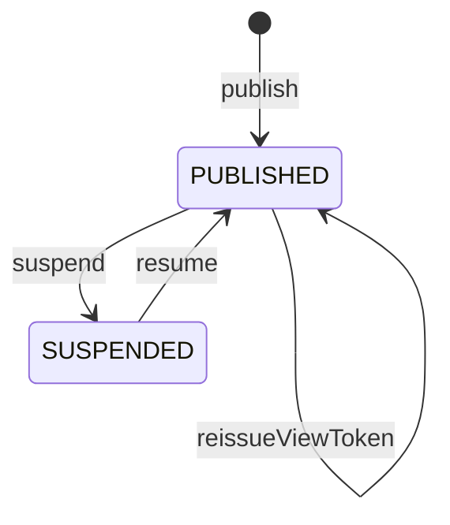

# 公開された1つの表示物と、それを開くための合鍵を守る集約：agg-shared-artifact

## 概要

- 誰かに見てもらうために公開された表示物1件を扱う集約。公開されているか、誰が開けるか、中身が入れ替わっていないかを守る。
- 中身に何が書かれているかは解釈しない。解釈しないことが、この集約が中身を書き換えないという約束の裏返しになっている。

---

## 集約ルート

SharedArtifact

### 外部参照（ID）

- Project
- Comment

---

## エンティティ

### SharedArtifact（集約ルート）

公開された表示物1件の公開状態と合鍵を守る集約ルート

| 属性 | 型 |
|---|---|
| slug | Slug |
| displayName | string |
| content | ArtifactContent |
| viewToken | ArtifactViewToken |
| status | ArtifactStatus |
| publishedBy | PublisherId |
| descriptor | ArtifactDescriptor |
| publishedAt | string |
| updatedAt | string |

---

## 値オブジェクト

### Slug

| 表す値 | 振る舞い |
|---|---|
| 公開された表示物を一意に指す短い符丁 | 不変。公開時に発行され、以後どの操作でも変わらない。差し替えても再公開しても同じ値を保つ。 |

| 属性 | 型 |
|---|---|
| value | string |

### ArtifactContent

| 表す値 | 振る舞い |
|---|---|
| 公開された表示物そのもの | 不変。公開後に部分的な書き換えは行わず、差し替えのときだけ丸ごと新しいものに置き換わる。置き換えても、それまでに集まったコメントは失われない。 |

| 属性 | 型 |
|---|---|
| bytes | string |
| fingerprint | string |

### ArtifactViewToken

| 表す値 | 振る舞い |
|---|---|
| この表示物1件を開くための合鍵 | 不変。発行された瞬間に一度だけ示され、以後は見返せない。書き換えではなく、常に新しい合鍵の発行によって置き換わる。置き換わった時点で、それまでの合鍵は使えなくなる。 |

| 属性 | 型 |
|---|---|
| value | string |
| issuedAt | string |

### ArtifactDescriptor

| 表す値 | 振る舞い |
|---|---|
| 表示物に添えられた識別子・種別・題名・要約・分類の目印 | 不変。表示物の中に書かれていれば取り出し、書かれていなければ題名だけを人が与える。種別と分類の目印は保持するだけで、値の意味を解釈しない。 |

| 属性 | 型 |
|---|---|
| documentId | string |
| docType | string |
| title | string |
| description | string |
| labels | string[] |

### ArtifactStatus

| 表す値 | 振る舞い |
|---|---|
| 公開されているかどうか | 不変。PUBLISHED と SUSPENDED のいずれか。 |

| 属性 | 型 |
|---|---|
| value | string |

### PublisherId

| 表す値 | 振る舞い |
|---|---|
| 公開した人を指す識別子 | 不変。招かれた者にのみ与えられる。 |

| 属性 | 型 |
|---|---|
| value | string |

---

## 不変条件

| ルール | 守り方 | 根拠 |
|---|---|---|
| 公開された表示物の中身は、公開後に部分的に書き換えられることが常に無い | guard | - 受け取った側が見ているものと、公開した側が渡したつもりのものが食い違わないようにするため。<br>- 手元へ取り出したときに、公開した表示物と一致することを保証するため。 |
| 合鍵を新しく発行したとき、それまでの合鍵は常に使えなくなる | guard | - 合鍵を渡した相手から見せる相手を外したいときに、新しい合鍵の発行がその手段になるため。古い合鍵が生き残ると、外したはずの相手が見続けられる。 |
| 公開を再開したとき、合鍵は常に新しくなる | guard | - 公開を止める理由の多くが、見せる相手を絞り直したいことにあるため。止める前の合鍵をそのまま復活させると、止めた意図が失われる。 |
| 符丁は、公開してから取り消すまで常に変わらない | schema | - 一度渡した居場所が変わらないことが、差し替えても同じ場所で見続けられるという体験の前提になるため。 |
| 中身に書かれた分類の目印が、誰が開けるかを変えることは常に無い | guard | - 分類の目印は、公開する人が中身に自由に書ける値であるため。これが閲覧の範囲を決めるなら、書き換えるだけで見せる相手を増やせてしまう。<br>- 誰が開けるかを決めるのは、合鍵とプロジェクトへの所属だけであり、いずれも人が明示的に操作した結果である。 |
| 中身を差し替えたとき、それまでに集まったコメントは常に失われない | guard | - 指摘を受けて直し、また見てもらう、という往復がこの文脈の中心にあるため。直すたびに反応が消えると、その往復が成立しない。 |

---

## ライフサイクル



### 遷移

| from | to | command | 条件 |
|---|---|---|---|
| [*] | PUBLISHED | publish | 招かれた者による公開であること |
| PUBLISHED | PUBLISHED | replaceContent |  |
| PUBLISHED | PUBLISHED | reissueViewToken |  |
| PUBLISHED | SUSPENDED | suspend |  |
| SUSPENDED | PUBLISHED | resume |  |

---

## コマンド

### publish

表示物を受け取って公開し、符丁と合鍵を発行する。中身をそのまま保持し、書き換えない。

| 前提 | 後 | 発行イベント |
|---|---|---|
| None | PUBLISHED |  |

### replaceContent

中身だけを新しいものへ丸ごと置き換える。符丁・合鍵・それまでのコメントを保つ。

| 前提 | 後 | 発行イベント |
|---|---|---|
| PUBLISHED | PUBLISHED |  |

### reissueViewToken

新しい合鍵を発行し、それまでの合鍵を使えなくする。符丁は変えない。

| 前提 | 後 | 発行イベント |
|---|---|---|
| PUBLISHED | PUBLISHED |  |

### suspend

開けない状態にする。中身もコメントも消さない。

| 前提 | 後 | 発行イベント |
|---|---|---|
| PUBLISHED | SUSPENDED |  |

### resume

再び開けるようにする。合鍵は必ず新しくなる。

| 前提 | 後 | 発行イベント |
|---|---|---|
| SUSPENDED | PUBLISHED |  |

---

## ドメインイベント

### ArtifactPublished

#### 発行契機

publish

#### ペイロード

| 項目 | 意味 |
|---|---|
| slug | 公開された表示物を指す符丁 |
| publishedBy | 公開した人 |

### ArtifactContentReplaced

#### 発行契機

replaceContent

#### ペイロード

| 項目 | 意味 |
|---|---|
| slug | 差し替えられた表示物を指す符丁 |
| replacedAt | 差し替えが行われた時点。この時点を境に、それ以前の指摘が差し替え前のものであると読み取れる |

### ArtifactSuspended

#### 発行契機

suspend

#### ペイロード

| 項目 | 意味 |
|---|---|
| slug | 公開を止めた表示物を指す符丁 |

---

## 不変条件シナリオ

### 背景

招かれた投稿者が表示物を1件公開しており、閲覧者から数件のコメントが集まっている。

### 差し替えても中身は部分的に書き換わらない

| 分類 | 観点 |
|---|---|
| 正常系 | 計算整合: 差し替えが丸ごとの置き換えであり、公開した表示物と受け取った側が見るものが一致し続けることを確かめる |

```gherkin
Given 表示物Aが公開されている
When 新しい表示物で中身を差し替える
Then 中身は新しいものと完全に一致する
And 差し替え前の中身の一部が残ることはない
```

### 合鍵を再発行すると前の合鍵は使えない

| 分類 | 観点 |
|---|---|
| 境界値 | 状態遷移: 合鍵の置き換えが、それまでの合鍵の失効を伴うことを確かめる |

```gherkin
Given 表示物Aの合鍵が閲覧者へ渡されている
When 合鍵を再発行する
Then 新しい合鍵で開ける
And それまでの合鍵では開けない
```

### 再開すると合鍵が変わる

| 分類 | 観点 |
|---|---|
| 境界値 | 状態遷移: 公開を止めて再開したとき、止める前の合鍵が復活しないことを確かめる |

```gherkin
Given 表示物Aが公開停止されている
When 公開を再開する
Then 新しい合鍵が発行される
And 公開停止前の合鍵では開けない
```

### 差し替えても居場所は変わらない

| 分類 | 観点 |
|---|---|
| 正常系 | 事前条件: 一度渡した居場所が保たれ、渡し直しが不要であることを確かめる |

```gherkin
Given 表示物Aの居場所が閲覧者へ渡されている
When 中身を差し替える
Then 居場所は変わらない
And 閲覧者は同じ居場所で新しい中身を見られる
```

### 分類の目印を書き換えても見られる相手は増えない

| 分類 | 観点 |
|---|---|
| 異常系 | 事前条件: 中身に書かれた値が閲覧の範囲に影響しないことを確かめる |

```gherkin
Given 表示物Aはどのプロジェクトにも所属していない
When 別のプロジェクトの名前を分類の目印として書いた中身へ差し替える
Then そのプロジェクトの合鍵では開けないままである
```

### 差し替えてもコメントが残る

| 分類 | 観点 |
|---|---|
| 正常系 | 計算整合: 直して見てもらう往復が成立することを確かめる |

```gherkin
Given 表示物Aに3件のコメントが集まっている
When 中身を差し替える
Then 3件のコメントはいずれも残っている
And 差し替えが行われた時点が区切りとして読み取れる
```
