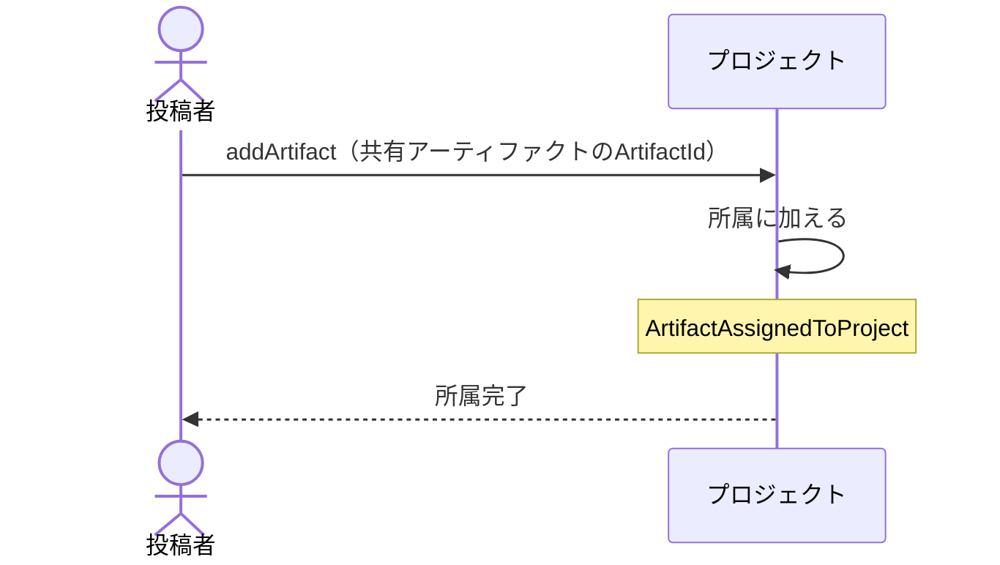

# 共有アーティファクトをプロジェクトへ入れる・外す：uc-assign-to-project

## 概要

- 共有アーティファクトを、プロジェクトへ加えたり外したりする操作。加えるとその単位の閲覧トークンでも開けるようになる。
- 所属は人が明示的に選んだときにだけ成立する。中身に書かれた値によって決まることはない。

---

## 存在意義

- 1件ずつ閲覧トークンを渡すと、渡す側も受け取る側も管理しきれない。関連するものをまとめて1つの閲覧トークンで渡せる必要がある。
- 所属が自動で決まる仕組みにすると、中身に書かれた値を書き換えるだけで他人のまとめに紛れ込める。人の操作を必須にすることで、見せる範囲を渡す側が把握し続けられる。

---

## 主アクターと意図

### 主アクター

投稿者

### 意図

複数の共有アーティファクトを1つの閲覧トークンでまとめて見てもらえるようにする

---

## 事前条件

- 対象のプロジェクトが存在し、開ける状態にあること
- 対象の共有アーティファクトが存在すること
- 操作する者が、対象の共有アーティファクトの投稿者であること
- 対象のプロジェクトが共有であるか、操作する者がその持ち主であること

---

## 基本フロー



---

## 事後条件

- 共有アーティファクトがプロジェクトに入っている
- その単位の閲覧トークンで、その共有アーティファクトを開ける
- 共有アーティファクト自身の閲覧トークンは変わっていない
- ArtifactAssignedToProject が発行されている

---

## 受け入れ基準

- 投稿者が共有アーティファクトを単位へ加えたとき、その単位の閲覧トークンでその共有アーティファクトを開けるようにすること
- 共有アーティファクトを加えたとき、その共有アーティファクト自身の閲覧トークンを変えないこと
- 共有アーティファクトを外したとき、その共有アーティファクト自身は失わず、それ自身の閲覧トークンで開ける状態を保つこと
- 1つの共有アーティファクトが複数の単位に同時に入れること
- 中身に書かれた値によって所属が決まることは無いこと
- 停止している共有アーティファクトを加えたとき、その単位の閲覧トークンでも開けないままにすること
- 共有のプロジェクトへは、招かれた投稿者が自分の共有アーティファクトを出し入れできること
- 個人のプロジェクトへは、持ち主以外に出し入れさせないこと
- 自分が投稿者でない共有アーティファクトを、どのプロジェクトへも出し入れさせないこと

---

## 操作保証

- 同じ共有アーティファクトを同じ単位へ繰り返し加えたとき、二重に入ることなく、一度加えた状態と同じ結果になること

---

## エラー

| コード | 条件 |
|---|---|
| `PROJECT_NOT_FOUND` | - 対象のプロジェクトが存在しない |
| `ARTIFACT_NOT_FOUND` | - 対象の共有アーティファクトが存在しない |
| `PROJECT_SUSPENDED` | - 対象のプロジェクトが公開停止されている |
| `NOT_INVITED` | - 操作する者が招かれた投稿者でない |

---

## 受け入れシナリオ

### 背景

プロジェクトPが開ける状態にあり、共有アーティファクトAが公開されている。操作する者は招かれた投稿者である。

### 加えるとプロジェクト閲覧トークンで開ける

| 分類 | 観点 |
|---|---|
| 正常系 | 状態遷移: 所属が閲覧の範囲を広げることを確かめる |

```gherkin
When 共有アーティファクトAをPへ加える
Then Pの閲覧トークンで共有アーティファクトAを開ける
And 共有アーティファクトA自身の閲覧トークンも引き続き使える
```

### 外しても共有アーティファクトは生きている

| 分類 | 観点 |
|---|---|
| 正常系 | 状態遷移: 外すことが消すことでないと確かめる |

```gherkin
Given 共有アーティファクトAがPに入っている
When 共有アーティファクトAをPから外す
Then Pの閲覧トークンでは共有アーティファクトAを開けない
And 共有アーティファクトA自身の閲覧トークンでは開ける
```

### 複数の単位に同時に入れる

| 分類 | 観点 |
|---|---|
| 正常系 | 計算整合: 所属が排他でないことを確かめる |

```gherkin
Given プロジェクトQも存在する
When 共有アーティファクトAをPとQの両方へ加える
Then Pの閲覧トークンでも、Qの閲覧トークンでも共有アーティファクトAを開ける
```

### 中身に書いた値では所属できない

| 分類 | 観点 |
|---|---|
| 異常系 | 事前条件: 所属が人の操作でのみ成立することを確かめる |

```gherkin
Given 共有アーティファクトBはPに入っていない
When 共有アーティファクトBの中身にPを指す分類の目印を書いて差し替える
Then 共有アーティファクトBはPに入らない
And Pの閲覧トークンで共有アーティファクトBを開けない
```

### 停止している共有アーティファクトは加えても開けない

| 分類 | 観点 |
|---|---|
| 境界値 | 事前条件: 停止の意図が所属によって迂回されないことを確かめる |

```gherkin
Given 共有アーティファクトCが公開停止されている
When 共有アーティファクトCをPへ加える
Then 所属自体は成立する
And Pの閲覧トークンでも共有アーティファクトCは開けない
```

### 停止している単位へは加えられない

| 分類 | 観点 |
|---|---|
| 異常系 | 事前条件: 単位の状態の前提を確かめる |

```gherkin
Given プロジェクトPが公開停止されている
When 共有アーティファクトAをPへ加えようとする
Then PROJECT_SUSPENDED として拒まれる
```

### 共有なら他の人も自分のものを入れられる

| 分類 | 観点 |
|---|---|
| 正常系 | 事前条件: 共有として作られたプロジェクトでは、持ち主が『誰でも入れてよい』と決めた前提が働くことを確かめる |

```gherkin
Given 投稿者Xが共有としてプロジェクトPを作っている
And 投稿者Yが共有アーティファクトBを公開している
When YがBをPへ加える
Then Pの閲覧トークンでBを開ける
```

### 個人のプロジェクトへは持ち主しか入れられない

| 分類 | 観点 |
|---|---|
| 異常系 | 事前条件: 渡した相手に何が見えるかを、持ち主が把握し続けられることを確かめる。個人と選んだのはそのため |

```gherkin
Given 投稿者Xが個人としてプロジェクトPを作っている
When 投稿者Yが自分の共有アーティファクトをPへ加えようとする
Then PROJECT_NOT_FOUND として拒まれる
And Pに入っているものは変わらない
```

### 他人の共有アーティファクトは出し入れできない

| 分類 | 観点 |
|---|---|
| 異常系 | 事前条件: 共有のプロジェクトでも、動かせるのは自分が公開したものに限られることを確かめる。他人のものを勝手に見せる範囲へ入れられない |

```gherkin
Given 共有のプロジェクトPがある
And 共有アーティファクトAの投稿者はXである
When 投稿者YがAをPへ加えようとする
Then ARTIFACT_NOT_FOUND として拒まれる
```

---

## 操作保証シナリオ

### 重ねて加えても一度分と同じ

| 分類 | 観点 |
|---|---|
| 境界値 | べき等性: 繰り返しの操作が結果を変えないことを確かめる |

```gherkin
Given 共有アーティファクトAがPに入っている
When 共有アーティファクトAをPへもう一度加える
Then 共有アーティファクトAは1件としてだけ入っている
And 拒まれることもない
```
