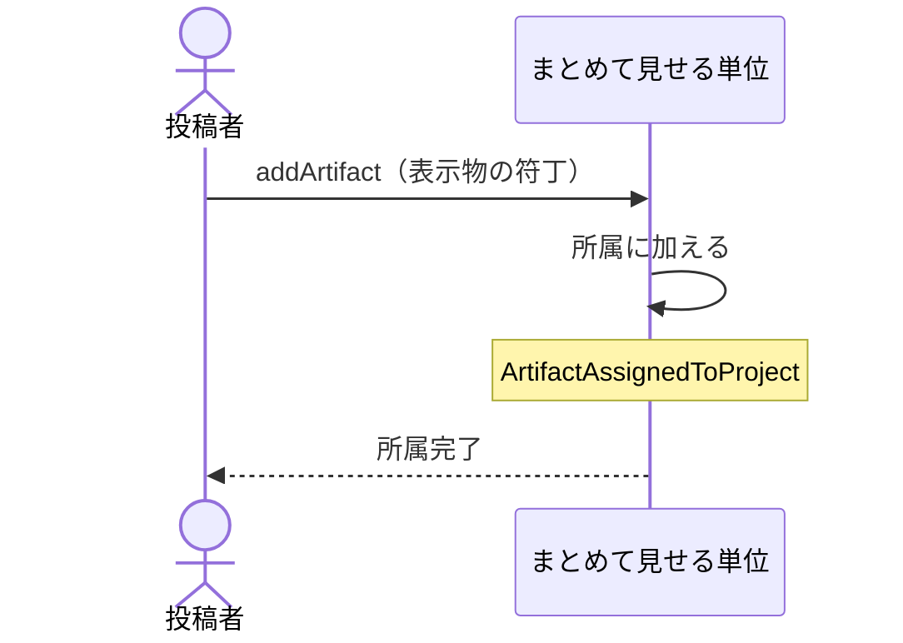

# 表示物をまとめて見せる単位へ入れる・外す：uc-assign-to-project

## 概要

- 表示物を、まとめて見せる単位へ加えたり外したりする操作。加えるとその単位の合鍵でも開けるようになる。
- 所属は人が明示的に選んだときにだけ成立する。表示物の中に書かれた値によって決まることはない。

---

## 存在意義

- 1件ずつ合鍵を渡すと、渡す側も受け取る側も管理しきれない。関連するものをまとめて1つの合鍵で渡せる必要がある。
- 所属が自動で決まる仕組みにすると、表示物の中に書かれた値を書き換えるだけで他人のまとめに紛れ込める。人の操作を必須にすることで、見せる範囲を渡す側が把握し続けられる。

---

## 主アクターと意図

### 主アクター

投稿者

### 意図

複数の表示物を1つの合鍵でまとめて見てもらえるようにする

---

## 事前条件

- 対象のまとめて見せる単位が存在し、開ける状態にあること
- 対象の表示物が存在すること
- 操作する者が、あらかじめ招かれた投稿者であること

---

## 基本フロー



---

## 事後条件

- 表示物がまとめて見せる単位に入っている
- その単位の合鍵で、その表示物を開ける
- 表示物自身の合鍵は変わっていない
- ArtifactAssignedToProject が発行されている

---

## 受け入れ基準

- 投稿者が表示物を単位へ加えたとき、その単位の合鍵でその表示物を開けるようにすること
- 表示物を加えたとき、その表示物自身の合鍵を変えないこと
- 表示物を外したとき、その表示物自身は失わず、それ自身の合鍵で開ける状態を保つこと
- 1つの表示物が複数の単位に同時に入れること
- 表示物の中に書かれた値によって所属が決まることは無いこと
- 停止している表示物を加えたとき、その単位の合鍵でも開けないままにすること

---

## 操作保証

- 同じ表示物を同じ単位へ繰り返し加えたとき、二重に入ることなく、一度加えた状態と同じ結果になること

---

## エラー

| コード | 条件 |
|---|---|
| `PROJECT_NOT_FOUND` | - 対象のまとめて見せる単位が存在しない |
| `ARTIFACT_NOT_FOUND` | - 対象の表示物が存在しない |
| `PROJECT_SUSPENDED` | - 対象のまとめて見せる単位が停止している |
| `NOT_INVITED` | - 操作する者が招かれた投稿者でない |

---

## 受け入れシナリオ

### 背景

まとめて見せる単位Pが開ける状態にあり、表示物Aが公開されている。操作する者は招かれた投稿者である。

### 加えるとまとめの合鍵で開ける

| 分類 | 観点 |
|---|---|
| 正常系 | 状態遷移: 所属が閲覧の範囲を広げることを確かめる |

```gherkin
When 表示物AをPへ加える
Then Pの合鍵で表示物Aを開ける
And 表示物A自身の合鍵も引き続き使える
```

### 外しても表示物は生きている

| 分類 | 観点 |
|---|---|
| 正常系 | 状態遷移: 外すことが消すことでないと確かめる |

```gherkin
Given 表示物AがPに入っている
When 表示物AをPから外す
Then Pの合鍵では表示物Aを開けない
And 表示物A自身の合鍵では開ける
```

### 複数の単位に同時に入れる

| 分類 | 観点 |
|---|---|
| 正常系 | 計算整合: 所属が排他でないことを確かめる |

```gherkin
Given まとめて見せる単位Qも存在する
When 表示物AをPとQの両方へ加える
Then Pの合鍵でも、Qの合鍵でも表示物Aを開ける
```

### 中身に書いた値では所属できない

| 分類 | 観点 |
|---|---|
| 異常系 | 事前条件: 所属が人の操作でのみ成立することを確かめる |

```gherkin
Given 表示物BはPに入っていない
When 表示物Bの中身にPを指す分類の目印を書いて差し替える
Then 表示物BはPに入らない
And Pの合鍵で表示物Bを開けない
```

### 停止している表示物は加えても開けない

| 分類 | 観点 |
|---|---|
| 境界値 | 事前条件: 停止の意図が所属によって迂回されないことを確かめる |

```gherkin
Given 表示物Cが停止している
When 表示物CをPへ加える
Then 所属自体は成立する
And Pの合鍵でも表示物Cは開けない
```

### 停止している単位へは加えられない

| 分類 | 観点 |
|---|---|
| 異常系 | 事前条件: 単位の状態の前提を確かめる |

```gherkin
Given まとめて見せる単位Pが停止している
When 表示物AをPへ加えようとする
Then PROJECT_SUSPENDED として拒まれる
```

---

## 操作保証シナリオ

### 重ねて加えても一度分と同じ

| 分類 | 観点 |
|---|---|
| 境界値 | べき等性: 繰り返しの操作が結果を変えないことを確かめる |

```gherkin
Given 表示物AがPに入っている
When 表示物AをPへもう一度加える
Then 表示物Aは1件としてだけ入っている
And 拒まれることもない
```
