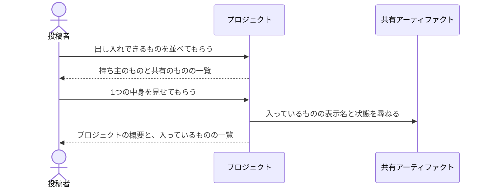

# プロジェクトの顔ぶれと中身を確かめる：uc-browse-projects

## 概要

- 投稿者が出し入れできるプロジェクトを並べ、そのうち1つの中身を開いて確かめる。一覧で候補を絞り、中身を見て入れ先を決めるという一続きの場面を担う。
- どちらも読み取るだけで、閲覧トークンそのものの値は返さない。

---

## 存在意義

- これが無いと、投稿者は自分の共有アーティファクトをどこへ入れるべきかを決められない。入れ先の候補が見えなければ、プロジェクトへ加える操作自体が使えない
- 一覧だけでは、そのプロジェクトにいま何が入っているかが分からない。重複して入れてしまうか、入っているものを外す判断ができない
- 公開が止まっているプロジェクトの中身を見られないと、再開するか中身を外すかを決められないまま封じ込められる

---

## 主アクターと意図

### 主アクター

投稿者

### 意図

出し入れできるプロジェクトの顔ぶれと中身を確かめ、自分のものをどこへ入れるかを決める

---

## 操作一覧

| 操作 | 概要 |
|---|---|
| `list` | 出し入れできるプロジェクトを並べる。持ち主のものと共有のものが並び、管理者にはすべてが並ぶ。 |
| `detail` | 1つのプロジェクトの概要と、いま入っている共有アーティファクトを返す。 |

---

## 事前条件

- 投稿者として招かれており、誰であるかを示す証明を持っている

---

## 基本フロー



---

## 事後条件

- 何も変わらない。読み取るだけの操作であり、プロジェクトの状態も所属も閲覧トークンも動かない

---

## 受け入れ基準

- When 投稿者が一覧を求めたとき、自分が持ち主のものと、共有のものを返すこと
- When 管理者が一覧を求めたとき、すべてのプロジェクトを返すこと
- When 一覧を返すとき、他人が持ち主の個人のプロジェクトを含めないこと
- When 投稿者が1つの中身を求めたとき、入っている共有アーティファクトを表示名つきで、更新の新しい順に返すこと
- When 中身を返すとき、それぞれが自分のものかどうかが分かる状態で返すこと
- While プロジェクトの公開が止まっている間も、中身を返すこと
- When 一覧も中身も、閲覧トークンそのものの値を含めないこと
- If 読めない記録があるとき、それを飛ばして残りを返し、飛ばした件数を添えること
- If 見れないプロジェクトの中身を求められたとき、存在しないものとして拒むこと

---

## 操作保証

- When 一覧も中身も何度求めても、プロジェクトの状態も所属も閲覧トークンも変わらないこと

---

## エラー

| コード | 条件 |
|---|---|
| `PROJECT_NOT_FOUND` | - 指されたプロジェクトが存在しない<br>- 存在するが、その人が見られない（他人が持ち主の個人のプロジェクト） |

---

## 受け入れシナリオ

### 背景

投稿者Xと投稿者Yが招かれている。

### 持ち主のものと共有のものが並ぶ

| 分類 | 観点 |
|---|---|
| 正常系 | 可視性の境界。入れ先の候補として正しいものだけが並ぶことを確かめる |

```gherkin
Scenario: 持ち主のものと共有のものが並ぶ
  Given 投稿者Xが個人のプロジェクトPを作っている
  And 投稿者Yが共有のプロジェクトQを作っている
  When 投稿者Xが一覧を求める
  Then P と Q が並ぶ
```

### 他人の個人のプロジェクトは並ばない

| 分類 | 観点 |
|---|---|
| 正常系 | 可視性の境界。個人のものが漏れないことを確かめる |

```gherkin
Scenario: 他人の個人のプロジェクトは並ばない
  Given 投稿者Yが個人のプロジェクトRを作っている
  When 投稿者Xが一覧を求める
  Then R は含まれない
```

### 管理者にはすべてが並ぶ

| 分類 | 観点 |
|---|---|
| 正常系 | 可視性の境界。管理者だけが境界を越えられることを確かめる |

```gherkin
Scenario: 管理者にはすべてが並ぶ
  Given 投稿者Yが個人のプロジェクトRを作っている
  When 管理者が一覧を求める
  Then R が含まれる
```

### 中身が名前つきで返る

| 分類 | 観点 |
|---|---|
| 正常系 | 判断材料。何が入っているかを識別子ではなく表示名で分かることを確かめる |

```gherkin
Scenario: 中身が名前つきで返る
  Given プロジェクトPに共有アーティファクトAが入っている
  When 投稿者XがPの中身を求める
  Then A の表示名と状態が返る
```

### 自分のものかどうかが分かる

| 分類 | 観点 |
|---|---|
| 正常系 | 判断材料。共有のプロジェクトでは他人のものも並ぶため、外せるのがどれかを区別する |

```gherkin
Scenario: 自分のものかどうかが分かる
  Given 共有のプロジェクトQに、投稿者XのAと投稿者YのBが入っている
  When 投稿者XがQの中身を求める
  Then A は自分のもの、B はそうでないと分かる
```

### 止まっていても中身は見られる

| 分類 | 観点 |
|---|---|
| 境界値 | 状態をまたぐ可視性。再開するか外すかを決めるのに中身が要る |

```gherkin
Scenario: 止まっていても中身は見られる
  Given プロジェクトPの公開が止まっている
  When 投稿者XがPの中身を求める
  Then 入っているものの一覧が返る
```

### 見れないプロジェクトは存在しない扱いになる

| 分類 | 観点 |
|---|---|
| 異常系 | 存在の漏えい。拒否と区別できると、あること自体が伝わる |

```gherkin
Scenario: 見れないプロジェクトは存在しない扱いになる
  Given 投稿者Yが個人のプロジェクトRを作っている
  When 投稿者XがRの中身を求める
  Then 見つからないとして拒まれる
  And 存在しない識別子を指したときと同じ答えになる
```

### 読めない記録があっても残りは返る

| 分類 | 観点 |
|---|---|
| 異常系 | 部分的な失敗。１件の不具合で一覧全体が失われないことを確かめる |

```gherkin
Scenario: 読めない記録があっても残りは返る
  Given 投稿者XがプロジェクトPとQを作っている
  And P の記録が読めない状態になっている
  When 投稿者Xが一覧を求める
  Then Q が返る
  And 読めなかった件数が1と伝わる
```

### 閲覧トークンはどちらにも現れない

| 分類 | 観点 |
|---|---|
| 正常系 | 漏えい。一覧と中身の両方で確かめる |

```gherkin
Scenario: 閲覧トークンはどちらにも現れない
  Given 投稿者XがプロジェクトPを作り、閲覧トークンを受け取っている
  When 投稿者Xが一覧と P の中身を求める
  Then どちらの答えにも、その閲覧トークンの値は現れない
```

---

## 操作保証シナリオ

### 背景

投稿者XがプロジェクトPを作っている。

### 何度見ても何も変わらない

| 分類 | 観点 |
|---|---|
| 正常系 | べき等性。読み取りが副作用を持たないことを確かめる |

```gherkin
Scenario: 何度見ても何も変わらない
  Given 投稿者Xが一覧と P の中身を見ている
  When 同じものをもう一度求める
  Then 同じ答えが返る
  And P の公開の状態も所属も閲覧トークンも変わっていない
```
