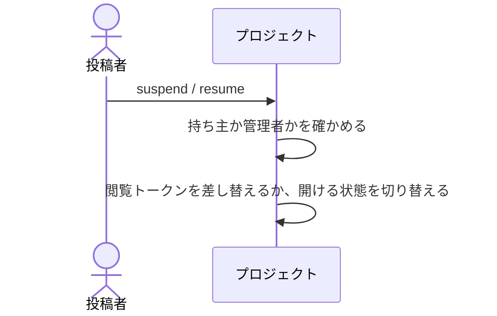

# プロジェクトの開閉を切り替える：uc-control-project-access

## 概要

- プロジェクトを開けない状態にしたり、再び開けるようにする操作。渡した相手全員に一度に及ぶため、共有のプロジェクトでも持ち主と管理者だけが行える。
- 閲覧トークンそのものの発行と無効化は、対象を問わず共通の操作として別に扱う。この操作はプロジェクトの開閉だけを担う。

---

## 存在意義

- これが無いと、一度渡したまとめの閲覧トークンを取り消せない。異動や契約終了で見せたくなくなっても、渡した相手は見続けられる。
- 共有のプロジェクトでも持ち主に限るのは、これらの操作が閲覧トークンを渡した相手全員に及ぶため。誰でも止められると、他の人が渡した相手まで巻き込んで見えなくなる。

---

## 主アクターと意図

### 主アクター

投稿者

### 意図

まとめて渡した相手の範囲を、あとから絞り直す

---

## 操作一覧

| 操作 | 概要 |
|---|---|
| `suspend` | このプロジェクトの閲覧トークンでは何も開けない状態にする。 |
| `resume` | 再び開ける状態に戻す。止める前の閲覧トークンは、期限内で無効にされていなければそのまま使える。 |

---

## 事前条件

- 操作する者が、そのプロジェクトの持ち主であるか、管理者であること
- 対象のプロジェクトが存在すること

---

## 基本フロー



---

## 事後条件

- 公開停止したときは、そのプロジェクトの閲覧トークンでは何も開けなくなっている
- 再開したときは、開ける状態に戻り、閲覧トークンが新しくなっている
- いずれの場合も、入っている共有アーティファクトは変わっていない
- いずれの場合も、入っている共有アーティファクトはそれぞれの閲覧トークンで引き続き開ける

---

## 受け入れ基準

- 持ち主が公開停止を求めたとき、そのプロジェクトの閲覧トークンでは何も開けなくすること
- 公開停止しても、入っている共有アーティファクトをそれぞれの閲覧トークンで開けるままにすること
- 管理者は、自分が作ったものでなくてもこれらを行えること
- 持ち主でも管理者でもない者が求めたとき、対象が見つからないものとして拒むこと
- 共有のプロジェクトであっても、持ち主でも管理者でもない者にはこれらを行わせないこと
- いずれの場合も、入っている共有アーティファクトの顔ぶれを変えないこと
- When 再び開ける状態に戻したとき、開閉の切り替えは 止める前の閲覧トークンのうち期限内で無効にされていないものを、そのまま使える状態にする shall

---

## 操作保証

- 見せ方を変えるどの操作も、入っている共有アーティファクトの中身・個別の閲覧トークン・集まったコメントを変えないこと
- 新しい閲覧トークンを返すとき、そのトークンはこの一度しか示されないこと

---

## エラー

| コード | 条件 |
|---|---|
| `PROJECT_NOT_FOUND` | - 対象のプロジェクトが存在しない<br>- 操作する者が持ち主でも管理者でもない |
| `NOT_SUSPENDED` | - 公開停止していないプロジェクトを再開しようとした |
| `NOT_ACTIVE` | - 公開停止しているプロジェクトを、公開停止しようとした |

---

## 受け入れシナリオ

### 背景

投稿者Xがプロジェクトを作り、共有アーティファクトAとBが入っている。閲覧トークンは相手へ渡してある。

### 公開停止しても中身は個別の閲覧トークンで開ける

| 分類 | 観点 |
|---|---|
| 境界値 | 一貫性: プロジェクトが見せ方の束ねであって入れ物ではないことを確かめる。束ねを解いても中身は消えない |

```gherkin
Scenario: 公開停止しても中身は個別の閲覧トークンで開ける
  Given 共有アーティファクトAの閲覧トークンを別の相手へ渡している
  When Xがプロジェクトを公開停止する
  Then プロジェクトの閲覧トークンでは何も開けない
  And Aの閲覧トークンを持つ相手はAを開ける
```

### 管理者は自分が作ったものでなくても扱える

| 分類 | 観点 |
|---|---|
| 正常系 | 事前条件: 持ち主が抜けたあとに、誰も止められないプロジェクトが残らないことを確かめる |

```gherkin
Scenario: 管理者は自分が作ったものでなくても扱える
  Given プロジェクトの持ち主がXである
  When 管理者が公開停止を求める
  Then 公開停止される
```

### 共有でも持ち主以外は見せ方を変えられない

| 分類 | 観点 |
|---|---|
| 異常系 | 事前条件: 出し入れができることと、見せ方を変えられることが別であると確かめる。誰でも止められると、他の人が渡した相手まで巻き込む |

```gherkin
Scenario: 共有でも持ち主以外は見せ方を変えられない
  Given プロジェクトが共有であり、投稿者Yが自分の共有アーティファクトを入れている
  When Yが公開停止を求める
  Then PROJECT_NOT_FOUND として拒まれる
  And プロジェクトは開ける状態のままである
```

### 止まっていないものは再開できない

| 分類 | 観点 |
|---|---|
| 異常系 | 状態遷移: 再開が公開停止からの復帰に限られることを確かめる |

```gherkin
Scenario: 止まっていないものは再開できない
  Given プロジェクトが開ける状態である
  When Xが再開を求める
  Then NOT_SUSPENDED として拒まれる
```

### 再び開けるようにしても止める前の閲覧トークンで開ける

| 分類 | 観点 |
|---|---|
| 正常系 | 状態遷移：開閉の切り替えが閲覧トークンを作り直さないことを確かめる |

```gherkin
Scenario: 再び開けるようにしても止める前の閲覧トークンで開ける
  Given 開けない状態にしたプロジェクトと、期限内で無効にされていない閲覧トークン
  When 再び開ける状態に戻す
  Then その閲覧トークンで、入っている共有アーティファクトを開ける
```

---

## 操作保証シナリオ

### 背景

プロジェクトに共有アーティファクトAが入っており、Aにはコメントが3件付いている。

### 見せ方を変えても中身とコメントは動かない

| 分類 | 観点 |
|---|---|
| 境界値 | 一貫性: まとめの都合が、個々の共有アーティファクトへ波及しないことを確かめる |

```gherkin
Scenario: 見せ方を変えても中身とコメントは動かない
  Given Aにコメントが3件付いている
  When プロジェクトの閲覧トークンを1本無効にして、新しく1本発行する
  And プロジェクトを公開停止して再開する
  Then Aの中身は変わっていない
  And Aの個別の閲覧トークンは変わっていない
  And Aのコメントは3件のまま残っている
```
