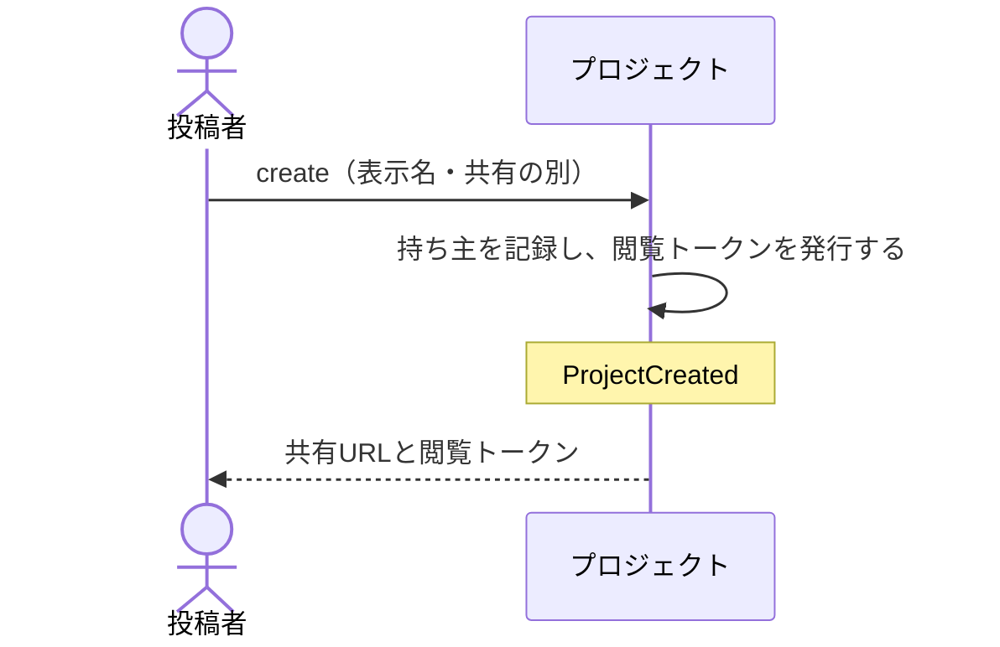

# まとめて見せるプロジェクトを作る：uc-create-project

## 概要

- 投稿者が、複数の共有アーティファクトを1つの閲覧トークンでまとめて見せるための単位を作る操作。作った時点では何も入っていない。
- 作るときに、自分だけが出し入れするか、招かれた人なら誰でも出し入れできるかを選ぶ。この別はあとから変えられない。

---

## 存在意義

- これが無いと、渡す相手ごとに共有アーティファクトの件数だけ閲覧トークンを渡すことになる。渡す側は何をどこまで渡したかを覚えていられず、受け取る側は複数のトークンを管理することになる。
- 作るときに共有の別を選ばせるのは、閲覧トークンを渡す相手を決める判断が『ここに何が入りうるか』を前提にしているため。あとから変えられると、その前提が渡したあとで崩れる。

---

## 主アクターと意図

### 主アクター

投稿者

### 意図

関わりのある共有アーティファクトを、1つの閲覧トークンでまとめて見せられるようにする

---

## 事前条件

- 操作する者が、あらかじめ招かれた投稿者であること

---

## 基本フロー



---

## 事後条件

- プロジェクトが開ける状態になっている
- 作った人が持ち主として記録されている
- 共有の別が記録されている
- そのプロジェクトを開くための閲覧トークンが発行されている
- 入っている共有アーティファクトは0件である
- ProjectCreated が発行されている

---

## 受け入れ基準

- 投稿者が表示名と共有の別を示したとき、共有URLと閲覧トークンを返すこと
- 作った人を持ち主として記録すること
- 閲覧トークンを返すとき、それが一度しか示されないことを投稿者に伝えること
- 作った直後は、入っている共有アーティファクトが0件であること
- 表示名が空のときは作らないこと
- 招かれていない者が作ろうとしたとき、作らず拒むこと
- 共有の別を、作ったあとに変えられなくすること

---

## 操作保証

- 閲覧トークンを返すとき、そのトークンはこの一度しか示されず、以後どの操作でも取り出せないこと

---

## エラー

| コード | 条件 |
|---|---|
| `NOT_INVITED` | - 操作する者が招かれた投稿者でない |
| `NAME_REQUIRED` | - 表示名が空である |
| `SCOPE_REQUIRED` | - 共有の別が示されていない、または想定外の値である |

---

## 受け入れシナリオ

### 背景

操作する者は招かれた投稿者である。

### 作ると共有URLと閲覧トークンが返る

| 分類 | 観点 |
|---|---|
| 正常系 | 状態遷移: 作った時点で開ける状態になり、渡せるものが手に入ることを確かめる |

```gherkin
Given 表示名と共有の別が示されている
When プロジェクトを作る
Then 共有URLと閲覧トークンが返る
And 入っている共有アーティファクトは0件である
And ProjectCreated が発行されている
```

### 作った人が持ち主になる

| 分類 | 観点 |
|---|---|
| 正常系 | 事前条件: 見せ方を変えられる人が、作った時点で1人に定まることを確かめる |

```gherkin
Given 投稿者Xがプロジェクトを作る
Then Xが持ち主として記録されている
And Xは閲覧トークンの再発行と公開停止ができる
```

### 表示名が空なら作らない

| 分類 | 観点 |
|---|---|
| 異常系 | 事前条件: 渡された側が何のまとまりかを読めない状態を作らないことを確かめる |

```gherkin
Given 表示名が空である
When プロジェクトを作ろうとする
Then NAME_REQUIRED として拒まれる
And 閲覧トークンは発行されない
```

### 招かれていない者は作れない

| 分類 | 観点 |
|---|---|
| 異常系 | 事前条件: 閲覧トークンの発行が招かれた者に限られることを確かめる |

```gherkin
Given 操作する者が招かれた投稿者でない
When プロジェクトを作ろうとする
Then NOT_INVITED として拒まれる
```

### 共有の別はあとから変えられない

| 分類 | 観点 |
|---|---|
| 境界値 | 一貫性: 渡す相手を決めた前提が、渡したあとで崩れないことを確かめる |

```gherkin
Given 個人として作られたプロジェクトがある
And その閲覧トークンを相手へ渡している
When 共有へ変えようとする
Then 変えられない
```

---

## 操作保証シナリオ

### 背景

プロジェクトが作られ、閲覧トークンが示されている。

### 閲覧トークンは後から取り出せない

| 分類 | 観点 |
|---|---|
| 境界値 | 一貫性: 閲覧トークンが一度しか示されないことを確かめる。取り出せると、一覧を見られる人が渡した相手と同じ範囲を開けてしまう |

```gherkin
Given プロジェクトの閲覧トークンが示されている
When 一覧や記録からその閲覧トークンを取り出そうとする
Then 閲覧トークンは得られない
And 新しく発行する以外に手立てが無い
```
