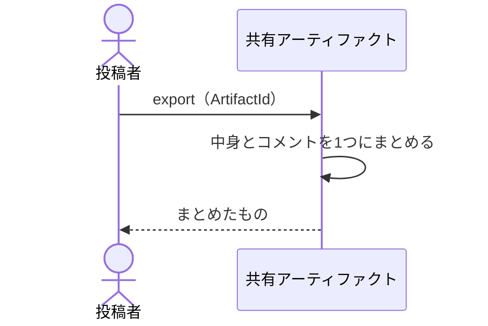

# 中身とコメントを手元へ取り出す：uc-export-artifact

## 概要

- 投稿者が、公開した共有アーティファクトの中身と、それに寄せられたコメントを手元へまとめて持ち出す操作。
- 取り出しても公開は続く。公開を止める前に控えを取る使い方と、記録として残す使い方の両方に使う。

---

## 存在意義

- これが無いと、集まったコメントがこの環境の中にしか存在しなくなる。環境を畳んだ時点で、どんな指摘を受けて何を直したのかという経緯がまとめて失われる。
- 公開を止める操作と切り離しておくのは、止めるかどうかを決める前に中身を確かめたい場面があるため。止めてからでは取り出せない作りにすると、迷ったときに止められなくなる。

---

## 主アクターと意図

### 主アクター

投稿者

### 意図

この環境が無くなっても、渡したものと返ってきたものが手元に残る状態にする

---

## 事前条件

- 操作する者が、対象の共有アーティファクトの投稿者であるか、管理者であること

---

## 基本フロー



---

## 事後条件

- 中身と、それまでに寄せられたコメントが手元にある
- 共有アーティファクトは公開されたままである
- 閲覧トークンも、集まったコメントも変わっていない

---

## 受け入れ基準

- 投稿者が取り出しを求めたとき、公開した中身をそのまま返すこと
- それまでに寄せられたコメントを、誰がいつ何を言ったかが分かる形で添えること
- 差し替えの区切りの記録も、コメントと同じ並びで添えること
- 取り出しても、公開状態・閲覧トークン・コメントを一切変えないこと
- 公開が止まっている共有アーティファクトも取り出せること
- 対象の投稿者でも管理者でもない者が求めたとき、対象が見つからないものとして拒むこと
- 閲覧トークンそのものを含めないこと

---

## 操作保証

- 取り出しが、保管されているものを一切書き換えないこと

---

## エラー

| コード | 条件 |
|---|---|
| `ARTIFACT_NOT_FOUND` | - 対象の共有アーティファクトが存在しない<br>- 操作する者が対象の投稿者でも管理者でもない |

---

## 受け入れシナリオ

### 背景

投稿者Xが共有アーティファクトAを公開しており、コメントが3件寄せられている。

### 中身とコメントがまとめて手元に来る

| 分類 | 観点 |
|---|---|
| 正常系 | 計算整合: 渡したものと返ってきたものが、この環境の外でも読める形になることを確かめる |

```gherkin
Given Aにコメントが3件寄せられている
When Xが取り出しを求める
Then 公開した中身がそのまま返る
And コメント3件が、誰がいつ何を言ったかが分かる形で添えられている
```

### 差し替えの区切りも一緒に来る

| 分類 | 観点 |
|---|---|
| 境界値 | 一貫性: どの指摘が差し替え前のものかを、取り出したあとでも読み取れることを確かめる。区切りが落ちると、手元では指摘の前後関係が分からなくなる |

```gherkin
Given Aが一度差し替えられており、その前後にコメントがある
When Xが取り出しを求める
Then 差し替えの区切りがコメントと同じ並びに現れる
```

### 取り出しても何も変わらない

| 分類 | 観点 |
|---|---|
| 正常系 | 一貫性: 取り出しが読むだけの操作であることを確かめる。公開が止まったり閲覧トークンが変わったりすると、控えを取るたびに渡した相手へ影響が及ぶ |

```gherkin
Given 閲覧者がAの閲覧トークンを持っている
When Xが取り出しを求める
Then Aは公開されたままである
And 閲覧者はそれまでの閲覧トークンでAを開ける
And Aのコメントは3件のまま残っている
```

### 公開が止まっていても取り出せる

| 分類 | 観点 |
|---|---|
| 境界値 | 事前条件: 止めたあとでも控えを取れることを確かめる。止めてからでは取り出せないと、迷ったときに止められなくなる |

```gherkin
Given Aが公開停止されている
When Xが取り出しを求める
Then 中身とコメントが返る
```

### 他人のものは取り出せない

| 分類 | 観点 |
|---|---|
| 異常系 | 事前条件: 取り出せる範囲が、自分が公開したものに限られることを確かめる。寄せられたコメントには、渡した相手しか知らない内容が含まれうる |

```gherkin
Given Aの投稿者はXである
When 管理者でない投稿者YがAの取り出しを求める
Then ARTIFACT_NOT_FOUND として拒まれる
```

### 閲覧トークンは含まれない

| 分類 | 観点 |
|---|---|
| 境界値 | 一貫性: 取り出したものが渡り歩いても、それだけで開ける状態にならないことを確かめる |

```gherkin
Given Aの閲覧トークンが発行されている
When Xが取り出しを求める
Then 返ったものに閲覧トークンは含まれない
```

---

## 操作保証シナリオ

### 背景

共有アーティファクトAが公開されている。

### 何度取り出しても同じものが返る

| 分類 | 観点 |
|---|---|
| 境界値 | べき等性: 取り出しが読むだけの操作であることを確かめる |

```gherkin
Given Aが公開されている
When 続けて2回取り出しを求める
Then 2回とも同じ中身とコメントが返る
And 保管されているものは何も変わっていない
```
