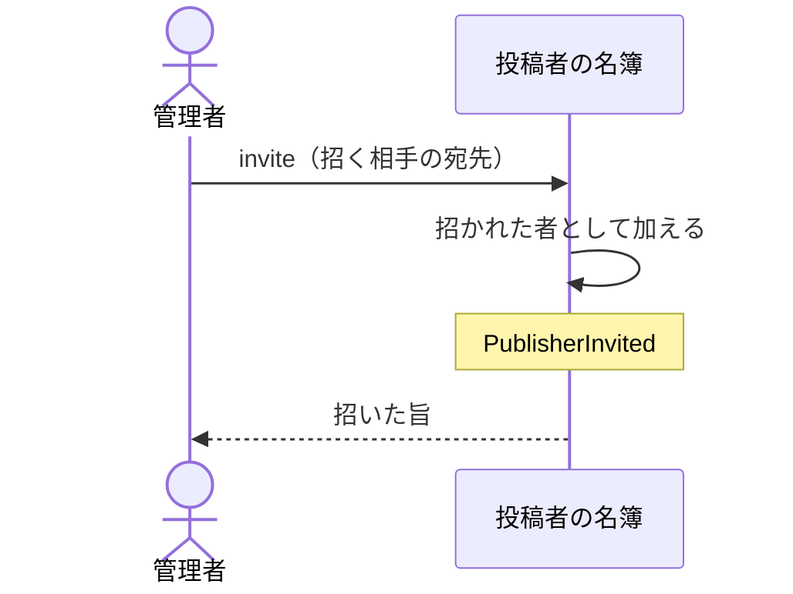

# 管理者が投稿者を招く・外す：uc-invite-publisher

## 概要

- 管理者が、公開できる人を増やしたり、外したりする操作。招かれた人だけが文書を公開できる。
- 外しても、その人がそれまでに公開した共有アーティファクトは消えない。誰も手入れできない状態にならないよう、外す前に引き継ぎ先を決める。

---

## 存在意義

- これが無いと、人がひとり増えるたびに環境を用意した者の手が要り、招くこと自体が滞る。滞ると、招かれていない人が誰かのアカウントを借りて公開する抜け道が生まれる。
- 誰でも名乗り出て投稿者になれる状態を許すと、共有URLと閲覧トークンの発行が濫用され、費用の負担も、置かれた内容の責任も、環境を用意した者が負うことになる。招く側を管理者に限ることでこれを防ぐ。

---

## 主アクターと意図

### 主アクター

管理者

### 意図

公開できる人の顔ぶれを、いまの体制に合わせる

---

## 関与する外部

- 投稿者の名簿（誰が招かれているかを持つ、この文脈の外にある仕組み）

---

## 操作一覧

| 操作 | 概要 |
|---|---|
| `invite` | 公開できる人を増やす。招かれた人は、初めて入るときに自分だけが知る合言葉を決める。 |
| `remove` | 公開できる人から外す。それまでに公開した共有アーティファクトは残る。 |
| `resend` | 招待をもう一度送る。仮の合言葉が新しくなる。既に入っている人へは送らない。 |

---

## 事前条件

- 操作する者が管理者であること
- 外すときは、対象の人が現に招かれていること

---

## 基本フロー



---

## 事後条件

- 招いたときは、その人が文書を公開できる状態になっている
- 外したときは、その人が新たに公開できない状態になっている
- 外したときも、その人がそれまでに公開した共有アーティファクトは公開されたまま残っている
- PublisherInvited または PublisherRemoved が発行されている

---

## 受け入れ基準

- 管理者が宛先を指定して招いたとき、その人が文書を公開できるようになること
- 招かれた人が初めて入るとき、本人だけが知る合言葉を決め直させること
- 管理者以外が招こうとしたとき、招かず拒むこと
- 既に招かれている人を重ねて招いたとき、二重に招かず、その人の状態を変えないこと
- 管理者が人を外したとき、その人が新たに公開できなくなること
- 人を外したとき、その人がそれまでに公開した共有アーティファクトを公開停止しないこと
- 引き継ぎ先が決まっていない共有アーティファクトを持つ人を外そうとしたとき、その件数を管理者に伝えること
- 管理者が自分自身を外そうとしたとき、外さず拒むこと
- 招待に応じていない人へ、管理者が招待を送り直せること
- 既に入っている人へは招待を送り直さないこと

---

## 操作保証

- 人を外すとき、その人が公開した共有アーティファクトの公開状態と閲覧トークンを一切変えないこと
- 同じ人を重ねて招いても、その人の合言葉と公開したものが変わらないこと
- 招いた人を指す識別子が、名簿の一覧が返すものと同じであること

---

## エラー

| コード | 条件 |
|---|---|
| `NOT_ADMINISTRATOR` | - 操作する者が管理者でない |
| `PUBLISHER_NOT_FOUND` | - 外そうとした人が招かれていない |
| `CANNOT_REMOVE_SELF` | - 管理者が自分自身を外そうとした |
| `ALREADY_ACTIVE` | - 招待を送り直そうとした相手が、既に自分の合言葉を決めて入っている |

---

## 受け入れシナリオ

### 背景

操作する者は管理者である。

### 招かれた人が公開できるようになる

| 分類 | 観点 |
|---|---|
| 正常系 | 状態遷移: 招くことが、公開できる状態への入口であることを確かめる |

```gherkin
Scenario: 招かれた人が公開できるようになる
  Given ある人がまだ招かれていない
  When 管理者がその人を招く
  Then その人は文書を公開できる
```

### 管理者でない者は招けない

| 分類 | 観点 |
|---|---|
| 異常系 | 事前条件: 招く側が管理者に限られることを確かめる |

```gherkin
Scenario: 管理者でない者は招けない
  Given 操作する者が管理者でない投稿者である
  When 誰かを招こうとする
  Then NOT_ADMINISTRATOR として拒まれる
  And 招かれた人は増えていない
```

### 重ねて招いても状態は変わらない

| 分類 | 観点 |
|---|---|
| 境界値 | べき等性: 同じ人を二度招いても、その人の合言葉や公開したものに影響しないことを確かめる |

```gherkin
Scenario: 重ねて招いても状態は変わらない
  Given ある人が既に招かれており、共有アーティファクトを公開している
  When 管理者が同じ人をもう一度招く
  Then 招かれた人は増えていない
  And その人が公開した共有アーティファクトは公開されたまま残っている
```

### 外された人は新たに公開できない

| 分類 | 観点 |
|---|---|
| 正常系 | 状態遷移: 外すことが、公開できる状態からの出口であることを確かめる |

```gherkin
Scenario: 外された人は新たに公開できない
  Given ある人が招かれている
  When 管理者がその人を外す
  Then その人は新たに文書を公開できない
```

### 外しても公開したものは残る

| 分類 | 観点 |
|---|---|
| 境界値 | 一貫性: 人を外すことが、その人が公開したものの公開状態に及ばないことを確かめる。閲覧者の手元の共有URLが、投稿者の異動で黙って死んではならない |

```gherkin
Scenario: 外しても公開したものは残る
  Given ある人が共有アーティファクトAを公開している
  When 管理者がその人を外す
  Then 共有アーティファクトAは公開されたまま残っている
  And 閲覧トークンを持つ閲覧者はAを開ける
```

### 手入れできなくなるものがあれば件数を伝える

| 分類 | 観点 |
|---|---|
| 境界値 | 事前条件: 外した結果、誰も公開停止も閲覧トークンの無効化もできない共有アーティファクトが生じることを、外す前に知らせることを確かめる |

```gherkin
Scenario: 手入れできなくなるものがあれば件数を伝える
  Given ある人が共有アーティファクトを3件公開しており、いずれも引き継ぎ先が決まっていない
  When 管理者がその人を外そうとする
  Then 引き継ぎ先の決まっていないものが3件あることが管理者に伝えられる
```

### 管理者は自分自身を外せない

| 分類 | 観点 |
|---|---|
| 異常系 | 事前条件: 管理者が一人もいない状態に落ちる経路を塞ぐことを確かめる |

```gherkin
Scenario: 管理者は自分自身を外せない
  Given 操作する者が管理者である
  When 自分自身を外そうとする
  Then CANNOT_REMOVE_SELF として拒まれる
```

### 招かれていない人は外せない

| 分類 | 観点 |
|---|---|
| 異常系 | 事前条件: 外す対象が現に招かれている人に限られることを確かめる |

```gherkin
Scenario: 招かれていない人は外せない
  Given ある人が招かれていない
  When 管理者がその人を外そうとする
  Then PUBLISHER_NOT_FOUND として拒まれる
```

### 仮の合言葉を無くした人を招き直せる

| 分類 | 観点 |
|---|---|
| 正常系 | 事前条件: 招待に応じていない人は合言葉の決め直しを使えないため、管理者が招き直すことが唯一の手立てであることを確かめる |

```gherkin
Scenario: 仮の合言葉を無くした人を招き直せる
  Given ある人が招かれ、まだ一度も入っていない
  When 管理者が招待を送り直す
  Then 新しい仮の合言葉がその人の宛先へ届く
  And その仮の合言葉で入って、自分の合言葉を決められる
```

### 既に入っている人へは送り直さない

| 分類 | 観点 |
|---|---|
| 異常系 | 事前条件: 送り直しが、本人が決めた合言葉を管理者の操作で使えなくする経路にならないことを確かめる |

```gherkin
Scenario: 既に入っている人へは送り直さない
  Given ある人が既に自分の合言葉を決めて入っている
  When 管理者がその人へ招待を送り直そうとする
  Then ALREADY_ACTIVE として拒まれる
  And その人の合言葉は変わっていない
```

---

## 操作保証シナリオ

### 背景

ある人が招かれており、共有アーティファクトAを公開している。

### 外しても閲覧トークンは失効しない

| 分類 | 観点 |
|---|---|
| 境界値 | 一貫性: 投稿者の異動が、閲覧者の手元の閲覧トークンに波及しないことを確かめる |

```gherkin
Scenario: 外しても閲覧トークンは失効しない
  Given 閲覧者が共有アーティファクトAの閲覧トークンを持っている
  When 管理者がAの投稿者を外す
  Then 閲覧者はそれまでの閲覧トークンでAを開ける
```

### 招待が返す識別子は一覧のものと揃っている

| 分類 | 観点 |
|---|---|
| 正常系 | 同一性: 招くことと見渡すことは別の操作だが、同じ人を同じ識別子で指す。揃っていないと、招いた直後にその人を引き継ぎ先として指せない |

```gherkin
Scenario: 招待が返す識別子は一覧のものと揃っている
  Given 管理者がある宛先の人を招く
  When 続けて招かれている人を見渡す
  Then 招待が返した識別子と、一覧に並ぶその人の識別子が一致する
```
