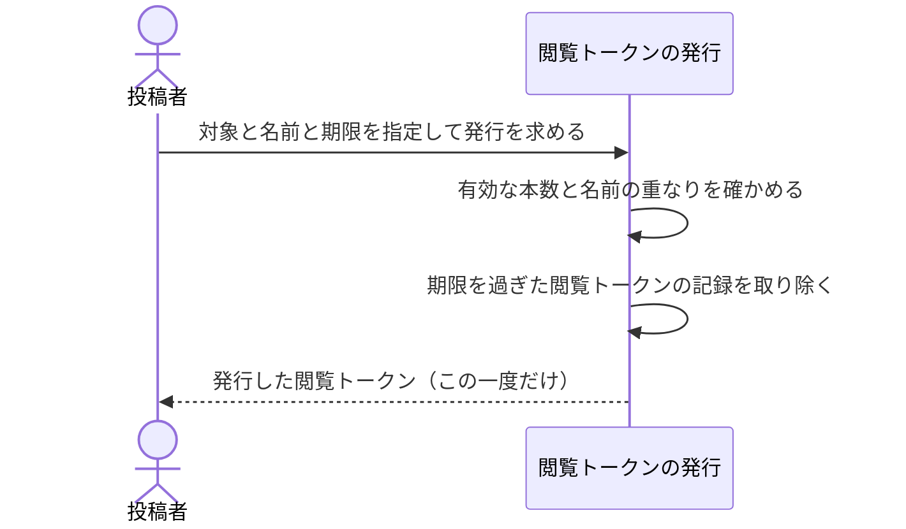

# 配布先ごとに閲覧トークンを発行する：uc-issue-view-token

## 概要

- 見せたい相手ごとに閲覧トークンを1本ずつ発行する操作。名前と期限を与え、あとから個別に外せるようにする。
- 発行した閲覧トークンの値はこの一度だけ示され、以後は見返せない。

---

## 存在意義

- 1本の閲覧トークンを全員へ配ると、ある相手だけを外したいときに、他の相手まで巻き添えで外れる。配布先ごとに分けておけば、外したい相手だけを外せる。
- 渡した相手を外す手立てが人手の操作だけだと、押し忘れたときに渡したものが永久に開き続ける。発行のたびに期限を与えることで、忘れても一度は必ず閉じる。

---

## 主アクターと意図

### 主アクター

投稿者

### 意図

見せたい相手ごとに別々の閲覧トークンを渡し、あとから個別に外せるようにしたい

---

## 事前条件

- 対象が公開されている
- 有効な閲覧トークンが上限に達していない

---

## 基本フロー



---

## 事後条件

- 新しい閲覧トークンが1本増えており、それまでの閲覧トークンはすべて使えたまま残っている
- 発行した閲覧トークンには名前と期限がある
- 期限を過ぎていた閲覧トークンの記録が取り除かれている

---

## 受け入れ基準

- When 名前と期限を指定して発行を求めたとき、閲覧トークンの発行は 新しい閲覧トークンを1本増やし、その値を一度だけ返す shall
- When 期限を指定しなかったとき、閲覧トークンの発行は 1週間の期限を与える shall
- If 対象が共有アーティファクトであり、発行した時点から1ヶ月を超える期限を指定したならば、閲覧トークンの発行は 発行を行わず拒む shall
- If 対象がプロジェクトならば、閲覧トークンの発行は 期限を設けない指定を受け付ける shall
- If 有効な閲覧トークンが上限に達しているならば、閲覧トークンの発行は 発行を行わず拒む shall
- If 有効な閲覧トークンに同じ名前があるならば、閲覧トークンの発行は 発行を行わず拒む shall
- While 発行を行う間、閲覧トークンの発行は それまでの閲覧トークンをどれも無効にしない shall

---

## 操作保証

- When 対象が存在しない、または操作する者に権限が無いとき、システムは TARGET_NOT_FOUND エラーを返す shall（対象を特定し権限を確かめる解決プロセス自体の契約であり、複数のusecaseに共通する）。

---

## エラー

| コード | 条件 |
|---|---|
| `TARGET_NOT_FOUND` | - 対象の共有アーティファクトまたはプロジェクトが存在しない<br>- 操作する者が対象の投稿者・持ち主でも管理者でもない |
| `TOKEN_LIMIT_REACHED` | - 有効な閲覧トークンが上限に達している |
| `DUPLICATE_TOKEN_NAME` | - 有効な閲覧トークンに同じ名前がある |
| `EXPIRY_TOO_FAR` | - 共有アーティファクトに対し、発行した時点から1ヶ月を超える期限を指定した |

---

## 受け入れシナリオ

### 発行しても既存の閲覧トークンは使えたまま残る

| 分類 | 観点 |
|---|---|
| 正常系 | 巻き添えの回避：発行が既存の配布先へ影響しないことを確かめる |

```gherkin
Scenario: 発行しても既存の閲覧トークンは使えたまま残る
  Given 閲覧トークンが1本ある共有アーティファクト
  When 新しい閲覧トークンを発行する
  Then 新しい閲覧トークンで開ける
  And それまでの閲覧トークンでも開ける
```

### 期限を指定しないと1週間になる

| 分類 | 観点 |
|---|---|
| 正常系 | 既定値：指定を省いても必ず期限が付くことを確かめる |

```gherkin
Scenario: 期限を指定しないと1週間になる
  Given 公開されている共有アーティファクト
  When 期限を指定せずに閲覧トークンを発行する
  Then その閲覧トークンの期限は発行から1週間後である
```

### 1ヶ月を超える期限は拒まれる

| 分類 | 観点 |
|---|---|
| 境界値 | 値域：期限があることが形だけにならないことを確かめる |

```gherkin
Scenario: 1ヶ月を超える期限は拒まれる
  Given 公開されている共有アーティファクト
  When 発行から1ヶ月を超える期限を指定して発行を求める
  Then EXPIRY_TOO_FAR として拒まれる
```

### プロジェクトには期限を設けない指定ができる

| 分類 | 観点 |
|---|---|
| 正常系 | 対象による差：置いておく場と回覧するものを区別することを確かめる |

```gherkin
Scenario: プロジェクトには期限を設けない指定ができる
  Given 公開されているプロジェクト
  When 期限を設けない指定で閲覧トークンを発行する
  Then 発行できる
```

### 上限に達していると発行できない

| 分類 | 観点 |
|---|---|
| 異常系 | 上限：選べる数に収まっていることを確かめる |

```gherkin
Scenario: 上限に達していると発行できない
  Given 有効な閲覧トークンが上限に達している共有アーティファクト
  When 新しい閲覧トークンを発行しようとする
  Then TOKEN_LIMIT_REACHED として拒まれる
```

### 同じ名前では発行できない

| 分類 | 観点 |
|---|---|
| 異常系 | 一意性：どれを無効にするか選べる状態を保つことを確かめる |

```gherkin
Scenario: 同じ名前では発行できない
  Given 「デザインチーム」という名前の有効な閲覧トークンがある対象
  When 同じ名前で発行を求める
  Then DUPLICATE_TOKEN_NAME として拒まれる
```

### 期限を過ぎた閲覧トークンは発行のときに取り除かれる

| 分類 | 観点 |
|---|---|
| 正常系 | 遅延削除：定期実行の仕組みを持たずに記録が溜まらないことを確かめる |

```gherkin
Scenario: 期限を過ぎた閲覧トークンは発行のときに取り除かれる
  Given 期限を過ぎた閲覧トークンがある対象
  When 新しい閲覧トークンを発行する
  Then 期限を過ぎた閲覧トークンの記録は残っていない
```

### 発行した閲覧トークンの値はそのとき一度だけ返る

| 分類 | 観点 |
|---|---|
| 正常系 | 一度だけ：値を手にできるのは発行のときだけであることを確かめる |

```gherkin
Scenario: 発行した閲覧トークンの値はそのとき一度だけ返る
  Given 公開されている共有アーティファクト
  When 名前と期限を指定して閲覧トークンを発行する
  Then その閲覧トークンの値が返る
  And 記録には値そのものが残っていない
```

---

## 操作保証シナリオ

### 権限の無い者にはTARGET_NOT_FOUND

| 分類 | 観点 |
|---|---|
| 異常系 | エラー：対象の存在と権限の欠如を区別しない |

```gherkin
Scenario: 権限の無い者にはTARGET_NOT_FOUND
  When 対象の投稿者でも管理者でもない者がこの操作を求める
  Then TARGET_NOT_FOUNDエラーが返る
```

### 管理者は他人の対象でも操作できる

| 分類 | 観点 |
|---|---|
| 正常系 | 権限：投稿者でなくても管理者は通ることを確かめる（TARGET_NOT_FOUNDの裏側） |

```gherkin
Scenario: 管理者は他人の対象でも操作できる
  When 対象の投稿者ではない管理者がこの操作を求める
  Then 拒まれずに操作できる
```
