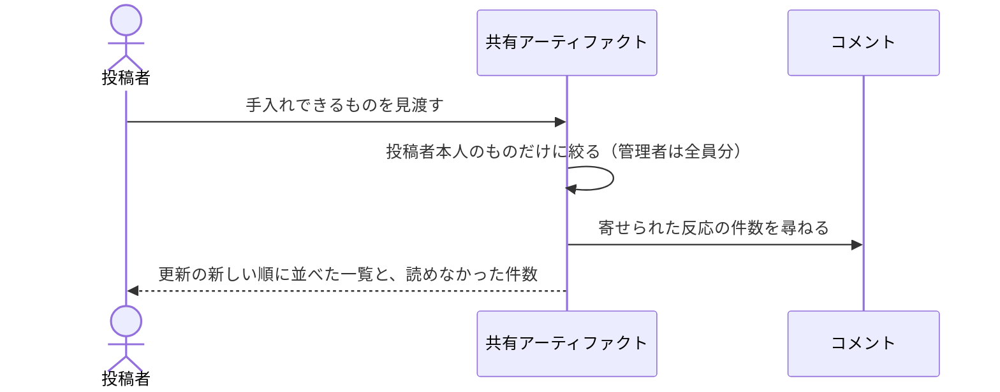

# 手入れできる共有アーティファクトを見渡す：uc-list-my-artifacts

## 概要

- 投稿者が手入れできる共有アーティファクトを、更新の新しい順に見渡す。投稿者には自分のものだけ、管理者には全員のものが並ぶ。
- 閲覧トークンそのものの値は含めない。読めない記録は飛ばして残りを返し、飛ばした件数を添える。

---

## 存在意義

- これが無いと、投稿者は自分が何を公開したかを覚えている場合にしか手入れできない。共有URLを控えていなければ、公開したものへ到達する手段が無くなる
- 管理者が引き継ぎ先を決めるには、誰が何を公開しているかを先に見渡せる必要がある。見渡す手段が無いと、投稿者が抜けたときに手入れできなくなるものを数えられない
- 一部の記録が読めないときに黙って落とすと、投稿者は「公開したはずのものが消えた」としか見えない。飛ばした件数を伝えることで、失われたのか読めないだけなのかを区別できる

---

## 主アクターと意図

### 主アクター

投稿者

### 意図

自分が手入れできる共有アーティファクトを見渡し、次に何を直すかを決める

---

## 事前条件

- 投稿者として招かれており、誰であるかを示す証明を持っている

---

## 基本フロー



---

## 事後条件

- 何も変わらない。読み取るだけの操作であり、共有アーティファクトの状態も閲覧トークンも動かない

---

## 受け入れ基準

- When 投稿者が見渡しを求めたとき、自分が公開した共有アーティファクトだけを返すこと
- When 管理者が見渡しを求めたとき、招かれている全員の共有アーティファクトを返すこと
- When 一覧を返すとき、更新の新しいものから順に並べること
- When 一覧を返すとき、閲覧トークンそのものの値を含めないこと
- When 一覧を返すとき、各共有アーティファクトに寄せられた反応の件数を添えること
- If 読めない記録があるとき、それを飛ばして残りを返し、飛ばした件数を添えること
- While 公開が止まっている間も、その共有アーティファクトを一覧に含め、止まっていることが分かる状態で返すこと

---

## 操作保証

- When 見渡しを何度求めても、共有アーティファクトの状態も閲覧トークンも変わらないこと

---

## 受け入れシナリオ

### 背景

投稿者Xと投稿者Yが招かれている。

### 自分が公開したものだけが並ぶ

| 分類 | 観点 |
|---|---|
| 正常系 | 可視性の境界。他人のものが混ざらないことを確かめる |

```gherkin
Scenario: 自分が公開したものだけが並ぶ
  Given 投稿者XがAを公開している
  And 投稿者YがBを公開している
  When 投稿者Xが見渡しを求める
  Then A だけが返る
  And B は含まれない
```

### 管理者には全員のものが並ぶ

| 分類 | 観点 |
|---|---|
| 正常系 | 可視性の境界。管理者だけが境界を越えられることを確かめる |

```gherkin
Scenario: 管理者には全員のものが並ぶ
  Given 投稿者XがAを公開している
  And 投稿者YがBを公開している
  When 管理者が見渡しを求める
  Then A と B の両方が返る
  And それぞれを公開した人が分かる
```

### 新しく直したものが先頭に来る

| 分類 | 観点 |
|---|---|
| 正常系 | 並び順。次に手を入れる候補が先頭に来ることを確かめる |

```gherkin
Scenario: 新しく直したものが先頭に来る
  Given 投稿者XがAを公開し、その後 B を公開している
  And その後 A の中身を差し替えている
  When 投稿者Xが見渡しを求める
  Then A が B より先に並ぶ
```

### 閲覧トークンは一覧に現れない

| 分類 | 観点 |
|---|---|
| 正常系 | 漏えい。一覧は控えとして保存されることがあるため、トークンを含めない |

```gherkin
Scenario: 閲覧トークンは一覧に現れない
  Given 投稿者XがAを公開し、閲覧トークンを受け取っている
  When 投稿者Xが見渡しを求める
  Then 返った一覧のどこにも、その閲覧トークンの値は現れない
```

### 寄せられた反応の件数が添う

| 分類 | 観点 |
|---|---|
| 正常系 | 判断材料。次に何を直すかを決めるのに反応の有無が要る |

```gherkin
Scenario: 寄せられた反応の件数が添う
  Given 投稿者XがAを公開している
  And A に反応が2件寄せられている
  When 投稿者Xが見渡しを求める
  Then A の行に反応が2件と添う
```

### 読めない記録があっても残りは返る

| 分類 | 観点 |
|---|---|
| 異常系 | 部分的な失敗。１件の不具合で一覧全体が失われないことを確かめる |

```gherkin
Scenario: 読めない記録があっても残りは返る
  Given 投稿者XがAとBを公開している
  And A の記録が読めない状態になっている
  When 投稿者Xが見渡しを求める
  Then B が返る
  And 読めなかった件数が1と伝わる
```

### 公開を止めているものも並ぶ

| 分類 | 観点 |
|---|---|
| 境界値 | 状態をまたぐ可視性。止めたものを見失わないことを確かめる |

```gherkin
Scenario: 公開を止めているものも並ぶ
  Given 投稿者XがAを公開し、その後公開を止めている
  When 投稿者Xが見渡しを求める
  Then A が並び、止まっていることが分かる
```

---

## 操作保証シナリオ

### 背景

投稿者XがAを公開している。

### 何度見渡しても何も変わらない

| 分類 | 観点 |
|---|---|
| 正常系 | べき等性。読み取りが副作用を持たないことを確かめる |

```gherkin
Scenario: 何度見渡しても何も変わらない
  Given 投稿者Xが見渡しを求めている
  When 同じ見渡しをもう一度求める
  Then 同じ一覧が返る
  And A の公開の状態も閲覧トークンも変わっていない
```
