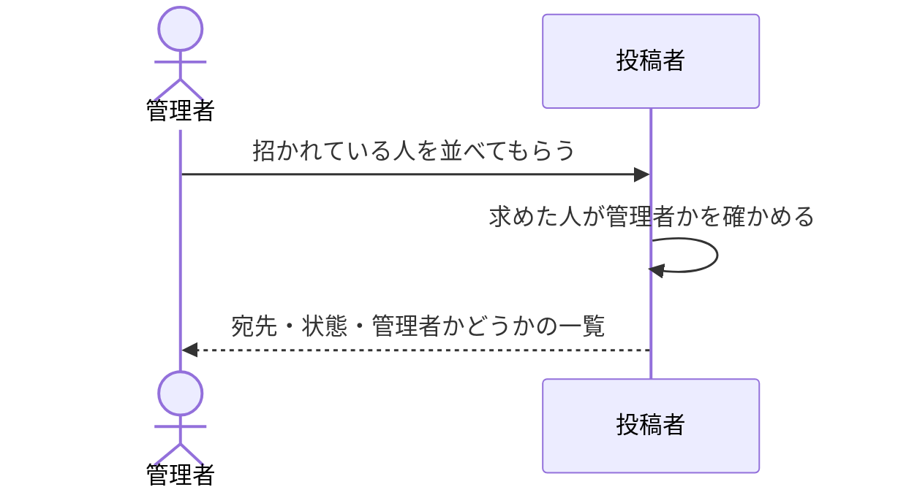

# 公開できる人の顔ぶれを確かめる：uc-list-publishers

## 概要

- 管理者が、招かれている人の顔ぶれを確かめる。それぞれが管理者か、まだ仮の合言葉のままかが分かる。
- 見られるのは管理者だけで、合言葉に関わるものは一切返さない。

---

## 存在意義

- これが無いと、管理者は招き直しや外す相手を宛先を覚えている場合にしか選べない。顔ぶれを体制に合わせる操作の手前で止まる
- 他の人に顔ぶれを見せないこと自体が守るべき規則である。共有の相手を社外へ広げたときに、社内の顔ぶれまで一緒に伝わらないようにする
- まだ仮の合言葉のままの人がいることを見分けられないと、招き直すべき相手を見逃す

---

## 主アクターと意図

### 主アクター

管理者

### 意図

いま誰が公開できるのかを確かめ、招き直す相手・外す相手を選ぶ

---

## 関与する外部

- 招かれている人の名簿（この文脈の外にある仕組み）

---

## 事前条件

- 管理者としての証明を持っている

---

## 基本フロー



---

## 事後条件

- 何も変わらない。読み取るだけの操作であり、名簿は動かない

---

## 受け入れ基準

- When 管理者が一覧を求めたとき、招かれている人をすべて返すこと
- When 一覧を返すとき、それぞれが管理者かどうかが分かる状態で返すこと
- When 一覧を返すとき、まだ仮の合言葉のままの人と、既に入っている人を区別できる状態で返すこと
- When 一覧を返すとき、合言葉に関わるものを一切含めないこと
- If 管理者でない者が一覧を求めたとき、拒むこと

---

## 操作保証

- When 一覧を何度求めても、招かれている人の名簿は変わらないこと

---

## エラー

| コード | 条件 |
|---|---|
| `NOT_ADMINISTRATOR` | - 求めた人が管理者ではない |

---

## 受け入れシナリオ

### 背景

管理者Aと投稿者Xが招かれている。

### 招かれている人がすべて並ぶ

| 分類 | 観点 |
|---|---|
| 正常系 | 網羅性。外す相手を選ぶには漏れがあってはならない |

```gherkin
Scenario: 招かれている人がすべて並ぶ
  When 管理者Aが一覧を求める
  Then 管理者Aと投稿者Xの両方が並ぶ
```

### 管理者かどうかが分かる

| 分類 | 観点 |
|---|---|
| 正常系 | 判断材料。管理者は自分自身を外せないため、どれが管理者かが見えている必要がある |

```gherkin
Scenario: 管理者かどうかが分かる
  When 管理者Aが一覧を求める
  Then A は管理者として、X はそうでないと分かる
```

### まだ入っていない人を見分けられる

| 分類 | 観点 |
|---|---|
| 正常系 | 状態の区別。招き直すべき相手を選ぶのに要る |

```gherkin
Scenario: まだ入っていない人を見分けられる
  Given 投稿者Zが招かれたが、まだ自分の合言葉を決めていない
  When 管理者Aが一覧を求める
  Then Z が、まだ入っていない状態として並ぶ
```

### 合言葉に関わるものは一切出ない

| 分類 | 観点 |
|---|---|
| 正常系 | 漏えい。名簿が持っていても、ここから外へ出さない |

```gherkin
Scenario: 合言葉に関わるものは一切出ない
  When 管理者Aが一覧を求める
  Then 返った一覧のどこにも、合言葉や仮の合言葉は現れない
```

### 管理者でない者は顔ぶれを見られない

| 分類 | 観点 |
|---|---|
| 異常系 | 事前条件違反。顔ぶれを投稿者どうしに見せないという規則そのものを確かめる |

```gherkin
Scenario: 管理者でない者は顔ぶれを見られない
  When 投稿者Xが一覧を求める
  Then 管理者でないことを理由に拒まれる
  And 顔ぶれは一切返らない
```

---

## 操作保証シナリオ

### 背景

管理者Aと投稿者Xが招かれている。

### 何度見ても名簿は変わらない

| 分類 | 観点 |
|---|---|
| 正常系 | べき等性。名簿はこの文脈の外にある仕組みなので、読み取りがそこを動かさないことを確かめる |

```gherkin
Scenario: 何度見ても名簿は変わらない
  Given 管理者Aが一覧を見ている
  When 同じ一覧をもう一度求める
  Then 同じ顔ぶれが返る
  And 誰の状態も変わっていない
```
