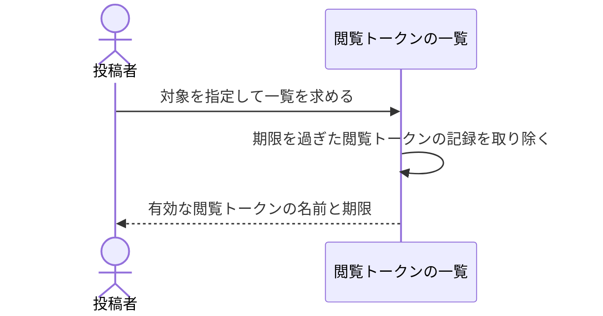

# どの配布先が生きているかを見る：uc-list-view-tokens

## 概要

- 対象の有効な閲覧トークンを、名前と期限とともに一覧する操作。どれを外すかを選ぶために使う。
- 閲覧トークンそのものの値は返さない。あわせて、期限を過ぎた閲覧トークンの記録を取り除く。

---

## 存在意義

- 配布先ごとに外せても、いま何が生きているかを見られなければ、どれを外すかを選べない。外す操作は一覧があって初めて成り立つ。
- 期限を過ぎた閲覧トークンの記録は、無効にする対象にならないのに一覧を埋める。見るたびに取り除くことで、定期実行の仕組みを持たずに溜まらないようにする。

---

## 主アクターと意図

### 主アクター

投稿者

### 意図

いま誰に見せているかを確かめ、外したいものを選びたい

---

## 事前条件

- 対象が存在する

---

## 基本フロー



---

## 事後条件

- 有効な閲覧トークンの名前と期限が返っている
- 閲覧トークンそのものの値は返っていない
- 期限を過ぎていた閲覧トークンの記録が取り除かれている

---

## 受け入れ基準

- When 一覧を求めたとき、一覧は 有効な閲覧トークンの名前と期限を返す shall
- While 一覧を返す間、一覧は 閲覧トークンそのものの値を返さない shall
- When 期限を過ぎた閲覧トークンがあるとき、一覧は その記録を取り除く shall
- If 有効な閲覧トークンが1本も無いならば、一覧は 空の一覧を返す shall

---

## 操作保証

- When 対象が存在しない、または操作する者に権限が無いとき、システムは TARGET_NOT_FOUND エラーを返す shall（対象を特定し権限を確かめる解決プロセス自体の契約であり、複数のusecaseに共通する）。

---

## エラー

| コード | 条件 |
|---|---|
| `TARGET_NOT_FOUND` | - 対象の共有アーティファクトまたはプロジェクトが存在しない<br>- 操作する者が対象の投稿者・持ち主でも管理者でもない |

---

## 受け入れシナリオ

### 有効な閲覧トークンの名前と期限が返る

| 分類 | 観点 |
|---|---|
| 正常系 | 選べる状態：どれを外すか判断する材料が渡ることを確かめる |

```gherkin
Scenario: 有効な閲覧トークンの名前と期限が返る
  Given 「デザインチーム」と「定例レビュー」という名前の閲覧トークンがある対象
  When 一覧を求める
  Then 2つの名前と、それぞれの期限が返る
```

### 閲覧トークンそのものの値は返らない

| 分類 | 観点 |
|---|---|
| 正常系 | 秘匿：発行の一度きりという性質が保たれることを確かめる |

```gherkin
Scenario: 閲覧トークンそのものの値は返らない
  Given 閲覧トークンがある対象
  When 一覧を求める
  Then 閲覧トークンそのものの値は含まれていない
```

### 期限を過ぎた閲覧トークンは一覧に現れず記録も残らない

| 分類 | 観点 |
|---|---|
| 正常系 | 遅延削除：見るたびに片付くことを確かめる |

```gherkin
Scenario: 期限を過ぎた閲覧トークンは一覧に現れず記録も残らない
  Given 有効な閲覧トークンが1本と、期限を過ぎた閲覧トークンが2本ある対象
  When 一覧を求める
  Then 返るのは有効な1本だけである
  And 期限を過ぎた閲覧トークンの記録は残っていない
```

### 1本も無ければ空の一覧が返る

| 分類 | 観点 |
|---|---|
| 境界値 | 境界：誰にも渡していない状態を失敗として扱わない |

```gherkin
Scenario: 1本も無ければ空の一覧が返る
  Given 有効な閲覧トークンが1本も無い対象
  When 一覧を求める
  Then 空の一覧が返る
```

---

## 操作保証シナリオ

### 権限の無い者にはTARGET_NOT_FOUND

| 分類 | 観点 |
|---|---|
| 異常系 | エラー：対象の存在と権限の欠如を区別しない |

```gherkin
Scenario: 権限の無い者にはTARGET_NOT_FOUND
  When 対象の投稿者でも管理者でもない者がこの操作を求める
  Then TARGET_NOT_FOUNDエラーが返る
```
