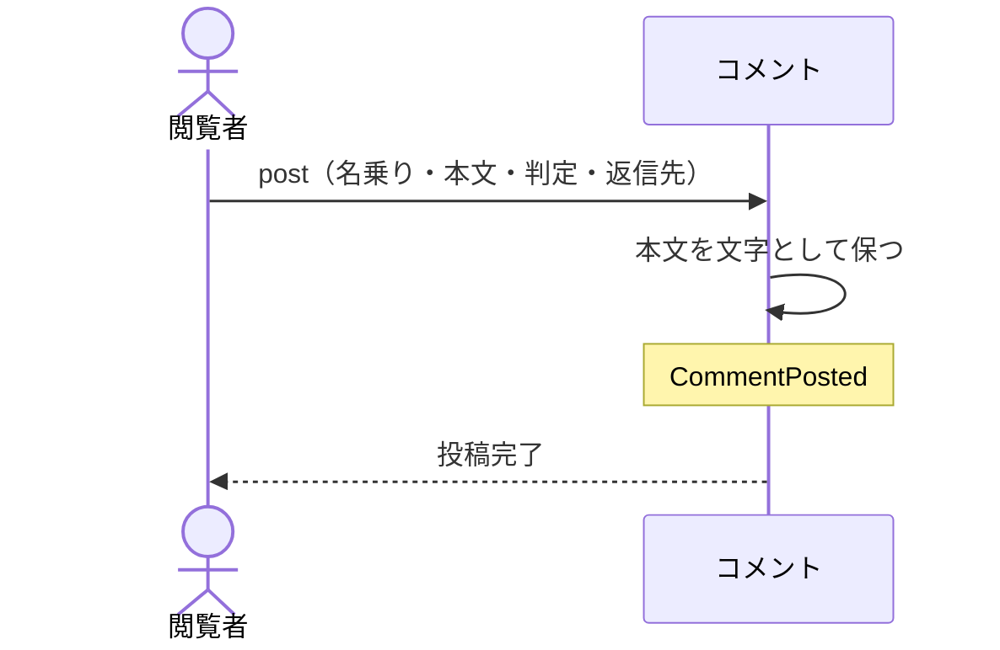

# 閲覧者が名乗ってコメントを残す：uc-post-comment

## 概要

- 閲覧トークンを持つ閲覧者が、共有アーティファクトにコメントを残す操作。名乗るだけでよく、あらかじめ登録されている必要はない。
- ただの意見か、この方向でよいか、直してほしいか、という判定を添えられる。他のコメントへの返信としても残せる。

---

## 存在意義

- これが無いと、見てもらった相手のコメントを別の手立てで集めることになり、どの指摘がどの共有アーティファクトに対するものかが散らばる。
- 登録を求めると、その手間だけでコメントを返さない人が出る。名乗るだけで残せることが、コメントが実際に集まるかどうかを分ける。
- 判定を添えられることで、単なる感想の列ではなく、合意がどこまで進んだかを後から読み取れる記録になる。

---

## 主アクターと意図

### 主アクター

閲覧者

### 意図

見た共有アーティファクトについて、その場で意見や判断を残す

---

## 事前条件

- 対象の共有アーティファクトが開ける状態にあること
- 閲覧者が、その共有アーティファクトを開ける閲覧トークンを持っていること

---

## 基本フロー



---

## 事後条件

- コメントが1件残っている
- そのコメントが対象の共有アーティファクトに結び付いている
- 本文が文字としてそのまま保たれている
- CommentPosted が発行されている

---

## 受け入れ基準

- 閲覧者が名乗りと本文を与えたとき、コメントを残すこと
- 閲覧者があらかじめ登録されていなくても、コメントを残せること
- 判定が与えられないとき、ただの意見として扱うこと
- 本文を示すとき、常に文字として示し、書かれた内容を組み立ての指示として解釈しないこと
- 同じ共有アーティファクトに付いたコメントを返信先として指せること
- 別の共有アーティファクトに付いたコメントを返信先として指したとき、拒むこと
- 停止している共有アーティファクトへコメントを残そうとしたとき、拒むこと
- コメントが並びに現れるまで時間がかかりうることを閲覧者に伝え、即座に現れるとは伝えないこと

---

## 操作保証

- 残されたコメントが、後からどの操作によっても書き換えられないこと
- 同時に複数の閲覧者がコメントを残したとき、いずれのコメントも失われないこと

---

## エラー

| コード | 条件 |
|---|---|
| `ARTIFACT_NOT_VIEWABLE` | - 対象の共有アーティファクトが公開停止されている<br>- 閲覧トークンを持っていない |
| `AUTHOR_REQUIRED` | - 名乗りが与えられていない |
| `BODY_REQUIRED` | - 本文が空である |
| `INVALID_PARENT` | - 返信先として指されたコメントが、別の共有アーティファクトに付いている |
| `BODY_TOO_LARGE` | - 本文が受け入れられる大きさを超えている |

---

## 受け入れシナリオ

### 背景

共有アーティファクトAが公開されており、閲覧者はその閲覧トークンを持っている。

### 名乗るだけでコメントを残せる

| 分類 | 観点 |
|---|---|
| 正常系 | 事前条件: 登録なしで残せることを確かめる |

```gherkin
Given 閲覧者はあらかじめ登録されていない
When 名乗りと本文を与えてコメントを残す
Then コメントが1件残る
And そのコメントは共有アーティファクトAに結び付いている
```

### 判定を添えられる

| 分類 | 観点 |
|---|---|
| 正常系 | 計算整合: 合意の状態が記録として残ることを確かめる |

```gherkin
When この方向でよいという判定を添えてコメントを残す
Then その判定とともにコメントが残る
And 後から読んだ人が、合意が示されたことを読み取れる
```

### 判定が無ければただの意見として扱う

| 分類 | 観点 |
|---|---|
| 境界値 | 事前条件: 既定の解釈が定まっていることを確かめる |

```gherkin
When 判定を添えずにコメントを残す
Then ただの意見として残る
```

### 本文は文字として示される

| 分類 | 観点 |
|---|---|
| 異常系 | 事前条件: 投稿された本文が指示として解釈されないことを確かめる |

```gherkin
When 組み立ての指示に見える文字列を本文に含めてコメントを残す
Then 他の閲覧者にはその文字列がそのまま文字として見える
And 指示として実行されることはない
```

### 同じ共有アーティファクトのコメントへ返信できる

| 分類 | 観点 |
|---|---|
| 正常系 | 計算整合: やり取りの筋道が成立することを確かめる |

```gherkin
Given 共有アーティファクトAにコメントが1件ある
When そのコメントを返信先に指して新しいコメントを残す
Then 返信として結び付いて残る
```

### 別の共有アーティファクトのコメントへは返信できない

| 分類 | 観点 |
|---|---|
| 異常系 | 事前条件: 筋道が1つの共有アーティファクトの中で閉じることを確かめる |

```gherkin
Given 共有アーティファクトBにコメントが1件ある
When 共有アーティファクトAへのコメントとして、共有アーティファクトBのコメントを返信先に指す
Then INVALID_PARENT として拒まれる
```

### 停止している共有アーティファクトには残せない

| 分類 | 観点 |
|---|---|
| 異常系 | 事前条件: 停止が投稿も止めることを確かめる |

```gherkin
Given 共有アーティファクトAが公開停止されている
When コメントを残そうとする
Then ARTIFACT_NOT_VIEWABLE として拒まれる
```

### 大きすぎる本文は拒む

| 分類 | 観点 |
|---|---|
| 境界値 | 事前条件: 受け入れられる大きさに上限があることを確かめる |

```gherkin
When 受け入れられる大きさを超える本文でコメントを残そうとする
Then BODY_TOO_LARGE として拒まれる
And 拒まれた理由が閲覧者に伝わる
```

---

## 操作保証シナリオ

### 残したコメントは書き換えられない

| 分類 | 観点 |
|---|---|
| 異常系 | 一貫性: 記録としての不変性を確かめる |

```gherkin
Given 閲覧者がコメントを1件残している
When 同じArtifactIdで別の内容を送る
Then 元のコメントは変わらない
```

### 同時に残しても失われない

| 分類 | 観点 |
|---|---|
| 境界値 | 一貫性: コメントどうしが互いを打ち消さないことを確かめる |

```gherkin
Given 2人の閲覧者が同じ共有アーティファクトを見ている
When 2人がほぼ同時にコメントを残す
Then 2件とも残っている
```
